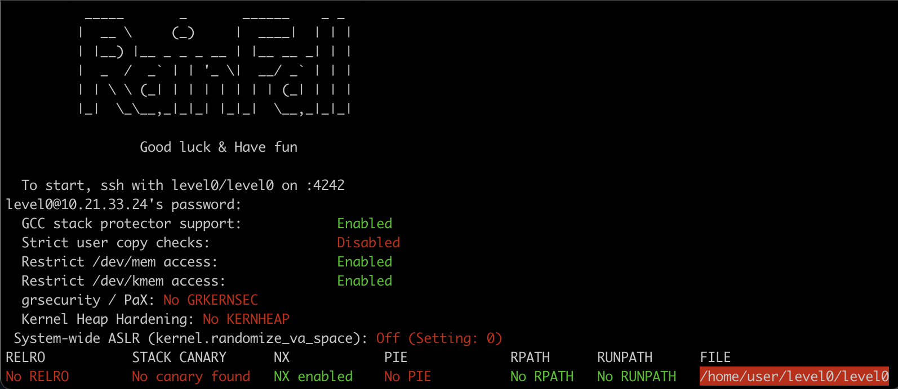
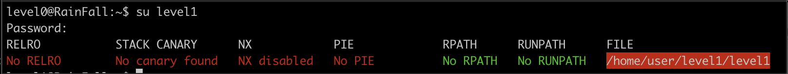

# Rainfall
Проект по изучению методов взлома и поиску уязвимостей.

На платформе intra на странице проекта есть образ, который необходимо запустить на виртуальной машине и получить пароли от пользователей                               \
level0 level1 level2 level3 level4     \
level5 level6 level7 level8 level9     \
bonu0 bonu1 bonu02 bonu3 end

Скрипт для запуска образа в VirtualBox: [Vbox/setup.sh](./Vbox/setup.sh) .

Полученные пароли записаны в файлы: \
[levelX](./project)/flag,           \
[bonusX](./project)/flag,           \
где X - номер уровня, на котором получен пароль.

Ниже последовательно описаны мои действия по достижению цели.

<a name="content"></a> 
# Содержание и список полученных паролей от следующего пользователя

[Вступительная теория о списке состояния механизмов защиты ядра](#Preamble)

| Пользователь           | Уязвимость | Инструмент | Пароль от level(xx+1)  |  
| ---------------------- | ---------- | -----------| ----------------------:|
| [level0](#lvl0)        |  | gdb |  1fe8a524fa4bec01ca4ea2a869af2a02260d4a7d5fe7e7c24d8617e6dca12d3a |
| [level1](#lvl1)        |  |  |  |
| [level2](#lvl2)        |  |  |  |
| [level3](#lvl3)        |  |  |  |
| [level4](#lvl4)        |  |  |  |
| [level5](#lvl5)        |  |  |  |
| [level6](#lvl6)        |  |  |  |
| [level7](#lvl7)        |  |  |  |
| [level8](#lvl8)        |  |  |  |
| [level9](#lvl9)        |  |  |  |
| [bonus0](#bonus0)      |  |  |  |
| [bonus1](#bonus1)      |  |  |  |
| [bonus2](#bonus2)      |  |  |  |
| [bonus3](#bonus3)      |  |  |  |


<a name="content"></a> 
# Вступительная теория о списке состояния механизмов защиты ядра

После запуска ВМ при входе в пользователя появляется сообщение:


<!-- _____       _       ______    _ _ -->
<!-- |  __ \     (_)     |  ____|  | | | -->
<!-- | |__) |__ _ _ _ __ | |__ __ _| | | -->
<!-- |  _  /  _` | | '_ \|  __/ _` | | | -->
<!-- | | \ \ (_| | | | | | | | (_| | | | -->
<!-- |_|  \_\__,_|_|_| |_|_|  \__,_|_|_| -->

<!-- Good luck & Have fun -->

<!-- To start, ssh with level0/level0 on :4242
    level0@10.21.33.24's password:
    GCC stack protector support:            Enabled
    Strict user copy checks:                Disabled
    Restrict /dev/mem access:               Enabled
    Restrict /dev/kmem access:              Enabled
    grsecurity / PaX: No GRKERNSEC
    Kernel Heap Hardening: No KERNHEAP
    System-wide ASLR (kernel.randomize_va_space): Off (Setting: 0)
    RELRO           STACK CANARY      NX            PIE             RPATH      RUNPATH      FILE
    No RELRO        No canary found   NX enabled    No PIE          No RPATH   No RUNPATH   /home/user/level0/level0 -->

Это список состояния механизмов защиты ядра.

Чтобы повторно посмотреть этот вывод, можно вызвать 3 команды:
```sh
checksec --kernel
cat /proc/sys/kernel/randomize_va_space
checksec --file /home/user/level0/level0
```
Хорошие статьи о checksec и randomize_va_space:
1. [о checksec --kernel
GCC stack protector support, Strict user copy checks, Restrict /dev/mem access, Restrict /dev/kmem access, grsecurity / PaX, Kernel Heap Hardening](https://blog.siphos.be/2011/07/high-level-explanation-on-some-binary-executable-security/),    
2. [о checksec --file и не только. RELPO, CANARY, NX, PIE](https://opensource.com/article/21/6/linux-checksec)     
3. [о kernel.randomize_va_space (ASLR)](https://www.spec.org/cpu2017/flags/Supermicro-Platform-Settings-V1.2-Milan-revC.html) 
4. [/proc/sys/kernel/randomize_va_space](https://www.kernel.org/doc/Documentation/sysctl/kernel.txt)
5. [kernel.randomize_va_space (ASLR)](https://www.spec.org/cpu2017/flags/Supermicro-Platform-Settings-V1.2-Milan-revC.html)

Еще кое-что для чтения о взломах
[Переполнение буфера: анатомия эксплоита](https://www.securitylab.ru/analytics/421994.php)
/
1. Можно в определенных ситуациях воспользоваться перезаписью данных в переменную (перезаписать данные за пределами переменной):
```sh
Strict user copy checks:                Disabled
```
2. Можно попробовать вычислить нужный адрес процесса:
```sh
System-wide ASLR (kernel.randomize_va_space): Off (Setting: 0)
```
"Этот параметр можно использовать для выбора типа рандомизации адресного пространства процесса. Значения по умолчанию различаются в зависимости от того, поддерживает ли архитектура ASLR, было ли ядро ​​собрано с параметром CONFIG_COMPAT_BRK или нет, или от используемых параметров загрузки ядра.                                       \
Возможные настройки:                                                         \
0: отключить рандомизацию адресного пространства процесса.                   \
1: Рандомизировать адреса базы mmap, стека и страниц VDSO.                   \
2: дополнительно рандомизируйте кучу. (Вероятно, это значение по умолчанию.) \
Отключение ASLR может сделать выполнение процессов более детерминированным, а время выполнения — более согласованным."                                           \
[Источник](https://www.spec.org/cpu2017/flags/Supermicro-Platform-Settings-V1.2-Milan-revC.html)

3. grsecurity / PaX: Custom GRKERNSEC
```
  Non-executable kernel pages:            Enabled / Disabled
  Prevent userspace pointer deref:        Enabled / Disabled
  Prevent kobject refcount overflow:      Enabled / Disabled
  Bounds check heap object copies:        Enabled / Disabled
  Disable writing to kmem/mem/port:       Enabled / Disabled
  Disable privileged I/O:                 Enabled / Disabled
  Harden module auto-loading:             Enabled / Disabled
  Hide kernel symbols:                    Enabled / Disabled
```
Поскольку No GRKERNSEC, то всё вышеописанное отключено.
[Подробнее об этих параметрах](https://blog.siphos.be/2011/07/checksec-kernel-security/)

[ioperm и iopl](https://www.opennet.ru/cgi-bin/opennet/man.cgi?topic=iopl&category=2)

checksec --kernel

checksec --kernel
* Kernel protection information:

  Description - List the status of kernel protection mechanisms. Rather than
  inspect kernel mechanisms that may aid in the prevention of exploitation of
  userspace processes, this option lists the status of kernel configuration
  options that harden the kernel itself against attack.

  Kernel config: /boot/config-3.2.0-90-generic-pae

  Warning: The config on disk may not represent running kernel config!

  GCC stack protector support:            Enabled
  Strict user copy checks:                Disabled
  Enforce read-only kernel data:          Enabled
  Restrict /dev/mem access:               Enabled
  Restrict /dev/kmem access:              Enabled

* grsecurity / PaX: No GRKERNSEC

  The grsecurity / PaX patchset is available here:
    http://grsecurity.net/

* Kernel Heap Hardening: No KERNHEAP

  The KERNHEAP hardening patchset is available here:
    https://www.subreption.com/kernheap/

#
###### [вернуться к содержанию](#content)
<a name="lvl0"></a> 
# level0

1. Проверяю содержимое директории и пробую запустить найденный файл различными способами:
```sh
ls -la
# ||
# \/
# -rwsr-x---+ 1 level1 users  747441 Mar  6  2016 level0

./level0
# ||
# \/
# Segmentation fault (core dumped)

ldd ./level0
# ||
# \/
# not a dynamic executable
```
Ссылки для чтения:
* [о чем говорит вывод `not a dynamic executable`](https://stackoverflow.com/questions/26541049/ltrace-couldnt-find-dynsym-or-dynstr-in-library-so) \
* [Как работает ltrace (инструмент трассировки библиотек)](https://stackoverflow.com/questions/32214079/how-does-ltrace-library-tracing-tool-work) \
* [внутреннее устройство ltrace](https://www.kernel.org/doc/ols/2007/ols2007v1-pages-41-52.pdf)

```sh
./level0 -1
# ||
# \/
# No !

gdb ./level0
(gdb) disas main
# ||
# \/
   0x08048ecc <+12>:	add    $0x4,%eax
   0x08048ecf <+15>:	mov    (%eax),%eax
   0x08048ed1 <+17>:	mov    %eax,(%esp)
   0x08048ed4 <+20>:	call   0x8049710 <atoi>
   0x08048ed9 <+25>:	cmp    $0x1a7,%eax
   0x08048ede <+30>:	jne    0x8048f58 <main+152>
```
Эти строки говорят о том, что при запуске ./level0 с аргументом, аргумент будет переведен в число и сравнен со значением 0x1a7<sub>16</sub> = 423<sub>10</sub>. При совпадении значений, будет произведен прыжок на 0x8048f58 <main+152> . \
Пробую 423 в качестве эксплоита:

```sh
./level0 423
$ cat /home/user/level1/.pass
# ||
# \/
# 1fe8a524fa4bec01ca4ea2a869af2a02260d4a7d5fe7e7c24d8617e6dca12d3a
$ exit
level0@RainFall:~$ su level1
# Password: 1fe8a524fa4bec01ca4ea2a869af2a02260d4a7d5fe7e7c24d8617e6dca12d3a
```

#
###### [вернуться к содержанию](#content)
<a name="lvl1"></a> 
# level1


#
###### [вернуться к содержанию](#content)
<a name="lvl2"></a> 
# level2

#
###### [вернуться к содержанию](#content)
<a name="lvl3"></a> 
# level3

#
###### [вернуться к содержанию](#content)
<a name="lvl1"></a> 
# level1

#
###### [вернуться к содержанию](#content)
<a name="lvl4"></a> 
# level4

#
###### [вернуться к содержанию](#content)
<a name="lvl5"></a> 
# level5

#
###### [вернуться к содержанию](#content)
<a name="lvl6"></a> 
# level6

#
###### [вернуться к содержанию](#content)
<a name="lvl7"></a> 
# level7

#
###### [вернуться к содержанию](#content)
<a name="lvl8"></a> 
# level8

#
###### [вернуться к содержанию](#content)
<a name="lvl9"></a> 
# level9

#
###### [вернуться к содержанию](#content)
<a name="bonus0"></a> 
# bonus0

#
###### [вернуться к содержанию](#content)
<a name="bonus1"></a> 
# bonus1

#
###### [вернуться к содержанию](#content)
<a name="bonus2"></a> 
# bonus2

#
###### [вернуться к содержанию](#content)
<a name="bonus3"></a> 
# bonus3